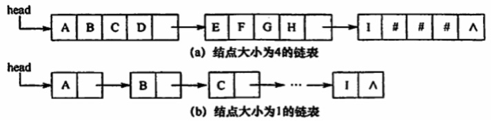
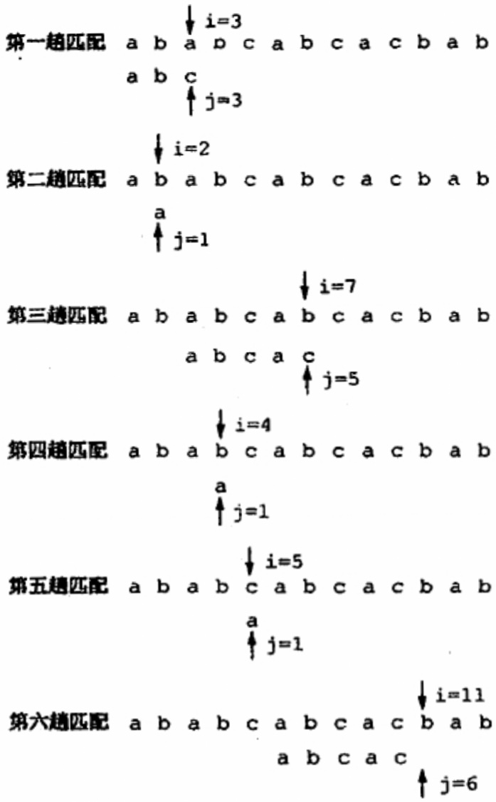
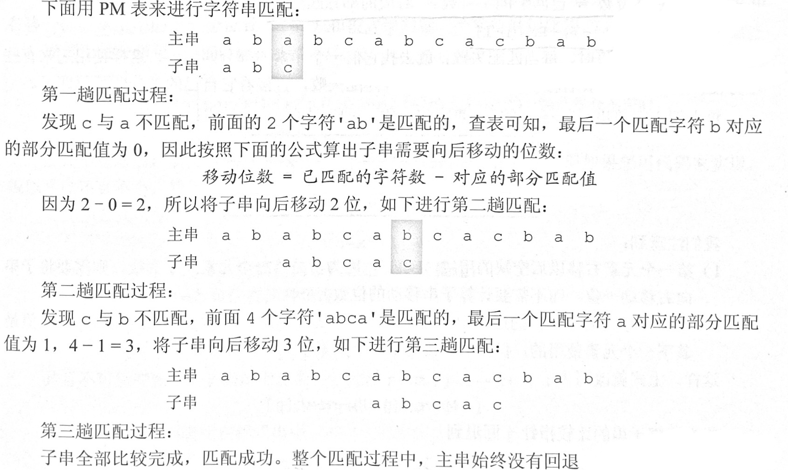

# 串

## 串的定义和实现

### 串的定义

串：是由零个或多个字符组成的有限序列。一般记为**S = ‘a<sub>1</sub>a<sub>2</sub>...a<sub>n</sub>’（n ≥ 0）**，S：串名，单引号括起来的字符序列是串的值，a<sub>i</sub>是字符，串中字符的个数n称为串的长度。n = 0时的串称为空串（∅）

子串：串中任意多个连续字符组成的子序列

主串：包含子串的串

当两个串的长度相等且每个对应位置的字符都相等时，称这两个串是相等的。

<br/>

### 串的存储结构

#### 定长顺序存储表示

```c++
#define MAXLEN 255
typedef struct {
    char ch[MAXLEN];
    int length;
}SString;

// 求子串：用Sub返回串S的第pos个字符起长度为len的子串
bool SubString(SString& Sub, SString S, int pos, int len) {
    // 子串范围越界
    if (pos + len - 1 > S.length)
        return false;
    for (int i = pos; i < pos + len; ++i)
        Sub.ch[i - pos + 1] = S.ch[i];
    Sub.length = len;
    return true;
}

// 比较操作：若S > T，则返回值 > 0；若 S = T则返回值 = 0；若S < T，则返回值 < 0
int StrCompare(SString S, SString T) {
    for (int i = 1; i <= S.length && i <= T.length; ++i) {  // 下标为0处不存放字符
        if (S.ch[i] != T.ch[i])
            return S.ch[i] - T.ch[i];
    }
    // 扫描过的所有字符都相等，则长度长的串更大
    return S.length - T.length;
}

// 定位操作：若主串S中存在于串T值相同的子串，则返回它在主串S中第一次出现的位置；否则函数值为0
int Index(SString S, SString T) {
    int i = 1, n = S.length, m = T.length;
    SString sub;    // 暂存子串
    while (i <= n - m + 1) {
        SubString(sub, S, i, m);
        if (StrCompare(sub, T) != 0) ++i;
        else return i;  // 返回子串在主串中的位置
    }
    return 0;   // S中不存在与T相等的子串
}
```

- 运行结果

```c++
int main() {
    SString S = { " Hello World!",12 };
    cout << "初始";
    PrintString(S);

    SString Sub;
    SubString(Sub, S, 7, 5);
    cout << "返回串第7个字符起长度为5的子";
    PrintString(Sub);

    SString T = { " Hello", 5 };
    cout << "比较字符串S = \"Hello World!\"和字符串T = \"Hello\"：";
    int cmp = StrCompare(S, T);
    if (cmp < 0)
        cout << "S < T\n";
    else if (cmp == 0)
        cout << "S = T\n";
    else
        cout << "S > T\n";

    SString U = { " World",5 };
    cout << "子串U = \"World\"在主串S = \"Hello World!的第\""
        << Index(S, U) << "个位置";
    return 0;
}

输出：
初始串：Hello World!
返回串第7个字符起长度为5的子串：World
比较字符串S = "Hello World!"和字符串T = "Hello"：S > T
子串U = "World"在主串S = "Hello World!的第"7个位置
```

<br/>

类似于线性表的存储结构，用一组地址连续的存储单元存储串值的字符序列。串的实际长度只能小于等于MAXLEN，超过预定长度的串值会被舍去，称为**截断**

<br/>

#### 堆分配存储表示

```c++
typedef struct {
    char* ch;
    int length;
}HString;

// 初始化
HString S;
S.ch = new char[MAXLEN];
S.length = 0;
```

仍然以一组地址连续的存储单元存储串值的字符序列，但存储空间是在程序执行过程中动态分配得到的。

<br/>

#### 块链存储表示

```c++
typedef struct StringNode {
    char ch;    // 每个结点存放1个字符
    struct StringNode* next;
}StringNode, * String;

typedef struct StringNode {
    char ch[4]; // 每个结点存放多个字符
    struct StringNode* next;
}StringNode, * String;
```

类似于链表的链式存储结构，每个结点既可存放一个字符，也可以存放多个字符。每个结点称为块，整个链表称为块链结构，如下图：



<br/>

## 串的匹配模式

### 简单的模式匹配算法

**模式匹配**：子串的定位操作，它求的是子串（模式串）在主串中的位置

暴力匹配算法：

```c++
int Index(SString S, SString T) {
    int i = 1, j = 1;
    while (i <= S.length && j <= T.length) {
        if (S.ch[i] == T.ch[j]) {
            ++i;    // 继续比较后续字符
            ++j;
        }
        else {
            i = i - j + 2;      // 指针后退重新开始匹配
            j = 1;
        }
    }
    if (j > T.length)
        return i - T.length;
    else
        return 0;
}
```

算法思想：从主串S的第一个字符起，与模式T的第一个字符比较，若相等，则继续比较后续字符；否则从主串的下一个字符起，重新和模式的字符比较；以此类推，直至模式T中的每个字符依次和主串S中的一个连续的字符序列相等，则称匹配成功函数值为与模式T中第一个字符相等的字符在主串S中的序号，否则称匹配不成功，函数值为0。如下图模式T = 'abcac'和主串S的匹配过程：



模式匹配算法最坏的时间复杂度为**O(nm)**，其中n和m分别为主串和模式串的长度

<br/>

### 改进的模式匹配算法——KMP算法

暴力匹配中，每趟匹配失败都是模式后移一位再重头开始比较。某趟已匹配相等的字符序列是模式的某个前缀，这种频繁的重复比较相当于模式串在不断地进行自我比较，这会导致效率不高。因此可以从模式串本身的结构入手，如果已匹配相等的前缀序列中有某个后缀正好是模式串的前缀，那么就可以将模式向后滑动到与这些相等字符对齐的位置，主串i指针无需回溯，并从该位置开始继续比较。

#### 字符串的前缀、后缀和部分匹配值

**前缀**：除最后一个字符以外，字符串的所有头部子串

**后缀**：除第一个字符以外，字符串的所有尾部子串

**部分匹配值**：字符串的前缀和后缀的最长相等前后缀长度

例如串‘ababa’：

- ‘a’的前缀和后缀都为空集，最长相等前后缀长度为0
- ‘ab’的前缀为{a}，后缀为{b}，{a}∩{b} = ∅，最长相等前后缀长度为0
- 'aba'的前缀为{a，ab}，后缀为{a，ba}，{a，ab}∩{a，ba} = {a}，最长相等前后缀长度为1
- 'abab'的前缀{a，ab，aba}∩后缀{b，ab，bab} = {ab}，最长相等前后缀长度为2
- ‘ababa’的前缀{a，ab，aba，abab}∩后缀{a，ba，aba，baba} = {a，aba}，最长相等前后缀长度为3

故字符串‘ababa’的部分匹配值为0 0 1 2 3

部分匹配值即最长相等前后缀长度，可以由它算出子串需要向后移动的位数：**移动位数 = 已匹配的字符数 - 对应的部分匹配值**，现将串‘abcac’的部分匹配值（PM）写成表的形式：

| 编号 |  1   |  2   |  3   |  4   |  5   |
| :--: | :--: | :--: | :--: | :--: | :--: |
|  S   |  a   |  b   |  c   |  a   |  c   |
|  PM  |  0   |  0   |  0   |  1   |  0   |

然后利用这个PM表和公式来进行匹配：



KMP算法可以在**O(n + m)**的时间数量级上完成串的模式匹配操作。上图的子串向后移动的操作，只不过是逻辑上的移动，在计算机中子串是不会移动的，移动的只有子串的指针，因此为了方便计算机的计算，我们使用PM来求出**next数组**：当模式串的第j个字符匹配失败时，令模式串跳到next[j]在继续匹配，**next[j] = S的最长相等前后缀长度 + 1（next[1] = 0）**

例如模式串’ababaa‘：


|  序号j  |  1   |  2   |  3   |  4   |  5   |  6   |
| :-----: | :--: | :--: | :--: | :--: | :--: | :--: |
| 模式串  |  a   |  b   |  a   |  b   |  a   |  a   |
| next[j] |  0   |  1   |  1   |  2   |  3   |  4   |

当j在指向模式串的第三个字符a发生失配时，下一次匹配j应该指向next[3] = 1处而主串的指针i不动。

```c++
// 求模式串T的next数组
void get_next(SString T, int next[]) {
    int i = 1, j = 0;
    next[1] = 0;    // next数组下标为1处的值必定是0
    while (i < T.length) {
        if (j == 0 || T.ch[i] == T.ch[j]) {
            ++i;
            ++j;
            // 若pi = pj，则next[j + 1] = next[j] + 1;
            next[i] = j;
        }
        else {
            // 否则令j = next[j]，循环继续
            j = next[j];
        }
    }
}

// KMP算法
int Index_KMP(SString S, SString T) {
    int i = 1, j = 1;
    int* next = new int[T.length + 1];
    get_next(T, next);  // 求模式串的next数组
    while (i <= S.length && j <= T.length) {
        if (j == 0 || S.ch[i] == T.ch[j]) {
            ++i;
            ++j;    // 继续比较后续字符
        }
        else
            j = next[j];    // 模式串向右用移动
    }
    if (j > T.length)
        return i - T.length;    // 匹配成功
    return 0;
}
```

- 运行结果

```c++
int main() {
    SString S = { " Hello", 5 };
    SString T = { " ell", 3 };
    cout << "主串：Hello\n子串：ell\n";
    int index = Index_KMP(S, T);
    if (index == 0)
        cout << "匹配失败";
    else
        cout << "匹配成功，子串在主串的第" << index << "个位置";
    return 0;
}

输出：
主串：Hello
子串：ell
匹配成功，子串在主串的第2个位置
```

<br/>

### KMP算法的进一步优化

前面的next数组在某些情况下有缺陷，还可以进一步优化，如：

|   主串s    |  a   |  a   |  a   |  b   |  a   |  a   |  a   |  a   |  b   |
| :--------: | :--: | :--: | :--: | :--: | :--: | :--: | :--: | :--: | :--: |
|  模式串p   |  a   |  a   |  a   |  a   |  b   |      |      |      |      |
|     j      |  1   |  2   |  3   |  4   |  5   |      |      |      |      |
|  next[j]   |  0   |  1   |  2   |  3   |  4   |      |      |      |      |
| nextval[j] |  0   |  0   |  0   |  0   |  4   |      |      |      |      |

当i=4、j=4时，s<sub>4</sub>跟p<sub>4</sub> (b≠a）失配，如果用之前的next数组还需要进行s<sub>4</sub>与p<sub>3</sub>、s<sub>4</sub>与p<sub>2</sub>、s<sub>4</sub>与p<sub>1</sub>这3次比较。事实上，因为 P<sub>next[4] = 3</sub> = p<sub>4</sub> = a、P<sub>next[3] = 2</sub> = p<sub>3</sub> = a、P<sub>next[2] = 1</sub> = p<sub>2</sub> = a，显然后面3次用一个和p<sub>4</sub>相同的字符跟s<sub>4</sub>比较毫无意义，必然失配。那么问题出在哪里呢?

问题在于不应该出现p<sub>j</sub> = p<sub>next[j]</sub>，那么相当于拿一个和p<sub>j</sub>相等的字符跟s<sub>j</sub>比较，这必然会导致失配，所以如果出现这种情况，则需要再次递归，将next[j]修正为next[next[j]]，直到两者不相等为止，更新后的数组命名为nextval。

```c++
void get_nextval(SString T, int nextval[]) {
    int i = 1, j = 0;
    nextval[1] = 0;     // nextval数组下标为1处的值必定是0
    while (i <= T.length) {
        if (j == 0 || T.ch[i] == T.ch[j]) {
            ++i;
            ++j;
            if (T.ch[i] != T.ch[j])
                nextval[i] = j;
            else
                nextval[i] = nextval[j];
        }
        else
            j = nextval[j];
    }
}
```


