# 排序

## 排序的基本概念

**排序**：重新排列表中的元素，使表中的元素满足按关键字有序的过程。

**算法的稳定性**：待排序序列表中有两个元素R<sub>i</sub>和R<sub>j</sub>，并且R<sub>i</sub>在R<sub>j</sub>前，使用某一排序算法后，R<sub>i</sub>仍在R<sub>j</sub>前面，那么这个排序算法是**稳定的**，否则**不稳定**

根据数据元素是否完全在内存中，可将排序算法分为两类：**内部排序**和**外部排序**


## 插入排序

思想：每次将一个待排序的记录按其关键字大小插入前面已排好的子序列，直到全部记录插入完成

### 直接插入排序

待排序表L[1...n]在某次排序过程中的某一时刻状态如下：

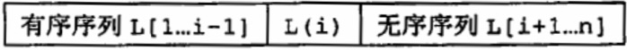

要将元素L(i)插入到有序序列L[1...i - 1]中，需要执行如下操作：

- 查找处L(i)在L[1...i - 1]中的**插入位置k**
- 将L[1...i - 1]中的所有元素依次**后移**一个位置
- 将L(i)复制到L(k)处

因此对排序表使用插入排序只需将L(2) ~ L(n)依次插入到前面的有序序列即可。插入排序在实现上通常采用就地排序，因此**空间复杂度为O(1)**

```c++
using ElemType = int;		// 定义顺序表中的元素类型，可自行修改
```

- 无“哨兵”版

```c++
void InsertSort(ElemType R[], int length) {
    int i, j, temp;
    for (i = 1; i < length; ++i) {
        if (R[i] < R[i - 1]) {  // R[i]要插入到有序序列中
            temp = R[i];
            for (j = i - 1; j >= 0 && R[j] > temp; --j)     // ">"为了保证算法的稳定性
                R[j + 1] = R[j];    // 大于temp的元素后移
            R[j + 1] = temp;    // 放入到插入位置
        }
    }
}
```

- 有“哨兵”版

```c++
void InsertSort(ElemType R[], int length) {
    int i, j;
    for (i = 2; i < length; ++i) {
        if (R[i] < R[i - 1]) {
            R[0] = R[i];	// R[0]为“哨兵”
            for (j = i - 1; R[j] > R[0]; --j)
                R[j + 1] = R[j];
            R[j + 1] = R[0];
        }
    }
}
```

- 运行结果

```c++
int main()
{
    int R[10] = { 5,81,12,62,3,0,25,21,55,48 };
    cout << "排序前：";
    for (int i = 0; i < 10; ++i)
        cout << R[i] << " ";

    InsertSort(R, 10);

    cout << "\n排序后：";
    for (int i = 0; i < 10; ++i)
        cout << R[i] << " ";
    return 0;
}

输出：
无“哨兵”版：
排序前： 5 81 12 62 3 0 25 21 55 48
排序后： 0 3 5 12 21 25 48 55 62 81
    
有“哨兵”版：R[0]处为“哨兵”
排序前： 5 81 12 62 3 0 25 21 55 48
排序后： 48 0 3 12 21 25 48 55 62 81
```

$$
假定初始序列为:49，38，65，97，76，13，27，\overline{49},初始时49可以视为一个已排好序的子序列
$$

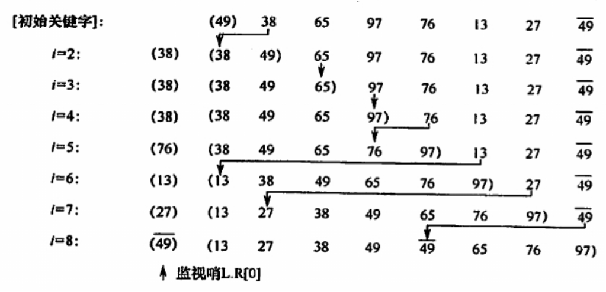

直接插入排序算法性能分析：

- **空间效率**：仅使用了常数个辅助单元，所以**空间复杂度为O(1)**

- **时间效率**：

  最好情况下，即表中元素已经接近有序，时间复杂度为O(n)

  最坏情况下，即初始时表中元素顺序与排序结果刚好相反（逆序），时间复杂度为O(n<sup>2</sup>)

  **平均时间复杂度为O(n<sup>2</sup>)**

- **稳定性**：稳定

- **适用性**：适用于顺序存储和链式存储的线性表


### 折半插入排序

思想：在直接插入排序的基础上加入了折半查找，先折半查找出元素的待插入位置，然后统一地移动插入位置之后的所有元素，只适用于顺序存储的线性表。

- 无“哨兵”版

```c++
void InsertSort(ElemType R[], int length) {
    int i, j, temp, low, mid, high;
    for (i = 1; i < length; ++i) {
        temp = R[i];
        low = 0, high = i - 1;
        while (low <= high) {
            mid = (low + high) / 2;
            if (R[mid] <= temp) low = mid + 1;	// 查找右半子表，取等号是为了保证算法稳定性
            else high = mid - 1;	// 查找左半子表
        }
        for (j = i - 1; j >= low; --j)
            R[j + 1] = R[j];
        R[low] = temp;		// low为插入位置，或者换成high + 1也行
    }
}
```

- 有“哨兵”版

```c++
void InsertSort(ElemType R[], int length) {
    int i, j, low, mid, high;
    for (int i = 2; i < length; ++i) {
        R[0] = R[i];    // R[0]为“哨兵”
        low = 1, high = i - 1;
        while (low <= high) {
            mid = (low + high) / 2;
            if (R[mid] <= R[0]) low = mid + 1;  // 查找右半子表，取等号是为了保证算法稳定性
            else high = mid - 1;    // 查找左半子表
        }
        for (j = i - 1; j >= low; --j)
            R[j + 1] = R[j];
        R[low] = R[0];      // low为插入位置，或者换成high + 1也行
    }
}
```

- 运行结果

```c++
int main()
{
    int R[10] = { 5,81,12,62,3,0,25,21,55,48 };
    cout << "排序前：";
    for (int i = 0; i < 10; ++i)
        cout << R[i] << " ";

    InsertSort(R, 10);

    cout << "\n排序后：";
    for (int i = 0; i < 10; ++i)
        cout << R[i] << " ";
    return 0;
}

输出：
无“哨兵”版：
排序前： 5 81 12 62 3 0 25 21 55 48
排序后： 0 3 5 12 21 25 48 55 62 81
    
有“哨兵”版：R[0]处为“哨兵”
排序前： 5 81 12 62 3 0 25 21 55 48
排序后： 48 0 3 12 21 25 48 55 62 81
```

折半插入排序性能分析：折半排序减少了比较元素的次数，约为O(nlog<sub>2</sub>n)，这个比较次数与排序表的初始状态无关，仅取决于表中的元素个数n；而元素的移动次数并未改变，所以折半插入排序的时间复杂度仍为**O(n<sup>2</sup>)**而且是**稳定**的排序方法。

前面两个插入排序更适用于**基本有序**的排序表和数据量不大的排序表。


###  希尔排序

希尔排序又叫缩小增量排序

**思想**：先将待排序表分割成若干形如L[i, i + d, i + 2d,..., i + kd]的“特殊”子表，即把某个“增量”的记录组成一个子表，对各个子表分别进行直接插入排序，当整个表中的元素已呈“基本有序”时，再对全体记录进行一次直接插入排序。

建议的增量序列为d<sub>i</sub> = n /2，d<sub>i + 1</sub> = ⌊d<sub>i</sub> / 2⌋，并且最后一个等于1

如下：d<sub>1</sub> = 5，d<sub>2</sub> = 3，d<sub>3</sub> = 1

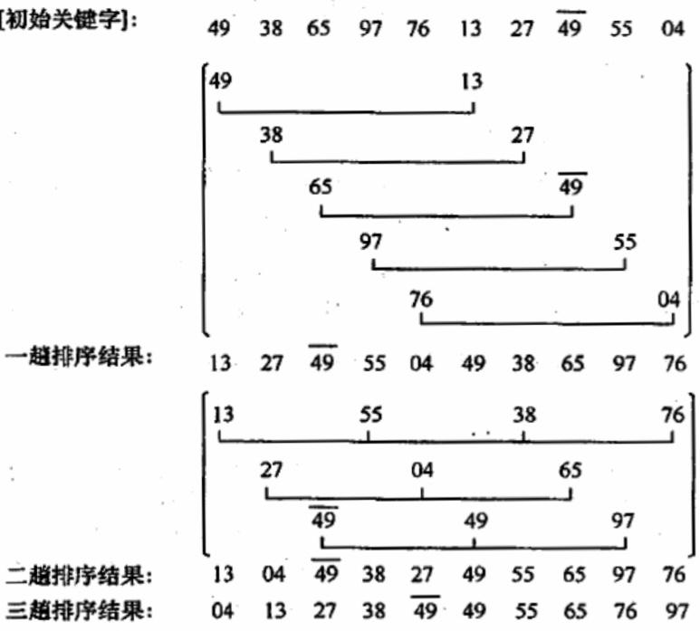

- 使用temp作为暂存单元

```c++
void ShellSort(ElemType R[], int length) {
    int d, i, j, temp;
    for (d = length / 2; d >= 1; d /= 2) {  // 步长变化
        for (i = d; i < length; ++i) {
            if (R[i] < R[i - d]) {  // 需要将R[i]插入到有序增量子表
                temp = R[i];
                for (j = i - d; j >= 0 && temp < R[j]; j -= d)
                    R[j + d] = R[j];    // 记录后移
                R[j + d] = temp;
            }
        }
    }
}
```

- 使用R[0]作为暂存单元

```c++
void ShellSort(ElemType R[], int length) {
    int d, i, j;
    for (d = length / 2; d >= 1; d /= 2) {  // 步长变化
        for (i = d + 1; i < length; ++i) {
            if (R[i] < R[i - d]) {  // 需要将R[i]插入到有序增量子表
                R[0] = R[i];    // R[0]作为暂存单元
                for (j = i - d; j > 0 && R[0] < R[j]; j -= d)
                    R[j + d] = R[j];    // 记录后移
                R[j + d] = R[0];
            }
        }
    }
}
```

- 运行结果

```c++
int main()
{
    int R[10] = { 5,81,12,62,3,0,25,21,55,48 };
    cout << "排序前：";
    for (int i = 0; i < 10; ++i)
        cout << R[i] << " ";

    ShellSort(R, 10);

    cout << "\n排序后：";
    for (int i = 0; i < 10; ++i)
        cout << R[i] << " ";
    return 0;
}

输出：
使用temp作为暂存单元：
排序前： 5 81 12 62 3 0 25 21 55 48
排序后： 0 3 5 12 21 25 48 55 62 81
    
使用R[0]作为暂存单元：R[0]处为“哨兵”
排序前： 5 81 12 62 3 0 25 21 55 48
排序后： 55 0 3 12 21 25 48 55 62 81
```

希尔排序算法性能分析：

- **空间效率**：仅使用了常数个辅助单元，所以**空间复杂度为O(1)**

- **时间效率**：时间复杂度依赖于增量序列的函数，当n在某个特定的范围内，时间复杂度为**O(n<sup>1.3</sup>)**，最坏情况下时间复杂度为O(n<sup>2</sup>)

- **稳定性**：不稳定

- **适用性**：适用于线性表为顺序存储的情况


## 交换排序

思想：根据序列中两个元素关键字的比较结果来对换这两个记录在序列中的位置

### 冒泡排序

思想：从前往后（或从后往前）两两比较相邻元素的值，若为逆序，则交换他们，直到序列比较完，这就是一趟冒泡排序，结果是将最小（大）的元素交换到待排序列的第一（最后）个位置，也就是最小关键字的“上浮”（或最大关键字的“沉底”），每趟冒泡排序都可以确定剩下排序序列中最小（大）关键字的**最终位置**，只需要n - 1趟冒泡排序就能把所有元素排好序。

如下：最小关键字的“上浮”

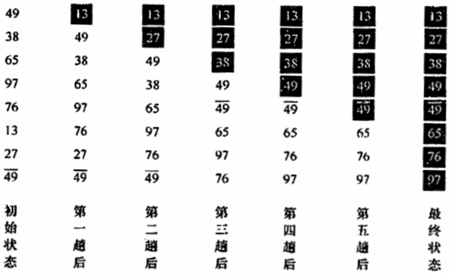

- 从后往前（上浮）

```c++
void BubbleSort(ElemType R[], int length) {
    for (int i = 0; i < length - 1; ++i) {  // 执行n - 1趟
        bool flag = false;  // 记录本趟排序是否有交换
        for (int j = length - 1; j > i; --j) {
            if (R[j] < R[j - 1]) {	// 不取等号是为了保证稳定性
                swap(R[j], R[j - 1]);
                flag = true;
            }
        }
        if (flag == false) return;
    }
}
```

- 从前往后（下沉）

```c++
void BubbleSort(ElemType R[], int length) {
    for (int i = 0; i < length - 1; ++i) {  // 执行n - 1趟
        bool flag = false;  // 记录本趟排序是否有交换
        for (int j = 0; j < length - i; ++j) {
            if (R[j - 1] > R[j]) {	// 不取等号是为了保证稳定性
                swap(R[j], R[j - 1]);
                flag = true;
            }
        }
        if (flag == false) return;
    }
}
```

- 运行结果

```c++
int main()
{
    int R[10] = { 5,81,12,62,3,0,25,21,55,48 };
    cout << "排序前：";
    for (int i = 0; i < 10; ++i)
        cout << R[i] << " ";

    BubbleSort(R, 10);

    cout << "\n排序后：";
    for (int i = 0; i < 10; ++i)
        cout << R[i] << " ";
    return 0;
}

输出：
排序前： 5 81 12 62 3 0 25 21 55 48
排序后： 0 3 5 12 21 25 48 55 62 81
```


冒泡排序性能分析：

**空间效率**：仅使用了常数个辅助单元，所以**空间复杂度为O(1)**

**时间效率**：最好情况下的时间复杂度为O(n)，即初始序列有序时；**平均时间复杂度为O(n<sup>2</sup>)**

**稳定性**：稳定

冒泡排序中所产生的有序子序列一定是全局有序的（不同于直接插入排序），每一趟排序都会将一个元素放置到最终的位置上。


### 快速排序

思想：快速排序思想是基于**分治法**的，在待排序表L[1...n]中任取一个元素pivot作为枢轴（或基准，通常取首元素），通过一趟快速排序将排序表划分为独立的两部分[1...k - 1]和L[k + 1...n]使得L[1...k - 1]的元素全部小于pivot，L[k + 1...n]中的元素全部大于等于pivot，则pivot放在了其最终位置L(k)上，这就是一趟快速排序（或一次划分）。

快速排序过程：是一个交替搜索和交换的过程

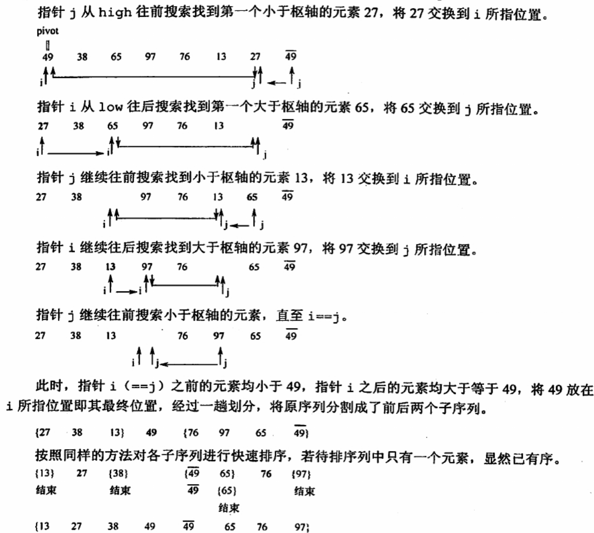


```c++
// 一次划分
int Partition(ElemType R[], int low, int high) {
    int pivot = R[low];     // 首元素作为枢轴
    while (low < high) {
        while (low < high && pivot <= R[high]) --high;
        R[low] = R[high];
        while (low < high && pivot >= R[low]) ++low;
        R[high] = R[low];
    }
    R[low] = pivot;     // 确定枢轴元素的最终位置
    return low;
}

void QuickSort(ElemType R[], int low, int high) {
    if (low < high) {   // 递归出口
        int pivotpos = Partition(R, low, high);
        QuickSort(R, low, pivotpos - 1);	// 划分左子表
        QuickSort(R, pivotpos + 1, high);	// 划分右子表
    }
}

// 封装
void QuickSort(ElemType R[], int length) {
    QuickSort(R, 0, length - 1);
}
```

- 运行结果

```c++
int main()
{
    int R[10] = { 5,81,12,62,3,0,25,21,55,48 };
    cout << "排序前：";
    for (int i = 0; i < 10; ++i)
        cout << R[i] << " ";

    QuickSort(R, 10);

    cout << "\n排序后：";
    for (int i = 0; i < 10; ++i)
        cout << R[i] << " ";
    return 0;
}

输出：
排序前： 5 81 12 62 3 0 25 21 55 48
排序后： 0 3 5 12 21 25 48 55 62 81
```


快速排序的性能取决于划分的操作：

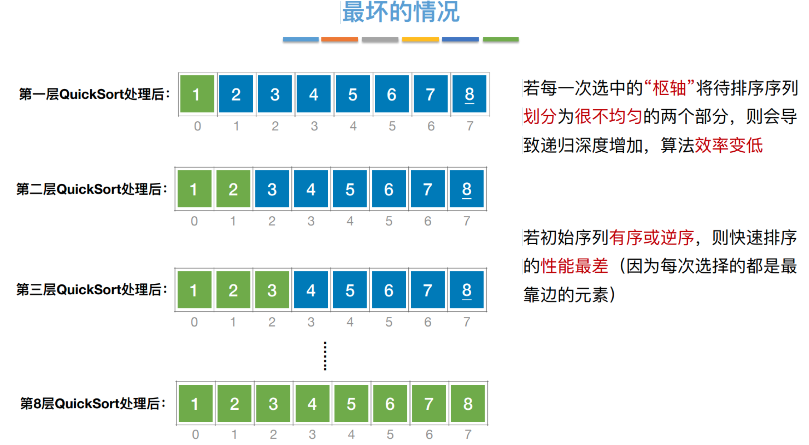


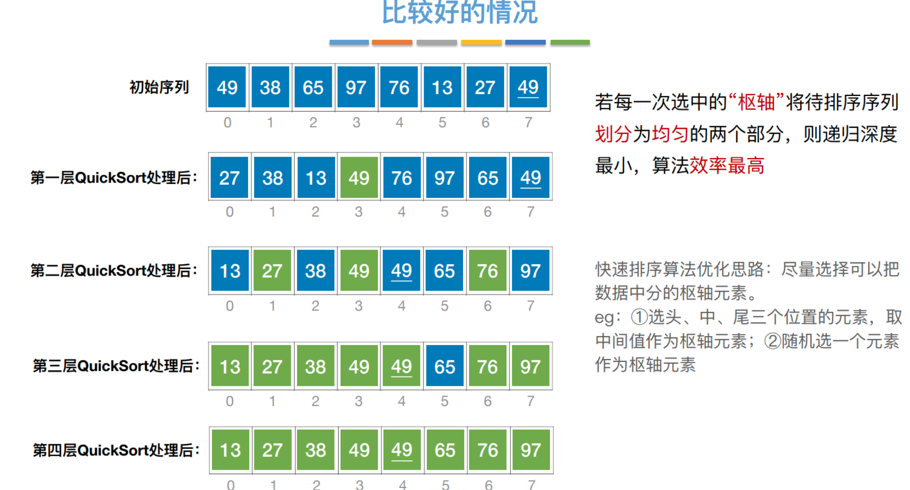


可以看出，最好的情况下，排序过程中枢轴所形成的二叉树高度最小

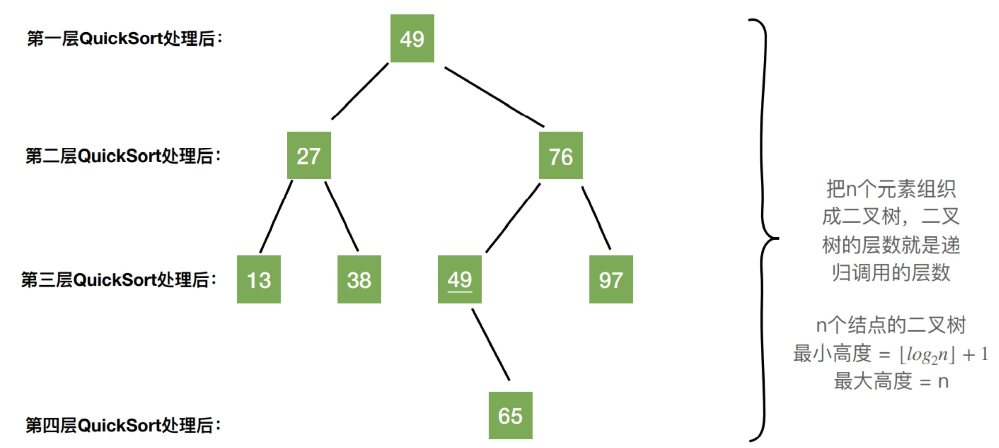


快速排序性能分析：
**空间效率**：由于快速排序是递归的，排序过程中需要借用递归工作栈，栈的容量与递归调用的最大深度一致，最好情况与平均情况下**空间复杂度为O(log<sub>2</sub>n)**，也就是二叉树的高度；最坏情况下空间复杂度为O(n)

**时间效率**：最坏情况下时间复杂度为O(n<sup>2</sup>)，最好和平均情况下**时间复杂度为O(nlog<sub>2</sub>n)**

**稳定性**：不稳定


## 选择排序

思想：每一趟（如第i趟）在后面n - i + 1个待排序元素中选取关键字最小的元素，作为有序子序列的第i个元素，直到第n - 1趟做完，剩下一个就不用再选了。

### 简单选择排序

思想：设表L[1...n]，第i趟即从L[i...n]中选取关键字最小的元素与L(i)交换，每一趟排序可以确定一个元素的最终位置，经过n - 1趟就可以使整个表有序。

```c++
void SelectSort(ElemType R[], int length) {
    int min;
    for (int i = 0; i < length - 1; ++i) {
        min = i;    // 记录最小关键字的下标
        for (int j = i + 1; j < length; ++j)
            if (R[j] < R[min]) min = j;
        if (min != i) swap(R[i], R[min]);   // 把最小元素放到位置L(i)上
    }
}
```

- 运行结果

```c++
int main()
{
    int R[10] = { 5,81,12,62,3,0,25,21,55,48 };
    cout << "排序前：";
    for (int i = 0; i < 10; ++i)
        cout << R[i] << " ";

    SelectSort(R, 10);

    cout << "\n排序后：";
    for (int i = 0; i < 10; ++i)
        cout << R[i] << " ";
    return 0;
}

输出：
排序前： 5 81 12 62 3 0 25 21 55 48
排序后： 0 3 5 12 21 25 48 55 62 81
```


简单选择排序性能分析：

**空间效率**：仅使用了常数个辅助单元，所以**空间复杂度为O(1)**

**时间效率**：元素移动的操作次数很少，不会超过3(n - 1)次，因此**时间复杂度为O(n<sup>2</sup>)**

**稳定性**：不稳定，如：L = {2，**2**，1}，排完序后为L = {1，**2**，2}


### 堆排序

堆的定义：n个关键字序列L[1...n]（一维数组）称为堆，且满足

- **大根堆**：L(i) >= L[2i]且L(i) >= L[2i + 1]（1 ≤ i ≤ ⌊n / 2⌋），最大元素放在根结点
- **小根堆**：L(i) <= L[2i]且L(i) <= L[2i + 1]（1 ≤ i ≤ ⌊n / 2⌋），最小元素放在根结点

如下图是一个大根堆：二叉树为堆的逻辑定义，而在计算机中堆实际上是右边的数组

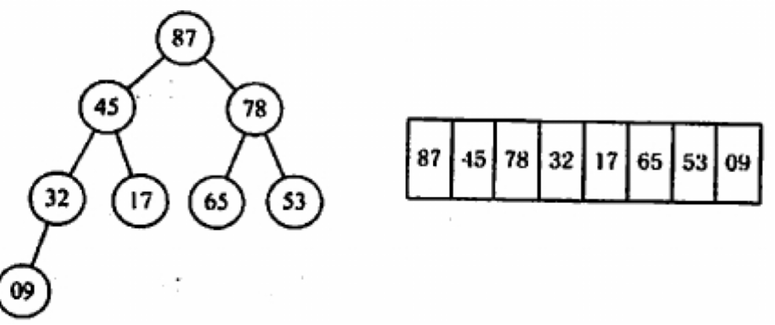

思想：首先将存放在L[1...n]中的n个元素建成初始堆，堆顶元素为最大值。输出堆顶元素后，通常将堆底元素放入堆顶，然后向下调整来维持大根堆的性质，一直重复直到堆中只剩下一个元素为止。

堆排序的**两个关键步骤**：

- 构造初始堆
- 输出栈顶元素然后调整堆

**构造初始堆**：n个结点的完全二叉树，最后一个结是第⌊n / 2⌋个结点的孩子。对第⌊n / 2⌋个结点为根的子树筛选（检查当前结点是否 ≥ 左、右孩子，若果不满足，将当前结点与更大的一个孩子互换。若元素互换破坏了下一级的堆，则采用相同的方法继续向下调整，即小元素不断“**下坠**”，小根堆则相反），使该子树成为堆。然后依次向前对各结点（⌊n / 2⌋ - 1 ~ 1）为根的子树进行筛选，直到根结点。

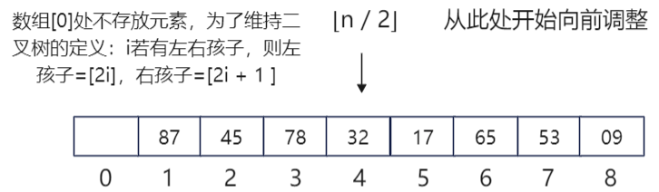

如下图：初始时调整L(4)子树，09 < 32，交换，交换后满足堆的定义；向前继续调整L(3)子树，78 < 左右孩子的较大者87，交换，交换后满足堆的定义：向前调整L(2)子树，17＜左右孩子的较大者 45，交换后满足堆的定义；向前调整至根结点 L(1)，53 < 左右孩子的较大者 87，交换，交换后破坏了L(3)子树的堆，采用上述方法对L(3)进行调整，53 < 左右孩子的较大者78，交换，至此该完全二叉树满足堆的定义。

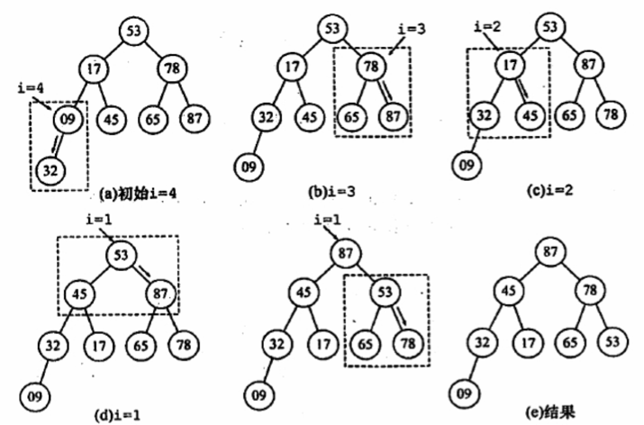

**基于大根堆进行排序（堆排序）**：每一趟将堆顶元素加入有序子序列（与待排序序列中的最后一个元素交换），并将待排序序列再次调整为大根堆（小元素的不断“**下坠**”，下坠调整时关键字的比较次数不会超过4n次）。

如下图：输出堆顶元素87后，将堆的最后一个元素09与堆顶元素交换，此时堆的性质被破坏，需要向下进行筛选。将09和左右孩子的较大者78交换，交换后破坏了L(3)子树的堆，继续对L(3)子树向下筛选，将09和左右孩子的较大者65交换，交换后得到了新堆

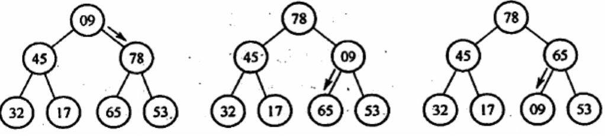

如下图：这时，在计算机的内存中，1 ~ 7为待排序序列，而8为有序子序列，逻辑上二叉树的结点87没有画出来，因为它已经有序，上图的二叉树显示的是都是待排序结点。

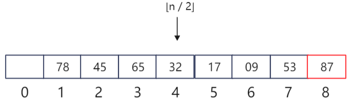

```c++
using ElemType = int;

// 将以root为根的子树调整为大根堆
void HeapAdjest(ElemType R[], int root, int length) {
    R[0] = R[root];     // R[0]暂存子树的根结点
    for (int i = 2 * root; i <= length; i *= 2) {
        if (i < length && R[i] < R[i + 1])     // 找出最大的孩子
            ++i;
        if (R[0] >= R[i]) break;    // 筛选结束
        else {
            R[root] = R[i];
            root = i;
        }
    }
    R[root] = R[0];     // 被筛选结点放入最终位置
}

// 建立大根堆
void BuildMaxHeap(ElemType R[], int length) {
    for (int i = length / 2; i > 0; --i)
        HeapAdjest(R, i, length);
}

// 堆排序
void HeapSort(ElemType R[], int length) {
    BuildMaxHeap(R, length);    // 建立初始堆
    for (int i = length; i > 1; --i) {  // 排序
        swap(R[1], R[i]);
        HeapAdjest(R, 1, i - 1);    // 把剩余的元素调整为堆
    }
}
```

- 运行结果

```c++
int main() {
    int R[11] = { 0,5,81,12,62,3,0,25,21,55,48 };	// 数组R[0]处不存放待排序元素，为了维持二叉树的定义
    cout << "排序前：";
    for (int i = 1; i < 11; ++i)	
        cout << R[i] << " ";

    HeapSort(R, 10);	// 数组长度为11，但待排序序列长度为10

    cout << "\n排序后：";
    for (int i = 1; i < 11; ++i)
        cout << R[i] << " ";
    return 0;
}

输出：
排序前： 5 81 12 62 3 0 25 21 55 48
排序后： 0 3 5 12 21 25 48 55 62 81
```


堆也支持插入操作：把新的结点放在堆的末端，再对这个新结点向上执行调整操作

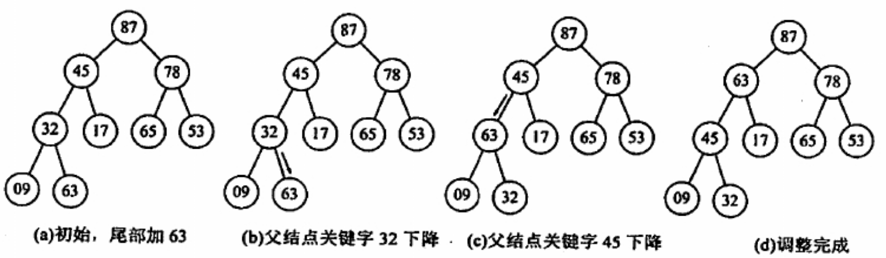

```c++
// 采用vector，因为堆的插入会增加元素的个数，使用数组可能会导致溢出
#include <vector>

// 将以root为根的子树调整为大根堆
void HeapAdjest(vector<ElemType>& R, int root, int length) {
    R[0] = R[root];     // R[0]暂存子树的根结点
    for (int i = 2 * root; i <= length; i *= 2) {
        if (i < length&& R[i] < R[i + 1])     // 找出最大的孩子
            ++i;
        if (R[0] >= R[i]) break;    // 筛选结束
        else {
            R[root] = R[i];
            root = i;
        }
    }
    R[root] = R[0];     // 被筛选结点放入最终位置
}

// 建立大根堆
void BuildMaxHeap(vector<ElemType>& R, int length) {
    for (int i = length / 2; i > 0; --i)
        HeapAdjest(R, i, length);
}

void InsertHeap(vector<ElemType>& R, ElemType value) {
    R.push_back(value);     // 插入尾端
    R[0] = value;   // 保存尾端元素
    for (int i = R.size() - 1; i > 0; i /= 2) {
        if (i / 2 > 0 && R[i] > R[i / 2])	// 判断是否要向上调整
            swap(R[i], R[i / 2]);
        else break;     // 调整完毕
    }
}
```

- 运行结果

```c++
int main() {
    vector<ElemType> R = { 0,65,9,32,87,17,53,78,45 };	// 数组R[0]处不存放待排序元素，为了维持二叉树的定义
    cout << "建堆前：";
    for (int i = 1; i < R.size(); ++i)
        cout << R[i] << " ";

    BuildMaxHeap(R, R.size() - 1);
    cout << "\n建堆后：";
    for (int i = 1; i < R.size(); ++i)
        cout << R[i] << " ";

    InsertHeap(R, 100);
    cout << "\n插入100后：";
    for (int i = 1; i < R.size(); ++i)
        cout << R[i] << " ";
    return 0;
}

输出：
建堆前： 65 9 32 87 17 53 78 45
建堆后： 87 65 78 45 17 53 32 9
插入100后： 100 87 78 65 17 53 32 9 45
```


堆排序适合关键字较多的情况：例如，如何在1亿个数中选出前100个最大值？首先使用一个大小为100的数组，读入前100个数，建立小顶堆，而后依次读入余下的数，若小于堆顶则舍弃，否则用该数取代堆顶并重新调整堆，待数据读取完毕，堆中100个数即为所求。

堆排序算法性能分析：

**空间效率**：仅使用了常数个辅助单元，所以**空间复杂度为O(1)**

**时间效率**：建堆时间为O(n)，每次调整的时间复杂度为O(h)（h = log<sub>2</sub>n），所以最好、最坏和平均情况下，**时间复杂度为O(nlog<sub>2</sub>n)**

**稳定性**：不稳定，如：L = { 1，**2**，2 }，排序后为L= { 1，2，**2** }


## 归并排序和基数排序

### 归并排序

思想：“归并”指将两个或两个以上的有序表合成一个新的有序表。假定待排序表含有n个记录，可以将它看做是n个有序的子表，即每个子表长度为1，然后两两归并，得到⌈n / 2⌉个长度为2或1的有序表；继续两两归并，直到合并成一个长度为n的有序表为止，这就是二路归并排序。如下图的二路归并排序：

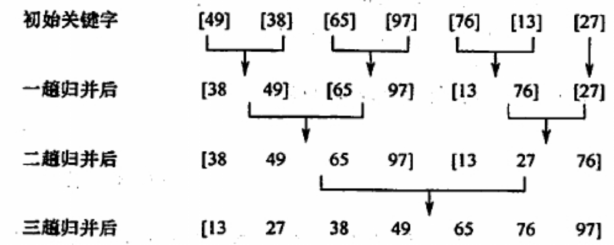

一趟二路归并排序的操作：调用⌈n / 2h⌉次Merge()，将L[1...n]中前后相邻且长度为h的有序段进行两两归并，得到前后相邻、长度为2h的有序段，整个归并排序需要进行⌈log<sub>2</sub>n⌉趟

```c++
#define SIZE 10
using ElemType = int;
ElemType* Temp = new ElemType[SIZE];

void Merge(ElemType R[], int low, int mid, int high) {
    for (int i = low; i <= high; ++i)
        Temp[i] = R[i];     // 将R数组中的元素放入临时数组中
    int p1, p2, p;
    for (p1 = low, p2 = mid + 1, p = p1; p1 <= mid && p2 <= high; ++p) {
        if (Temp[p1] <= Temp[p2])       // 取等号是为了保证稳定性
            R[p] = Temp[p1++];
        else 
            R[p] = Temp[p2++];
    }
    while (p1 <= mid) R[p++] = Temp[p1++];  // 第一个表没有检测完
    while (p2 <= high) R[p++] = Temp[p2++]; // 第二个表没有检测完
}

void MergeSort(ElemType R[], int low, int high) {
    if (low < high) {
        int mid = (low + high) / 2;
        MergeSort(R, low, mid);         // 对左半部分归并排序
        MergeSort(R, mid + 1, high);    // 对右半部分归并
        Merge(R, low, mid, high);       // 归并
    }
}

// 封装
void MergeSort(ElemType R[], int length) {
    MergeSort(R, 0, length - 1);
}
```

- 运行结果

```c++
int main() {
    int R[7] = { 49,38,65,97,76,13,27 };
    cout << "排序前：";
    for (int i = 0; i < 7; ++i)
        cout << R[i] << " ";

    MergeSort(R, 7);

    cout << "\n排序后：";
    for (int i = 0; i < 7; ++i)
        cout << R[i] << " ";
    return 0;
}

输出：
排序前： 49 38 65 97 76 13 27
排序后： 13 27 38 49 65 76 97
```

Merge函数中p1, p2, p的作用：作为“指针”将Temp数组中的元素依次放回原数组中

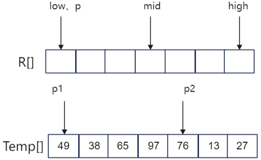

一般来说，对于N个元素进行k路归并排序时，排序的趟数m满足k<sup>m</sup> = N，从而m = log<sub>k</sub>N，又因为m为整数，所以m = ⌈log<sub>k</sub>N⌉


2路归并排序性能分析：

**空间效率**：在Merge操作中，辅助空间为n个单元，所以**空间复杂度为O(n)**

**时间效率**：每趟归并的时间复杂度为O(n)，共需要进行⌈log<sub>2</sub>n⌉，所以**时间复杂度为O(nlog2n)**

**稳定性**：稳定


### 基数排序

基数排序**不基于比较和移动**进行排序，而基于关键字各位的大小进行排序，是一种借助多关键字排序的思想对单逻辑关键字进行排序的方法。

假设长度为n的线性表中每个结点a<sub>j</sub>的关键字由d元组(k<sub>j</sub><sup>d - 1</sup>，k<sub>j</sub><sup>d - 2</sup>，... ，k<sub>j</sub><sup>1</sup>，k<sub>j</sub><sup>0</sup>)组成，满足0 ≤ k<sub>j</sub><sup>i </sup> ≤ r - 1（0 ≤ j < n，0 ≤ i ≤ d - 1），其中k<sub>j</sub><sup>d - 1</sup>为最主位关键字，k<sub>j</sub><sup>0</sup>为最次位关键字。如：十进制0 ~ 9为10元组，满足每一个数字都在0 ~ 9之间，即0 ≤ k<sub>j</sub><sup>i </sup> ≤ 9

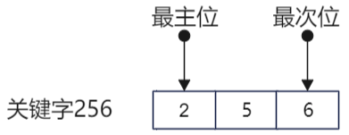

多关键排序的方法：

- 最高位优先（MSD）：按关键字权重**递减**依次逐层划分成若干更小的子序列，最后将所有子序列依连接成一个有序子序列
- 最低位优先（LSD）：按关键字权重**递增**依次逐层划分成若干更小的子序列，最后将所有子序列依连接成一个有序子序列

如：十进制数256，可以写为2 × 10<sup>2</sup> + 5 × 10<sup>1</sup> + 6 × 10<sup>0</sup>，后面的10<sup>k</sup>（k = 0 ，1，2，... ，n）即为各个位的权，十进制的基数为10（0 ~ 9），“逢十进一”

下面描述以r为基数的最低位优先基数排序的排序过程，在排序过程中，使用r个队列Q<sub>0</sub>，Q<sub>1</sub>，... ，Q<sub>r - 1</sub>：

对i = 0， 1，... ，d - 1，依次做一次“分配”和收集（其实就是一次稳定的排序过程）

- **分配**：开始时，把Q<sub>0</sub>，Q<sub>1</sub>，... ，Q<sub>r - 1</sub>各个队列置成空队列，然后依次考察线性表中的每个结点a<sub>j</sub>，若a<sub>j</sub>的关键字k<sub>j</sub><sup>i </sup> = k，就把a<sub>j</sub>放进队列Q<sub>k</sub>队列中
- **收集**：把Q<sub>0</sub>，Q<sub>1</sub>，... ，Q<sub>r - 1</sub>各个队列中的结点依次首尾相接，得到新的结点序列（通常是链表），从而组成新的线性表

如下图的链式基数排序：每个关键字由3位子关键字构成K<sup>1</sup>K<sup>2</sup>K<sup>3</sup>，分别代表百位、十位和各位，采用最低位优先的方式进行排序

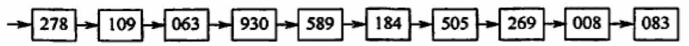

第一趟关键字用最低位关键字K<sup>3</sup>进行，将所有最低位关键字（个位）相等的记录分配到同一个队列，然后进行收集操作，序列按个位关键字递增

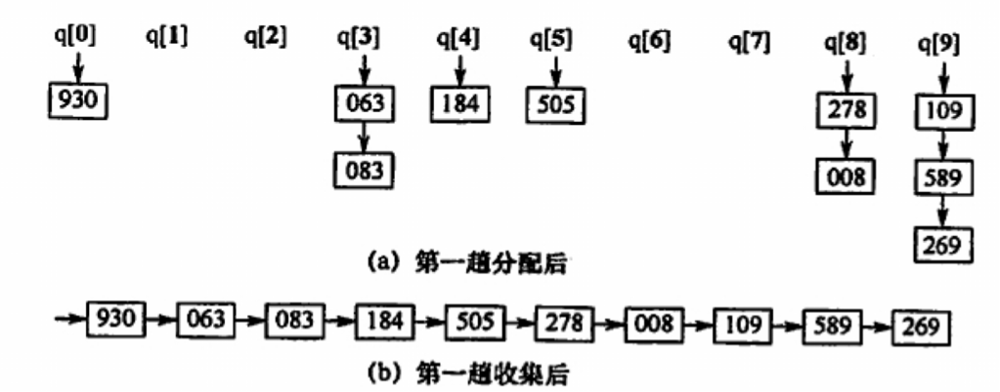

第二趟关键字用中间位关键字K<sup>2</sup>进行，然后进行收集操作，序列按十关键字递增，十位数字相等时按个位关键字递增

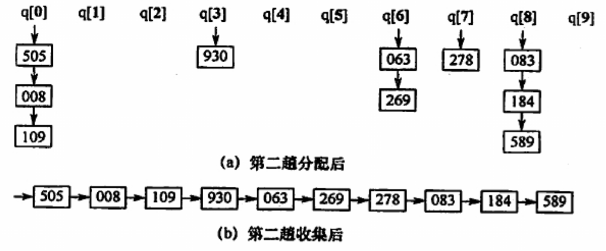

第三趟关键字用最高位关键字K<sup>1</sup>进行，然后进行收集操作，序列按百位关键字递增，百位数字相等时按十位关键字递增，十位数字相等时按个位关键字递增，最后整个序列都是递增的

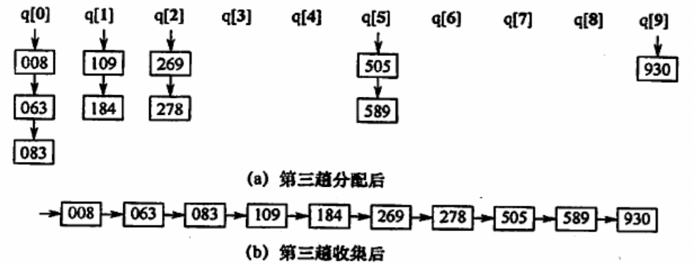

```c++
using ElemType = int;

/* 链表相关操作 */
// 链表结点
typedef struct LinkNode {
    ElemType data;
    struct LinkNode* next;
}LinkNode, * LinkList;

// 尾插法建立链表(有头结点)
LinkList TailInsert(LinkList& L) {
    ElemType value;
    L = new LinkNode();
    LinkNode* node, * tail = L;
    cin >> value;
    while (value != 9999) {		// 9999为结束标志
        node = new LinkNode();
        node->data = value;
        tail->next = node;
        tail = node;
        cin >> value;
    }
    tail->next = nullptr;
    return L;
}

// 回收链表内存
void DeleteLinkList(LinkList& L) {
    LinkNode* p = L, * q;
    while (p != nullptr) {
        q = p;
        p = p->next;
        delete q;
    }
    L = nullptr;
}


/* 队列相关操作 */
// 链队列
typedef struct {
    LinkNode* front, * rear;
}LinkQueue;

// 入队
void EnQueue(LinkQueue& Q, LinkNode*& R) {
    LinkNode* p = R;
    R = R->next;
    Q.rear->next = p;   // 插入队列中
    Q.rear = p;
    p->next = nullptr;
}

// 判空
bool IsEmpty(LinkQueue Q) {
    if (Q.front == Q.rear)
        return true;
    return false;
}

// 初始化队列(包含头结点)
void InitQueue(LinkQueue Queue[], int length) {
    for (int i = 0; i < length; ++i) {
        Queue[i].front = Queue[i].rear = new LinkNode();
        Queue[i].front->next = nullptr;
    }
}

// 回收队列内存
void DeleteQueue(LinkQueue Queue[], int length) {
    for (int i = 0; i < length; ++i) {
        delete Queue[i].front;
        Queue[i].front = Queue[i].rear = nullptr;
    }
}

/* 基数排序相关操作 */
// 获取各个位的数字，使用方法getDigit(数字, 第几位)
int getDigit(int digital, int time) {
    int result = 0;
    for (int i = 0; i < time; ++i) {
        result = digital % 10;
        digital /= 10;
    }
    return result;
}

// 最低位优先的基数排序
void RadixSort(LinkList& L, int digits) {   // digits关键字的长度
    LinkQueue* Queue = new LinkQueue[10];    // 建立10个链队列
    InitQueue(Queue, 10);   // 初始化队列

    for (int i = 1; i <= digits; ++i) { // 一共digits趟（关键字的位数）
        LinkNode* p = L;

        // 一趟分配
        while (p->next != nullptr) {
            EnQueue(Queue[getDigit(p->next->data, i)], p->next);  // 放入对应队列中
        }

        // 一趟收集
        L->next = nullptr;
        p = nullptr;
        for (int j = 0; j < 10; ++j) {
            if (!IsEmpty(Queue[j])) {
                if (L->next == nullptr)   // 第一次连接队列
                    L->next = Queue[j].front->next;
                else       // 后续连接队列
                    p->next = Queue[j].front->next;
                p = Queue[j].rear;
            }
        }

        // 复原队列
        for (int i = 0; i < 10; ++i) {
            Queue[i].rear = Queue[i].front;
            Queue[i].front->next = nullptr;
        }
    }

    // 回收内存
    DeleteQueue(Queue, 10);
}
```

- 运行结果

```c++
int main() {
    // 建立单链表：输入520 211 438 888 007 111 985 666 996 233 168 9999
    LinkList L;
    TailInsert(L);

    LinkNode* p = L->next;
    cout << "排序前：";
    while (p != nullptr) {
        cout << p->data << " ";
        p = p->next;
    }

    RadixSort(L, 3);

    p = L->next;
    cout << "\n排序后：";
    while (p != nullptr) {
        cout << p->data << " ";
        p = p->next;
    }

    // 回收内存
    DeleteLinkList(L);
    return 0;
}

输入：
520 211 438 888 007 111 985 666 996 233 168 9999	// 9999为结束标志
输出：
排序前： 520 211 438 888 7 111 985 666 996 233 168
排序后： 7 111 168 211 233 438 520 666 888 985 996
```


基数排序的应用：

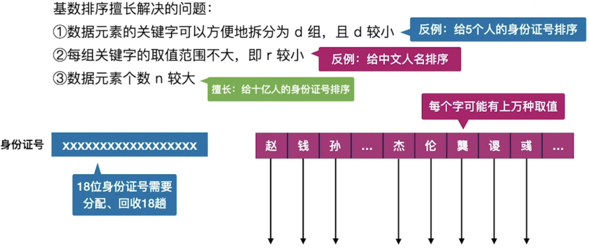


基数排序性能分析

**空间效率**：一趟排序需要的辅助空间为r（r个队列：r个队头指针和r个队尾指针，可重复使用），所以**空间复杂度为O(r)**

**时间效率**：基数排序需要进行d（一个关键字的长度）趟分配和收集，一趟分配要O(n)，一趟收集要O(r)，所以**时间复杂度为O(d*(n + r))**，与序列的初始状态无关

**稳定性**：基数排序中按位排序时必须是稳定的，所以基数排序是稳定的


## 各种内部排序算法的比较

|   算法种类   |                      |      时间复杂度      |                      |     空间复杂度      | 是否稳定 |
| :----------: | :------------------: | :------------------: | :------------------: | :-----------------: | :------: |
|              |       最好情况       |       平均情况       |       最坏情况       |                     |    是    |
| 直接插入排序 |         O(n)         |   O(n<sup>2</sup>)   |   O(n<sup>2</sup>)   |        O(1)         |    是    |
|   冒泡排序   |         O(n)         |   O(n<sup>2</sup>)   |   O(n<sup>2</sup>)   |        O(1)         |    否    |
| 简单选择排序 |   O(n<sup>2</sup>)   |   O(n<sup>2</sup>)   |   O(n<sup>2</sup>)   |        O(1)         |    否    |
|   希尔排序   |                      |                      |                      |        O(1)         |    否    |
|   快速排序   | O(nlog<sub>2</sub>n) | O(nlog<sub>2</sub>n) |   O(n<sup>2</sup>)   | O(log<sub>2</sub>n) |    否    |
|    堆排序    | O(nlog<sub>2</sub>n) | O(nlog<sub>2</sub>n) | O(nlog<sub>2</sub>n) |        O(1)         |    否    |
| 2路归并排序  | O(nlog<sub>2</sub>n) | O(nlog<sub>2</sub>n) | O(nlog<sub>2</sub>n) |        O(n)         |    是    |
|   基数排序   |     O(d(n + r))      |     O(d(n + r))      |     O(d(n + r))      |        O(r)         |    是    |

1）选取排序方法需要考虑的因素

- 待排序的元素数目n
- 元素本身信息量的大小
- 元素本身信息量的大小。关键字的结构及其分布情况
- 稳定性的要求
- 语言工具的条件，存储结构及辅助空间的大小等

2）排序算法小结

- 若n较小，可采用直接插入排序或简单选择排序。由于直接插入排序所需的记录移动次数较简单选择排序的多，因而当记录本身信息量较大时，用简单选择排序较好
- 若文件的初始状态已按关键字基本有序，则选用直接插入排序或冒泡排序为宜
- 若n较大，则应采用时间复杂度为O(nlog<sub>2</sub>n)的排序方法：快速排序、堆排序或归并排序快速排序被认为是目前基于比较的内部排序方法中最好的方法，当待排序的关键字随机分布时，快速排序的平均时间最短。堆排序所需的辅助空间少于快速排序，并且不会出现快速排序可能出现的最坏情况，这两种排序都是不稳定的。若要求排序稳定且时间复杂度为O(nlog<sub>2</sub>n)，则可选用归并排序。但本章介绍的从单个记录起进行两两归并的排序算法并不值得提倡，通常可以将它和直接插入排序结合在一起使用。先利用直接插入排序求得较长的有序子文件，然后两两归并。直接插入排序是稳定的，因此改进后的归并排序仍是稳定的
- 在基于比较的排序方法中，每次比较两个关键字的大小之后，仅出现两种可能的转移，因此可以用一棵二叉树来描述比较判定过程，由此可以证明：当文件的n个关键字随机分布时，任何借助于“比较”的排序算法，至少需要O(nlog<sub>2</sub>n)的时间
- 若n很大，记录的关键字位数较少且可以分解时，采用基数排序较好
- 当记录本身信息量较大时，为避免耗费大量时间移动记录，可用链表作为存储结构
