# 查找

<br/>

## 查找的基本概念

**查找**：在数据集合中寻找满足某种条件的数据元素的过程称为查找。

**查找表（查找结构）**：用于查找的数据集合称为查找表，它由同一类型的数据元素（或记录）组成。

对查找表进行的操作一般有四种：

- ① 查询某个特定的数据元素是否在查找表中
- ② 检索满足条件的某个特定的数据元素的各种属性
- ③ 在查找表中插入一个数据元素
- ④ 从查找表中删除某个数据元素

**静态查找表**：只涉及到上述操作①②的查找表，无需动态地修改查找表。如：顺序查找、折半查找、散列查找等

**动态查找表**：需要动态地插入或删除的查找表。如：二叉树排序树的查找、散列查找等。

**关键字**：数据元素中唯一标识该元素的某个数据项的值。

**平均查找长度**：所有查找过程中进行关键字的比较次数的平均值，是衡量算法效率最重要的指标。

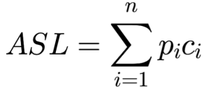

**n**：查找表的长度；**P<sub>i</sub>**：查找第i个数据元素的概率；**C<sub>i</sub>**：找到第i个元素所需进行的比较次数

<br/>

## 顺序查找和折半查找

### 顺序查找

#### 一般线性表的顺序查找

**定义**：顺序查找又叫线性查找，适用于顺序表和链表。

**思想**：从线性表的一端开始，逐个检查关键字是否满足给定的条件，若查找成功，则返回元素在线性表中的位置；否则返回错误信息

- 顺序表定义

```c++
using ElemType = int;		// 定义顺序表中的元素类型，可自行修改
typedef struct {
    ElemType *elem;
    int length;
}SSTable;
```

- 有”哨兵“版

```c++
int SequenceSearch(SSTable ST, ElemType value) {
    ST.elem[0] = value;	// "哨兵"
    int i;
    for (i = ST.length; ST.elem[i] != value; --i);
    return i;	// 若表中不存在元素value，则返回0
}
```

引入“哨兵”ST.elem[0]的目的是为了使得for循环内不必判断数组是否越界，因为满足i == 0时，循环一定会跳出。

- 无“哨兵”版

```c++
int SequenceSearch(SSTable ST, ElemType value){
    for(int i = 0; i < ST.length; ++i)
        if(value == ST.elem[i])
            return i;	// 查找成功
    return -1;		// 查找失败
}
```

- 运行结果

```c++
int main(){
    SSTable ST;
    ST.elem = new int[10];
    ST.length = 10;		// 初始化ST对象
    for (int i = 0; i < ST.length; ++i)		// 赋值
        ST.elem[i] = i;
    cout << "ST:";
    for (int i = 0; i < ST.length; ++i)     // 输出ST内的元素
        cout << ST.elem[i] << " ";
    cout << endl << "下标为：" << SequenceSearch(ST, 3);
    return 0
}

输出：
ST:0 1 2 3 4 5 6 7 8 9
下标为：3
```

对于有n个元素的表，给定value值与表中第i个元素相等，即查找成功时，需要进行n - i + 1次关键字比较，即C<sub>i</sub> = n - i + 1

查找成功时，顺序查找的平均长度为

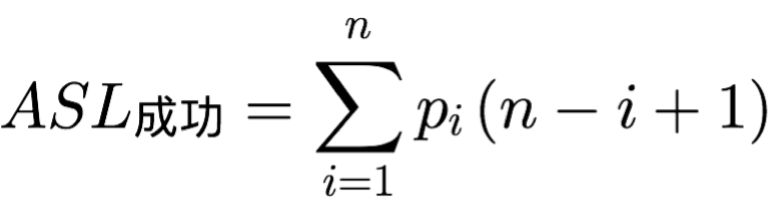

当每个元素的查找概率相等，即P<sub>i</sub> = 1/n时

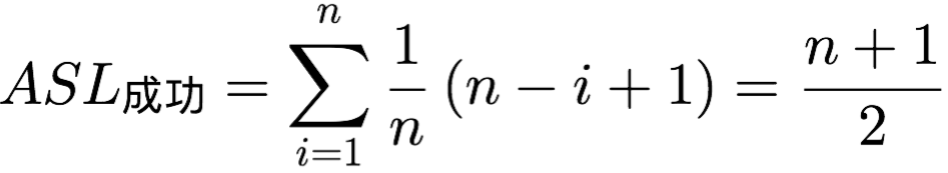

查找不成功时，顺序查找的平均长度为

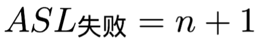

**顺序查找评价**

- 优点：对数据存储没有要求，顺序存储和链式存储都可以
- 缺点：当n较大时，平均查找长度较长

#### 有序表的顺序查找

**思想**：若在查找之前就已经知道表是关键字有序的，则查找失败时就不用查找整个表，假设表L是按关键字从小到大排列的，查找的顺序是从前往后，当查找到第i个元素时，发现第i个元素的值小于value，第i + 1个元素的值大于value，这时就可以判断是查找失败了，因为后面的元素的关键字均大于value。

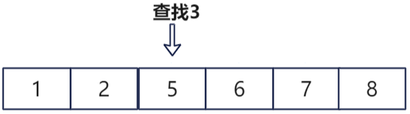

```c++
int SequenceSearch(SSTable ST, ElemType value) {
    for (int i = 0; i < ST.length; ++i) {
        if (value == ST.elem[i])
            return i;	// 查找成功
        else if (value < ST.elem[i])
            return -1;  // 查找失败
    }
    return -1;		// 查找失败，value值大于ST中所有元素的值
}
```

<br/>

### 折半查找

**定义**：折半查找又叫二分查找，仅适用于有序的顺序表

**思想**：将给定的value与表中中间位置进行比较，若相等，则查找成功；若不等，则value值只可能在中间元素以外的前半部分或后半部分。

```c++
int BinarySearch(SSTable ST, ElemType value){
    int low = 0, high = ST.length - 1, mid;
    while(low <= high){
        mid = (low + high) / 2;
        if(value == ST.elem[mid]) 
            return mid;		// 查找成功，返回下标
        else if(value < ST.elem[mid]) 
            high = mid - 1;		// 在前半部分继续查找
        else
            low = mid + 1;		// 在后半部分继续查找
    }
}
```

- 运行结果

```c++
int main()
{
    SSTable ST;
    ST.elem = new int[10];
    ST.length = 10;
    for (int i = 0; i < ST.length; ++i)
        ST.elem[i] = i;
    cout << "ST:";
    for (int i = 0; i < ST.length; ++i)     // 输出ST内的元素
        cout << ST.elem[i] << " ";
    cout << endl << "下标为：" << BinarySearch(ST, 3);
    return 0;
}

输出：
ST:0 1 2 3 4 5 6 7 8 9
下标为：3
```

如，已知11个元素的有序表{5，8，10，11，23，32，35，50，53，66，69}，要查找值为11的元素，指针low和high分别指向表的下界和上界，mid则指向表的中间位置⌊(low + high) / 2⌋

- 初始：

  low = 0, high = 10, mid = (0 + 10) / 2= 5

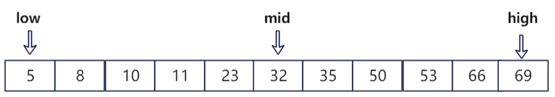

- 第一次查找：

  ST.elem[mid]为32，value为11,11 < 32，所以应该在mid的左半部分查找，low = 0, high = 5 - 1 = 4, mid = (0 + 4) / 2= 2，第一次查找的范围为[0,2]

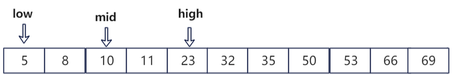

- 第二次查找：

  ST.elem[mid]为10，value为11,11 > 10，所以应该在mid的右半部分查找，low = 2 + 1 = 3, high = 4, mid = (3 + 4) / 2= 3，第二次查找的范围为[3,4]

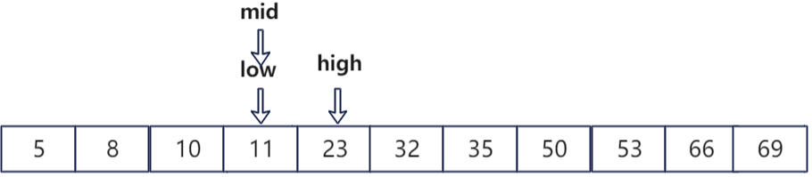

这时ST.elem[mid] == value查找成功，返回mid的值。

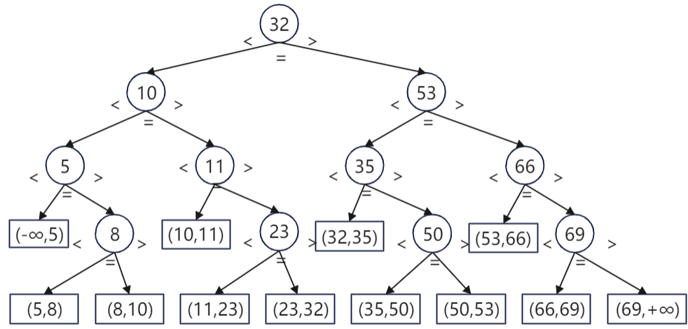

折半查找的过程可用二叉树来表示，称为判定树。树中每个圆形结点表示一个记录，结点中的值即为记录的关键字值；树最下面大的叶子结点都是方形的，它表示查找不成功的情况。从树中可以看出：

- 查找成功时，查找长度为从根结点到目的结点的路径上的结点数。
- 查找不成功时，查找长度为从根结点到对应失败结点的父节点路径上的结点数。

- 每个结点值均大于其左结子点值，且均小于其右子结点值。
- 判定树为一颗平衡二叉树

所以，用折半查找到给定值的比较次数组多不会超过树的高度，因此折半查找的时间复杂度为O(log₂n)

<br/>

### 分块查找

分块查找又叫索引顺序查找，它吸取了顺序查找和折半查找的各自的优点

**思想**：将查找表分为若干子块，块内的元素可以无序，但块之间是有序的，即第i个块的最大关键字小于第i + 1个块大的最小关键字；索引表中的每个元素含有各块的最大关键字和各块中的第一个元素的地址，索引表按关键字有序排列。

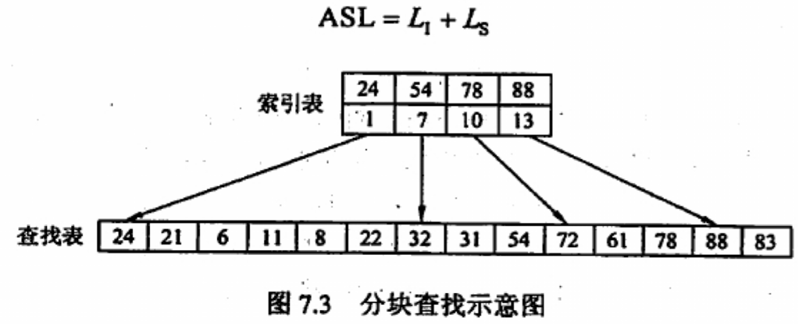

分块查找过程分为两步：

- 第一步是在索引表中确定待查记录所在的块，可以顺序查找或折半查找索引表
- 第二步是在块内顺序查找

<br/>

## B树和B+树

### B树及其基本操作

**定义**：B树，又称为多路平衡查找树，B树种所有结点的孩子个数的最大值称为B树的阶(m)。一棵m阶B树或为空树，或为满足如下特性的m叉树：

- 树中每个结点至多有m棵子树，即至多含有m - 1个关键字
- 若根结点不是终端结点，则至少有两棵子树
- 除根结点以外的非叶子结点至少有⌈m / 2⌉棵子树，即至少含有⌈m / 2⌉ - 1个关键字
- 所有叶子结点都出现在同一层次上，并且不带信息(可视为外部信息或类似于查找判定树的查找失败结点)
- 关键字的值：子树0 < 关键字1 < 子树1 < 关键字2 < 子树2 <...

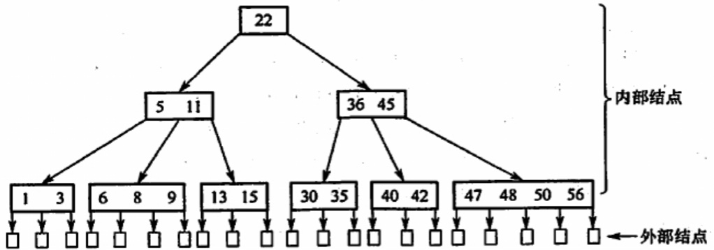

#### B树的高度

若n ≥ 1，则对任意一棵包含n个关键字、高度为h、阶数为m的B树：

- 树中关键字的个数应满足n ≤ (m - 1)(1 + m + m² + ... + m^h-1) = m^h - 1，因此有h ≥ log<sub>m</sub>(n + 1)

- 另一个公式为h ≤ log<sub>⌈m / 2⌉</sub>((n + 1) / 2) + 1，请自行推导

#### B树的查找

在B树上的查找与二叉查找树很相似，包含了两个操作：

- 在B树中查找结点
- 在结点内查找关键字

由于B树常存储在磁盘上，因此前一个查找操作是在磁盘上进行的，而后一个操作是在内存中进行的。

#### B树的插入

将关键字key插入B树的过程：

- 定位：利用B树的查找算法，找出插入该关键字的最低层的某个非叶结点。
- 插入：因为B树中，每个非失败结点的关键字个数都在[⌈m / 2⌉ - 1, m - 1]内。若插入后的结点关键字个数小于m，可以直接插入；若插入后结点的关键字个数大于m - 1，则必须对结点进行分裂。

分裂的方法：取一个新结点，在插入key后的原结点，从中间位置(⌈m / 2⌉)将其中的关键字分为两部分

- 左部分包括的关键字放在原结点中
- 右部分的关键字放到新结点中
- 中间位置(⌈m / 2⌉)的结点插入原结点的父结点

若此时导致其父结点的关键字个数也超过了上限(⌈m / 2⌉ - 1)，则继续分裂下去，直到根结点为止。

如下图m = 3的B树，结点中最多有m - 1 = 2个关键字，中间位置为⌈m / 2⌉ - 1 = 2 - 1 = 1

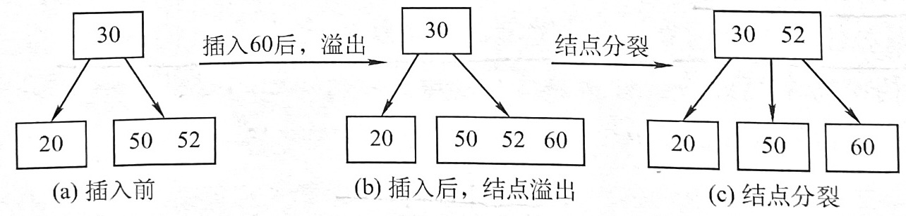

#### B树的删除

当被删除关键字不在终端结点时(最底层非叶结点)中时，可以用k的前驱或后继k‘来代替k，然后再相应的结点中删除k’，关键字k‘必定落在某个终端结点中，这时就转变为删除终端结点的情况

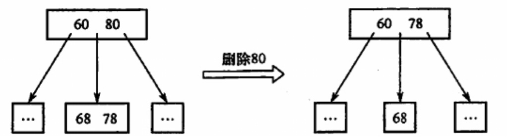

当被删除结点在终端结点(最底层非叶结点)时，有三种情况：

- 直接删除关键字：若被删除关键字所在结点的关键字个数 ≥ ⌈m / 2⌉，表明删除该关键字后任满足B树的定义，则直接删除该关键字
- 兄弟够借：若被删除关键字所在结点的关键字个数 = ⌈m / 2⌉ - 1，且与此结点相邻的右（或左）兄弟结点的关键字个数 ≥ ⌈m / 2⌉，则需要调整该结点、右（或左）兄弟结点及其双亲结点，以达到新的平衡

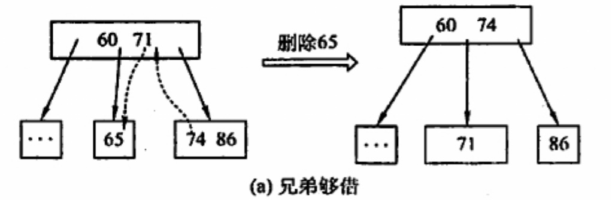

- 兄弟不够借：若被删除关键字所在结点的关键字个数 = ⌈m / 2⌉ - 1，且与此结点相邻的右（或左）兄弟结点的关键字个数均 = ⌈m / 2⌉ - 1，则将关键字删除后与右（或左）兄弟结点及双亲结点中的关键字进行合并

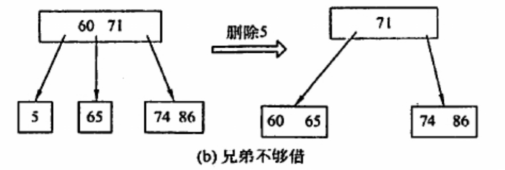

在合并过程中，双亲结点中的关键字个数会减1，若双亲结点是根结点且关键字减少至0，则直接将根结点删除，合并后的新结点成为根；若双亲结点不是根结点，且关键字个数减少到⌈m / 2⌉ - 2，则又要与它自己的兄弟结点进行调整或合并操作，并重复上述步骤，直至符合B树的要求为止。

<br/>

### B+树的基本概念

一棵m阶的B+树需要满足的条件：

- 每个分支结点最多有m棵子树（孩子结点）
- 非叶根结点至少有两棵子树，其他每个分支结点至少有⌈m / 2⌉棵子树
- 结点的子树个数与关键字个数相等
- 所有叶结点包含全部关键字及指向相应记录的指针，叶结点将关键字按大到小顺序排列，并且相邻叶结点按大小顺序相互链接起来（支持顺序查找）
- 所有分支结点中仅包含它的各个子结点中关键字的最大值及指向其子结点的指针（类似于分块查找）

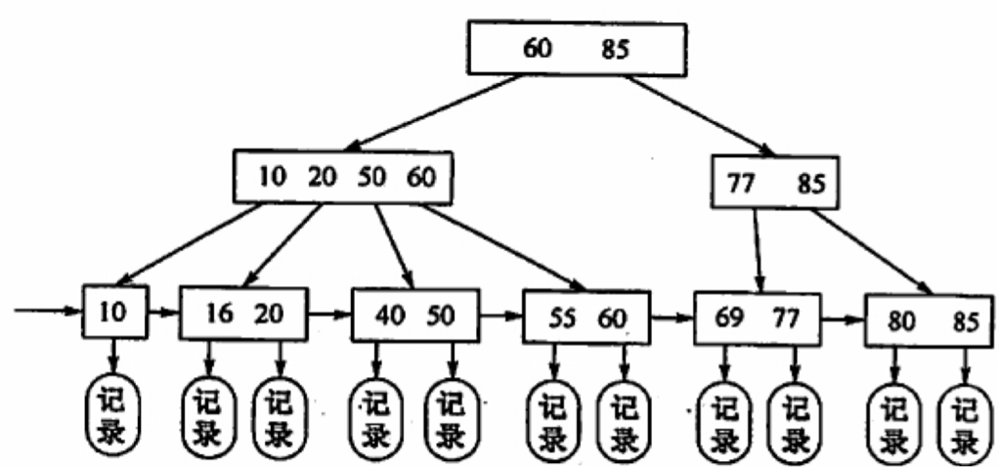

B树与B+树的区别：

|                | m阶B树                                         | m阶B+树                                              |
| -------------- | :--------------------------------------------- | ---------------------------------------------------- |
| 类比           | 二叉查找树的进化->m叉查找树                    | 分块查找的进化->多级分块查找                         |
| 关键字与分叉   | m个关键字对应m + 1个分叉                       | m个关键字对应m个分叉                                 |
| 结点包含的信息 | 所有结点中都包含记录的信息                     | 只有最下层叶结点才包含记录的信息                     |
| 查找方式       | 不支持顺序查找。查找成功时可能停在任何一层结点 | 支持顺序查找，无论查找成功或失败都会到达最下一层结点 |

相同点：  除根结点外，最少要有⌈m / 2⌉个分叉（确保结点不要太空），任何一个结点的子树都要一样高（保持绝对平衡）

<br/>

## 散列表

### 基本概念

**散列函数**：一个把查找表中的关键字映射成该关键字对应的地址的函数，记为Hash(key) = Addr（地址可以是数组下标、索引或内存地址等）

**冲突**：不同的关键字被映射到了相同的地址（冲突是只能减少但**无法避免**的）。如：key1 ≠ key2，但Hash(key1) = Hash(key2)

**同义词**：上面发生冲突的关键字key1和key2即为同义词

**散列表**：根据关键字直接进行访问的数据结构，即散列表建立了关键字和存储地址之间的一种直接映射关系

理想情况下对散列表进行查找的时间复杂度为O(1)，与表中元素的个数无关

<br/>

### 散列表的构造方法

注意：

- 散列函数的定义域要包含所有需要存储的关键字，而值域的范围则取决于散列表的大小或地址范围
- 散列函数计算出来的地址应该尽可能均匀地分布在整个地址空间中，减少冲突的发生
- 散列函数要尽可能简单，能在较短的时间内计算出来

常用的散列函数：

#### 直接定址法

直接取关键字的某个线性函数值为散列地址，散列函数为：**H(key) = key**或**H(key) = a × key + b**（就是数学上的y = a*x + b， a、b为常数）。这种方法不会产生冲突，适合关键字分布基本连续的情况，若关键字分布不连续，空位较多，则会造成空间的浪费。

#### 除留余数法

假定散列表表长为m，取一个不大于m但最接近或等于m的质数p，散列函数为：**H(key) = key % p**（p的取法详见《数论》），此方法的关键是选好p值，使得每个关键字能等概率地映射到散列空间中。

#### 数字分析法

设关键字是r进制数，而r个数码在各位上出现的频率不一定相同，可能在某些位上分布均匀些，各种数码位出现的机会均等。可以选取数码位分布较为均匀的若干位作为散列地址。这种方法适用于已知的关键字集合，若更换了关键字，则需要重新构造新的散列函数。

例子：

如手机号码的0~9（10个数码位）即为十进制数，假设手机号码为11位，每个位置上数字0~9出现的机会是相同的

现有手机号码：

133XXXX1234

133XXXX8162

...

133XXXX1182

133XXXX9884

以它们作为关键字设计散列函数，则可以构造一个长度为10000（10<sup>4</sup>，基数r = 10，有4位）的散列表，以手机号码后四位作为散列地址

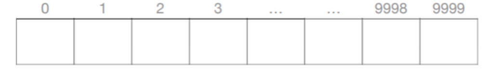

#### 平方取中法

取关键字的平方值的中间几位作为散列地址。这种方法得到的散列地址与关键字的每位都有关系，因此使得散列地址分布比较均匀，适用于关键字的每位取值都不够均匀或均小于散列地址所需要的位数。

<br/>

### 处理冲突的方法

#### 开放定址法

指可存放新表项的空闲地址既向它的同义词表项开放，又向它的非同义词表项开放。公式为：**H<sub>i</sub> = (H(key) + d<sub>i</sub>) % m**，i：第i次发生冲突，m：散列表长，d<sub>i</sub>：为增量序列

使用开放定址法时，删除结点不能简单地将被删除结点的空间置为空，否则将截断在它之后填入散列表的同义词结点的查找路径，可以做一个“删除标记”进行逻辑删除，因此需要定期维护散列表，把删除标记的元素物理删除

- **线性探测法**：d<sub>i</sub> = 0，1，2，...，n；即发生冲突时，每次往后探测相邻的下一个单元是否为空。这个方法可能会导致大量元素在相邻的散列地址上“**聚集（或堆积）**”起来，大大降低了查找效率

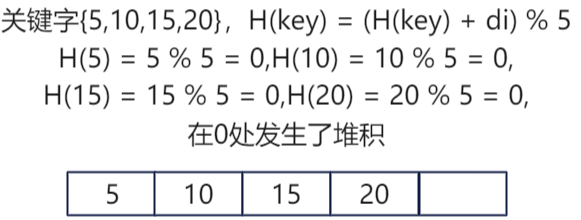

- **平方探测法(二次探测法)**：d<sub>i</sub> = 0<sup>2</sup>，1<sup>2</sup>，-1<sup>2</sup>，2<sup>2</sup>，-2<sup>2</sup>，...，k<sup>2</sup>，-k<sup>2</sup>（k ≤ m / 2）；散列表长度m必须是一个可以表示成4k + 3的素数（原因见《数论》）。这个发放可以避免堆积的问题，缺点是不能探测到散列表上的所有单元，但至少能探测到一半单元。
- **再散列法（双散列法）**：d<sub>i</sub> = Hash<sub>2</sub>(key)；需要使用两个散列函数，公式为H<sub>i</sub> = (H(key) + i × Hash<sub>2</sub>(key)) % m，最多经过，m - 1次探测就会遍历表中所有位置
- **伪随机序列法**：d<sub>i</sub> = 伪随机数序列

#### 拉链法（链接法）
把所有同义词存储在一个线性链表中，这个线性链表由其散列地址唯一标识，如：关键字序列为{19，14，23，01，68，20，84，27，55，11，10，79}，散列函数H(key) = key % 13

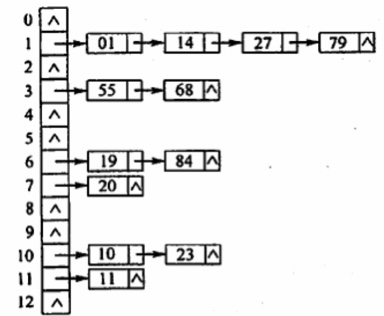

此方法适用于经常插入和删除的情况

### 散列表查找及性能分析

查找过程步骤：

初始化：Addr = Hash(key)

- ①检测表中地址为Addr的位置上是否有记录，若无记录，返回查找失败；若有记录，比较它与key的值，若相等，则返回查找成功标志，否则执行步骤②
- ②用给定的处理冲突方法计算“下一个散列地址”，然后使Addr 设置为此地址，执行步骤①

由此可见：

- 散列表的查找过程仍然是一个给定值和关键字进行比较的过程，因此，平均查找长度（ASL）仍然是衡量散列表的查找效率的度量
- 散列表的查找效率取决于三个因素：散列函数，处理冲突的方法和装填因子

**装填因子α**：定义为一个表的装满程度，α = 表中记录数n / 散列表长度m，散列表的ASL依赖于散列表的装填因子，而不直接依赖于n或m