# 栈和队列

## 栈

### 栈的基本概念

定义：

- 栈：只允许在一端进行插入或删除操作的线性表
- 栈顶：线性表允许进行插入删除的那一端
- 栈底：不允许进行插入删除的另一端
- 空栈：不含任何元素的空表

假设某个栈S = (a<sub>1</sub>，a<sub>2</sub>，a<sub>3</sub>，a<sub>4</sub>，a<sub>5</sub>)，如下图，a<sub>1</sub>为栈底元素，a<sub>5</sub>为栈顶元素，由于栈**后进先出LIFO（先进后出）**的特性，这个栈的进栈顺序依次为a<sub>1</sub>，a<sub>2</sub>，a<sub>3</sub>，a<sub>4</sub>，a<sub>5</sub>，而出栈顺序为a<sub>5</sub>，a<sub>4</sub>，a<sub>3</sub>，a<sub>2</sub>，a<sub>1</sub>

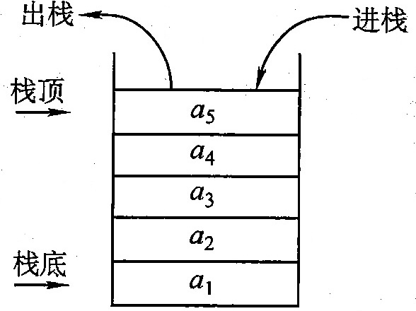

**卡特兰数**：n个不同元素进栈，出栈元素不同排列的个数为：
$$
\frac{1}{n + 1}C_{2n}^{n}
$$


### 栈的顺序存储结构

#### 顺序栈的实现

采用顺序存储的栈称为顺序栈，它利用一组地址连续的存储单元存放自栈底到栈顶的数据元素，同时设置一个指针（top），用来指示当前栈顶元素的位置

```c++
// 进栈操作：栈不满时，栈顶指针先加1，再送值到栈顶元素
// 出栈操作：栈非空时，先取栈顶元素值，再将栈顶指针减1
// 栈空条件：S.top == -1
// 栈满条件：S.top == MaxSize - 1
// 栈长：S.top + 1

// 若栈顶指针初始化为S.top = 0，即top指向栈顶元素的下一个位置
// 则入栈操作变为S.data[S.top++] = value;
// 出栈操作变为value = S.data[--S.top];

#define MaxSize 50
using ElemType = int;

typedef struct {
    ElemType data[MaxSize];
    int top;    // 栈顶指针
}SqStack;

// 初始化
void InitStack(SqStack& S) {
    S.top = -1;     // 初始化栈顶指针
}

// 判栈空
bool StackIsEmpty(SqStack S) {
    if (S.top == -1)
        return true;
    return false;
}

// 进栈
bool Push(SqStack& S, ElemType value) {
    if (S.top == MaxSize - 1)   // 栈满，报错
        return false;
    S.data[++S.top] = value;    // 指针先加1，再入栈
    return true;
}

// 出栈
bool Pop(SqStack& S, ElemType& value) {
    if (S.top == -1)    // 栈空，报错
        return false;
    value = S.data[S.top--];    // 指针先减1，再出栈
    return true;
}

// 读栈顶元素
bool GetTop(SqStack S, ElemType& value) {
    if (S.top == -1)    // 栈空，报错
        return false;
    value = S.data[S.top];
    return true;
}

// 打印栈
void PrintStack(const SqStack& S) {
    if (S.top == -1) return;
    cout << "栈：";
    for (int i = 0; i <= S.top; ++i)
        cout << S.data[i] << " ";
    cout << endl;
}
```

- 运行结果

```c++
int main() {
    SqStack S;
    InitStack(S);

    cout << "输入数据（输入9999结束）：";
    int value;
    cin >> value;
    while (value != 9999) {
        Push(S, value);
        cin >> value;
    }
    PrintStack(S);

    int topValue;
    cout << "栈顶元素为：";
    GetTop(S, topValue);
    cout << topValue << endl;

    cout << "出栈\n";
    Pop(S, topValue);
    PrintStack(S);

    cout << "栈长：" << S.top + 1;
    return 0;
}

输出：
输入数据（输入9999结束）： 5 85 95 22 12 30 1 25 36 54 9999
栈： 5 85 95 22 12 30 1 25 36 54
栈顶元素为： 54
出栈
栈： 5 85 95 22 12 30 1 25 36
栈长： 9
```


#### 共享栈

利用栈底位置不变的特性，可以让两个顺序栈共享一个一维数组空间，将两个栈的栈底分别设置在共享空间的两端，两个栈顶向共享空间的中间延伸，如下图所示：

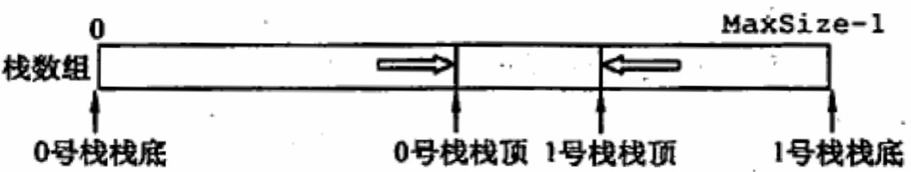

两个栈的栈顶指针都指向栈顶元素，top0 == -1时0号栈为空，top1 == MaxSize时1号栈为空；仅当两个栈顶指针相邻（top1 - top0 == 1）时，判断为栈满。共享栈是为了更有效地利用存储空间，两个栈的空间相互调节，只有在整个存储空间被占满时才发生上溢。其存取数据的时间复杂度为O(1)，所以对存取效率没什么影响。


### 栈的链式存储结构

采用链式存储结构的栈称为链栈，链栈其实就是单链表，优点是便于多个栈共享存储空间和提高效率，且不存在栈满上溢的情况。链栈的所有操作都是在表头进行的，这里链栈不定义头结点，Lhead指向栈顶元素，如下图：

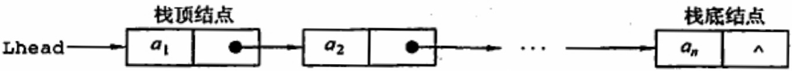

```c++
#define MaxSize 50
using ElemType = int;

typedef struct LinkNode {
    ElemType data;
    struct LinkNode* next;
}*LiStack;

/* 以下实现均不包含头结点 */
// 初始化
void InitLiStack(LiStack& S) {
    S = nullptr;
}

// 判栈空
bool StackIsEmpty(LiStack S) {
    if (S == nullptr)
        return true;
    return false;
}

// 进栈
bool Push(LiStack& S, ElemType value) {
    LinkNode* node = new LinkNode();
    node->data = value;
    node->next = nullptr;
    if(S != nullptr)
        node->next = S;
    S = node;
    return true;
}

// 出栈
bool Pop(LiStack& S, ElemType& value) {
    if (S == nullptr)
        return false;
    LinkNode* p = S;
    S = S->next;
    delete p;
    return true;
}

// 读栈顶元素
bool GetTop(LiStack S, ElemType& value) {
    if (S == nullptr)
        return false;
    value = S->data;
    return true;
}

// 栈长
int GetSize(LiStack S) {
    if (S == nullptr)
        return 0;
    LinkNode* p = S;
    int count = 1;
    while (p->next != nullptr) {
        p = p->next;
        ++count;
    }
    return count;
}

// 销毁栈
void DeleteStack(LiStack& S) {
    if (S == nullptr) return;
    LinkNode* p = S;
    while (S != nullptr) {
        S = S->next;
        delete p;
        p = S;
    }
}

// 打印栈
void PrintStack(const LiStack& S) {
    if (S == nullptr) return;
    LinkNode* p = S;
    cout << "栈：";
    while (p != nullptr) {
        cout << p->data << " ";
        p = p->next;
    }
    cout << endl;
}
```

- 运行结果

```c++
int main() {
    LiStack S;
    InitLiStack(S);

    cout << "输入数据（输入9999结束）：";
    int value;
    cin >> value;
    while (value != 9999) {
        Push(S, value);
        cin >> value;
    }
    PrintStack(S);

    int topValue;
    cout << "栈顶元素为：";
    GetTop(S, topValue);
    cout << topValue << endl;

    cout << "出栈\n";
    Pop(S, topValue);
    PrintStack(S);

    cout << "栈长：" << GetSize(S);

    DeleteStack(S);
    return 0;
}

输出：
输入数据（输入9999结束）： 5 85 95 22 12 30 1 25 36 54 9999
栈： 54 36 25 1 30 12 22 95 85 5
栈顶元素为： 54
出栈
栈： 36 25 1 30 12 22 95 85 5
栈长： 9
```


## 队列

### 队列的基本概念

定义：简称队，也是一种操作受限的线性表，只允许在表的一端进行插入，而在表的另一端进行删除。向队列中插入元素称为入队或进队；删除元素称为出队或离队。操作特性是**先进先出（FIFO）**

队头：允许删除的那一端，又称队首

队尾：允许插入的那一端

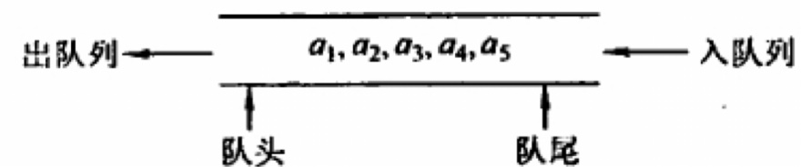


### 队列的顺序存储结构

#### 队列的顺序存储

不能用Q.rear == MaxSize作为队满条件，如下图（d），队列中仅有一个元素，但仍满足该条件。这时入队出现“**上溢出**”，但这种溢出并不是真正的溢出，在data数组中依然存在可以存放元素的空位置，所以是一种”**假溢出**“

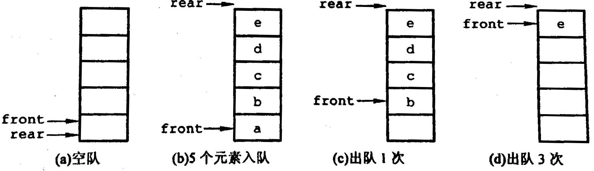


#### 循环队列

为了解决上面的问题，引出了循环队列，即从逻辑上把存储队列元素的表视为一个环，当队首指针Q.front == MaxSize - 1后，再前进一个位置就自动到0，这可以利用取余算法（%）来实现

- **初始时**：Q.front = Q.rear = 0
- **队首指针进1**：Q.front = (Q.front + 1) % MaxSize
- **队尾指针进1**：Q.rear = (Q.rear + 1) % MaxSize
- **队列长度**：(Q.rear + MaxSize - Q.front) % MaxSize
- **队空/队满**：Q.front == Q.rear

为了区分队空还是队满的情况，有三种处理方式：

- 牺牲一个单元来区分队空还是队满，入队时少用一个队列元素。约定以“**队头指针在队尾指针的下一位置作为队满的标志**”，如下图

  **队满条件**：(Q.rear + 1) % MaxSize == Q.front

  **队空条件**：Q.front == Q.rear

  **队列中元素的个数**：(Q.rear - Q.front + MaxSize) % MaxSize

- 类型中增设表示元素个数的数据成员，这样，队空的条件为Q.size == 0,；队满的条件为Q.size == MaxSize。这两种情况都有Q.front == Q.rear

- 类型中增设一个tag成员，以区分是队满还是队空。tag == 0时，若因删除导致Q.front == Q.rear，则为队空；tag == 1时，若因插入导致Q.front == Q.rear，则为队满

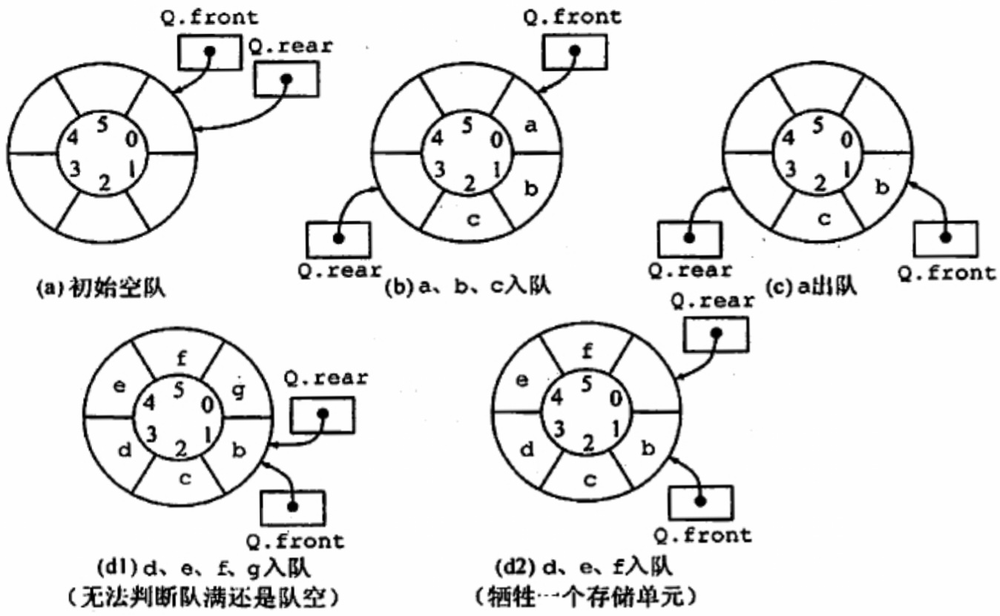

```c++
// 初始状态（队空条件）：Q.front == Q.rear == 0
// 进队操作：队不满时，先送值到队尾元素，再将队尾指针加1
// 出队操作：队不空时，选取队头元素，再将队头指针加1

#define MaxSize 50
using ElemType = int;

typedef struct {
    ElemType data[MaxSize];
    int front, rear;    // 队头和队尾指针
}SqQueue;

// 初始化
void InitQueue(SqQueue& Q) {
    Q.rear = Q.front = 0;   // 初始化队首、队尾指针
}

// 判队空
bool QueueIsEmpty(SqQueue Q) {
    if (Q.front == Q.rear)
        return true;
    return false;
}

// 入队
bool EnQueue(SqQueue& Q, ElemType value) {
    if ((Q.rear + 1) % MaxSize == Q.front)  // 队满时报错
        return false;
    Q.data[Q.rear] = value;
    Q.rear = (Q.rear + 1) % MaxSize;    // 队尾指针加1取模
    return true;
}

// 出队
bool DeQueue(SqQueue& Q, ElemType& value) {
    if (Q.rear == Q.front)  // 队空时报错
        return false;
    value = Q.data[Q.front];
    Q.front = (Q.front + 1) % MaxSize;    // 队头指针加1取模
    return true;
}

// 元素个数
int QueueSize(SqQueue Q) {
    return (Q.rear - Q.front + MaxSize) % MaxSize;
}

// 打印队列
void PrintQueue(const SqQueue& Q) {
    cout << "队列：";
    int size = QueueSize(Q), i = 0, j = Q.front;
    while (i != size) {
        cout << Q.data[j] << " ";
        j = (j + 1) % MaxSize;
        ++i;
    }
    cout << endl;
}
```

- 运行结果

```c++
int main() {
    SqQueue Q;
    InitQueue(Q);

    cout << "输入数据（输入9999结束）：";
    int value;
    cin >> value;
    while (value != 9999) {
        EnQueue(Q, value);
        cin >> value;
    }
    PrintQueue(Q);

    cout << "元素100入队\n";
    EnQueue(Q, 100);
    PrintQueue(Q);

    cout << "队头元素出队\n";
    DeQueue(Q, value);
    PrintQueue(Q);

    cout << "队列中元素个数：" << QueueSize(Q);
    return 0;
}

输出：
输入数据（输入9999结束）： 5 85 95 22 12 30 1 25 36 54 9999
队列： 5 85 95 22 12 30 1 25 36 54
元素100入队
队列： 5 85 95 22 12 30 1 25 36 54 100
队头元素出队
队列： 85 95 22 12 30 1 25 36 54 100
队列中元素个数： 10
```


### 队的链式存储结构

队列的链式表示称为链队列，它实际上是一个同时带有队头指针和队尾指针的单链表。头指针指向队头结点，尾指针指向队尾结点，即单链表的最后一个结点

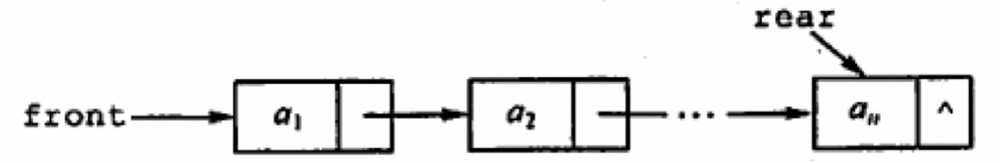

**出队**：先判断队列是否为空，若不为空，则取出队头元素，将其从链表中删除，并让Q.front指向下一个结点（若该结点为最后一个结点，则置Q.front和Q.rear都为NULL）

**入队**：建立一个新结点，将新结点插入到链表的尾部，并让Q.rear指向这个新插入的结点（若原队列为空，则令Q.front也指向该结点）

为了适合插入和删除变得方便，通常将链式队列设计成一个带头结点的单链表，如下图：

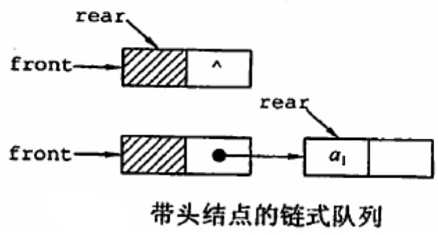

链队列适合使用在数据元素变动比较大的情形，而且不存在队列满且产生溢出的问题


```c++
// 不含头结点时：当Q.front == NULL且Q.rear == NULL时，链式队列为空
// 含头结点时：当Q.front == Q.rear时，链式队列为空

// 以下为包含头结点的情况
using ElemType = int;

typedef struct LinkNode {    // 链式队列结点
    ElemType data;
    struct LinkNode* next;
}LinkNode;

typedef struct {    // 链式队列
    LinkNode* front, * rear;    // 链式队列的头指针和尾指针
}LinkQueue;

// 初始化
void InitQueue(LinkQueue& Q) {
    Q.front = Q.rear = new LinkNode();  // 建立头结点
    Q.front->next = nullptr;
}

// 队列空
bool IsEmpty(LinkQueue Q) {
    if (Q.front == Q.rear)
        return true;
    return false;
}

// 入队
void EnQueue(LinkQueue& Q, ElemType value) {
    LinkNode* node = new LinkNode();
    node->data = value;
    node->next = nullptr;
    Q.rear->next = node;
    Q.rear = node;
}

// 出队
bool DeQueue(LinkQueue& Q, ElemType& value) {
    if (Q.front == Q.rear)      // 队空
        return false;
    LinkNode* p = Q.front->next;
    value = p->data;
    Q.front->next = p->next;
    delete p;
    return true;
}

// 队长
int QueueSize(LinkQueue Q) {
    LinkNode* p = nullptr;
    if (Q.front->next != nullptr)
        p = Q.front->next;
    else
        return 0;
    int size = 0;
    while (p != nullptr) {
        p = p->next;
        ++size;
    }
    return size;
}

// 打印队列
void PrintQueue(const LinkQueue& Q) {
    cout << "队列：";
    LinkNode* p = nullptr;
    if (Q.front->next != nullptr)
        p = Q.front->next;
    while (p != nullptr) {
        cout << p->data << " ";
        p = p->next;
    }
    cout << endl;
}
```

- 运行结果

```c++
int main() {
    LinkQueue Q;
    InitQueue(Q);

    cout << "输入数据（输入9999结束）：";
    int value;
    cin >> value;
    while (value != 9999) {
        EnQueue(Q, value);
        cin >> value;
    }
    PrintQueue(Q);

    cout << "元素100入队\n";
    EnQueue(Q, 100);
    PrintQueue(Q);

    cout << "队头元素出队\n";
    DeQueue(Q, value);
    PrintQueue(Q);

    cout << "队列中元素个数：" << QueueSize(Q);
    return 0;
}

输出：
输入数据（输入9999结束）： 5 85 95 22 12 30 1 25 36 54 9999
队列： 5 85 95 22 12 30 1 25 36 54
元素100入队
队列： 5 85 95 22 12 30 1 25 36 54 100
队头元素出队
队列： 85 95 22 12 30 1 25 36 54 100
队列中元素个数： 10
```


### 双端队列

定义：允许两端都可以进行入队和出队的队列，其元素的逻辑结构仍是线性结构。将队列的两端分别称为前端和后端，两端都可以入队和出队，如下图：

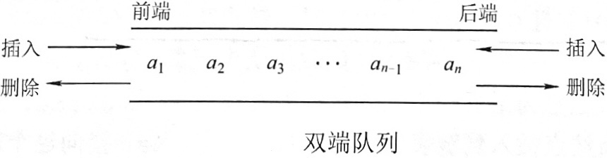

输出受限的双端队列：允许在一端进行插入和删除，但在另一端只允许插入的双端队列

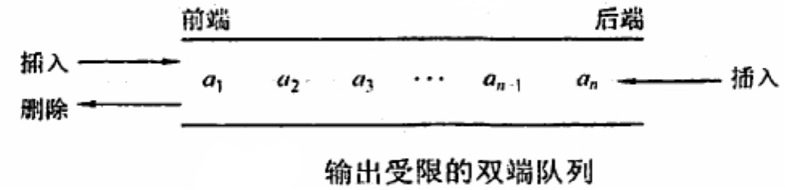

输入受限的双端队列：允许在一端进行插入和删除，但在另一端只允许删除的双端队列

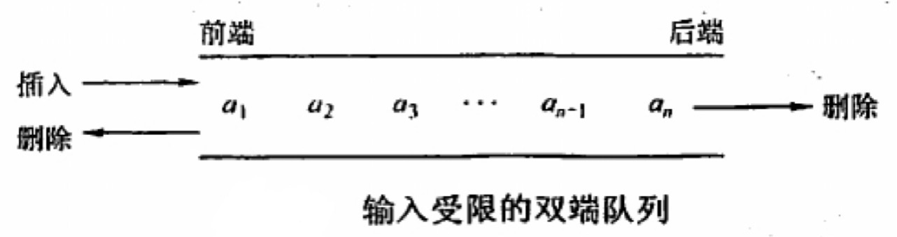


## 栈和队列的应用

### 栈在括号匹配中的应用

假设表达式中允许包含两种括号：圆括号“()”和方括号“[]”，如何正确地匹配括号呢，考虑下列括号序列：

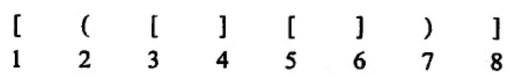

算法思想：

- 设置一个空栈，顺序读入括号
- 若是一个右括号，则要么匹配一个对应的左括号，要么是不合法的情况（括号序列不匹配，退出程序）
- 若是左括号，则作为一个新的更急迫的期待压入栈中
- 算法结束时，栈为空，否则括号序列不匹配

```c++
/* 栈的实现 */
#define MaxSize 50
using ElemType = char;

typedef struct {
    ElemType data[MaxSize];
    int top;    // 栈顶指针
}SqStack;

// 初始化
void InitStack(SqStack& S) {
    S.top = -1;     // 初始化栈顶指针
}

// 判栈空
bool StackIsEmpty(SqStack S) {
    if (S.top == -1)
        return true;
    return false;
}

// 进栈
bool Push(SqStack& S, ElemType value) {
    if (S.top == MaxSize - 1)   // 栈满，报错
        return false;
    S.data[++S.top] = value;    // 指针先加1，再入栈
    return true;
}

// 出栈
bool Pop(SqStack& S, ElemType& value) {
    if (S.top == -1)    // 栈空，报错
        return false;
    value = S.data[S.top--];    // 指针先减1，再出栈
    return true;
}


/* 括号匹配算法（支持"()"，"[]"，"{}"） */
bool bracketCheck(char str[], int length) {
    SqStack S;
    InitStack(S);
    for (int i = 0; i < length; ++i) {
        if (str[i] == '(' || str[i] == '[' || str[i] == '{') {
            Push(S, str[i]);
        }
        else {
            if (StackIsEmpty(S))  // 扫描到左括号，且当前栈为空
                return false;   // 匹配失败

            char topElem;
            Pop(S, topElem);

            if (str[i] == ')' && topElem != '(')
                return false;
            if (str[i] == ']' && topElem != '[')
                return false; 
            if (str[i] == '}' && topElem != '{')
                return false;
        }
    }
    return StackIsEmpty(S);   // 检查完全部括号后，若栈空则匹配成功
}
```

- 运行结果

```c++
int main() {
    char str[10] = { '{','{','[','(',')',']','}','}','(',')' };
    cout << ((bracketCheck(str, 10) == true) ? "匹配成功" : "匹配失败");
    return 0;
}

输出：
匹配成功
```


### 栈在表达式求值中的应用

中缀表达式不仅依赖运算符的优先级，而且还要处理括号。后缀表达式的运算符在操作数后面，在后缀表达式中已考虑了运算符的优先级，没有括号，只有操作数和操作符。如：中缀表达式A + B * (C - D) - E / 所对应的后缀表达式为ABCD-*+EF/-

**中缀转后缀**：

- 手算方法：

  ①确定中缀表达式中各个运算符的运算顺序

  ②选择下一个运算符，按照**[左操作数    右操作数    运算符]**的方式组合成一个新的操作数

  ③如果还有运算符没被处理，就返回步骤②

如下图：

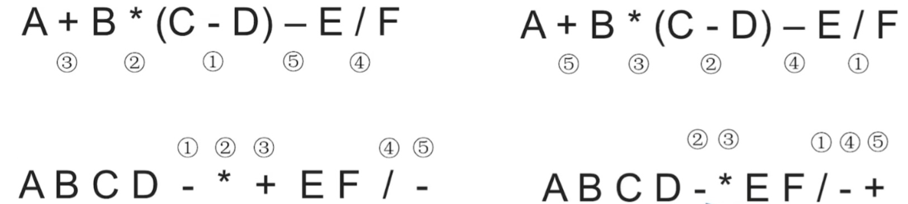

左右两种方法都是正确的，不过为了与计算机得出的结果（左边的）相同，使用“**左优先**”原则：只要左边的运算符能先计算，就优先算左边的

- 中缀转后缀算法：初始化一个栈，用于保存暂时还不能确定运算符顺序的运算符，从左到右处理各个元素，直到末尾。可能遇到三种情况：

  ①遇到**操作数**。直接加入后缀表达式

  ②遇到**界限符**。遇到“(”直接入栈；遇到“)”则依次弹出栈内运算符并加入后缀表达式，直到弹出“(”为止。注意：“(”不加入后缀表达式

  ③遇到**运算符**。依次弹出栈中**优先级**高于或等于当前运算符的所有运算符，并加入后缀表达式，若碰到“(”或栈空则停止。之后再把当前运算符入栈

- 按上述方法处理完所有字符后，将栈中剩余运算符依次弹出，并加入后缀表达式


**中缀转前缀**：

- 手算方法：

  ①确定中缀表达式中各个运算符的运算顺序

  ②选择下一个运算符，按照**[ 运算符    左操作数    右操作数]**的方式组合成一个新的操作数

  ③如果还有运算符没被处理，就返回步骤②

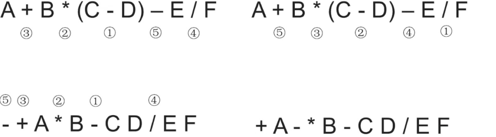

左右两种方法都是正确的，不过为了与计算机得出的结果（左边的）相同，使用“**右优先**”原则：只要右边的运算符能先计算，就优先算右边的


**用栈实现后缀表达式的计算**：

①从左到右扫描下一个元素，直到处理完所有元素

②若扫描到操作数则压入栈，并回到①；否则执行③

③若扫描到操作符，则依次弹出两个栈顶元素A、B，执行相应运算（B <op> A），运算结果压回栈顶，回到①

下图是后缀表达式ABCD-*+EF/-求值的过程：

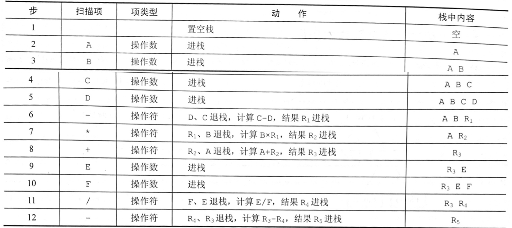


**用栈实现中缀表达式的计算**：

- 初始化两个栈，操作数栈（后缀表达式求值）和运算符栈（中缀转后缀）
- 若扫描到操作数，则压入操作数栈
- 若扫描到运算符或界限符，则按照“中缀转后缀”相同的逻辑踏入运算符栈（期间也会弹出运算符，每当弹出一个运算符时，就需要再弹出两个操作数栈的栈顶元素并执行相应运算，运算结果再压回操作数栈）


### 栈在递归中的应用

若在一个函数、过程或数据结构的定义中又应用了它自身，则这个函数、过程或数据结构称为是递归定义的，简称递归

递归通常把一个大型的复杂问题层层转化为一个与原问题相似的规模较小的问题求解，但是递归通常会执行重复的计算，导致效率不高。

如斐波那契数列，其定义为：

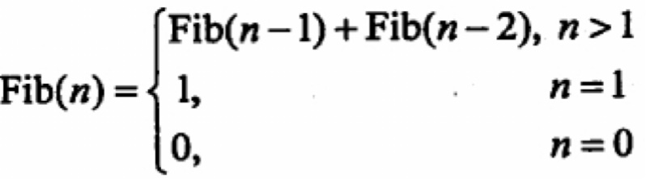

```c++
int Fib(int n) {
    if (n == 0) 
        return 0;
    else if (n == 1) 
        return 1;
    else
        return  Fib(n - 1) + Fib(n - 2);
}

int main() {
    cout << Fib(5) << endl;
    return 0;
}

输出：
5
```

递归模型不能是循环定义的，必须要满足下面两个条件：

- 递归表达式（递归体）
- 边界条件（递归出口）

如下图，Fib(5)的递归执行过程，其中Fib(3)、Fib(2)、Fib(1)、Fib(0)被调用了多次：

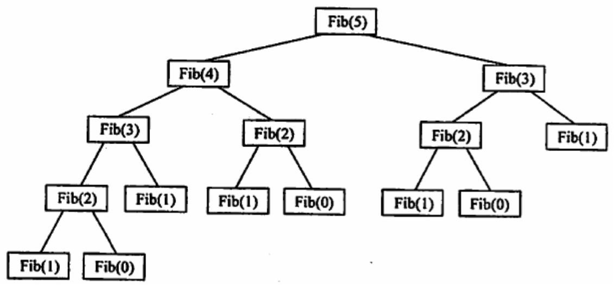


### 队列在层次遍历中的作用

二叉树的遍历就需要用到队列，过程为：

①根结点入队

②若队空（所有结点已处理完毕），则结束遍历；否则重复③操作

③队列中第一个结点出队，并访问之。若其有左孩子，则将左孩子入队；若其有右孩子，则将右孩子入队，返回②

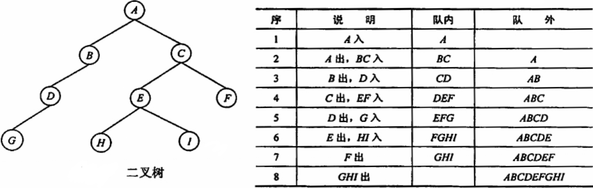


## 特殊矩阵的压缩存储

### 数组的定义

数组是由n（n ≥ 1）个相同类型的数据元素构成的有限序列，每个数据元素称为一个数组元素，每个元素在n个线性关系中的序号称为该元素的下标，下标的取值称为数组的维界。


### 数组的存储结构

一个数组的所有元素在内存中占用一段连续的存储空间，以一维数组A[0...n - 1]为例，其存储结构关系式为：**LOC(a<sub>i</sub>) = LOC(a<sub>0</sub>) + i × L（i ≤ i < n）**，L：每个元素所占的存储单元

对于二维数组，有**按行优先**和**按列优先**两种映射方法，按行优先存储的基本思想：先行后列，先存储行号较小的元素，行号相等先优先存储列号较小的元素。设二维数组的行下标与列下标的范围分别为[0，h<sub>1</sub>]与[0，h<sub>2</sub>]，则存储结构关系式为：

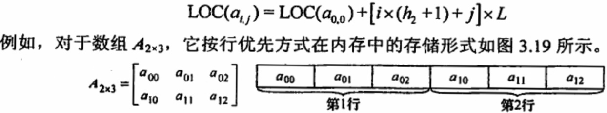

当以列优先方式存储时，存储结构关系式为：

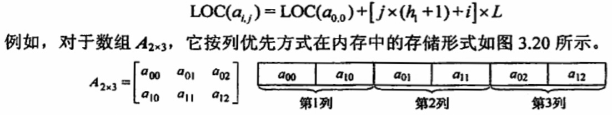


### 矩阵的压缩存储

**压缩存储**：指为多个值相同的元素只分配一个存储空间，对零元素不分配存储空间。其目的是节省存储空间。

**特殊矩阵**：指具有许多相同矩阵元素或零元素，并且这些相同矩阵元素或零元素的分布有一定规律性的矩阵。常见的特殊矩阵有对称矩阵、上(下)三角矩阵、对角矩阵等。

**特殊矩阵的压缩存储方法**：找出特殊矩阵中值相同的矩阵元素的分布规律，把那些呈现规律性分布的、值相同的多个矩阵元素压缩存储到一个存储空间中。


#### 对称矩阵

定义：对于一个n阶方阵A\[1...n][1...n]中的任意个元素a<sub>ij</sub>都有a<sub>ij</sub> = a<sub>ji</sub>（1 ≤ i，j ≤ n），其中的元素可以划分为3个部分：上三角区、主对角线和下三角区，根据这个性质只要存储矩阵的下(上)三角部分（包含主对角）的元素，存放在一维数组**B[n (n + 1) / 2]**中如下图：

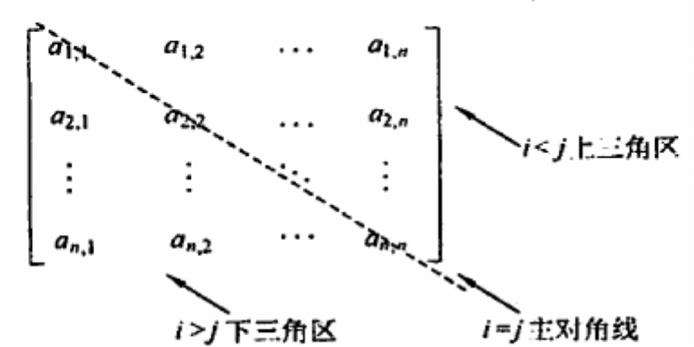

元素下标之间的对应关系为：

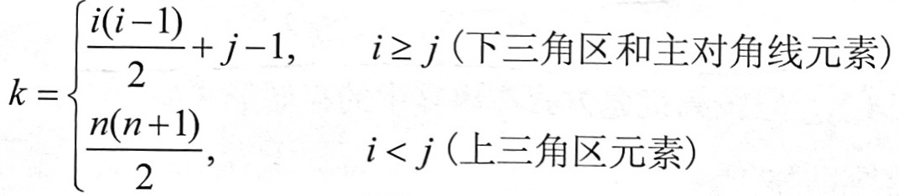

#### 三角矩阵

定义：下三角矩阵中，上三角区的所有元素均为同一常量，其存储方法与对称矩阵类似，不同之处在于存储完下三角区和主对角线上的元素后，还要存储对角线上方的常量一次，上三角矩阵与之类似。可以存放在一维数组**B[n (n + 1) / 2 + 1]**中如下图：

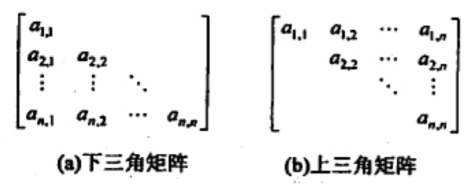

- 下三角矩阵

元素下标之间的对应关系为：

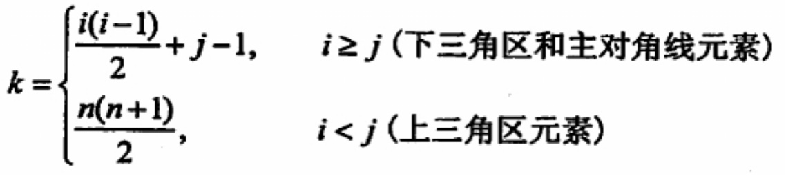

在内存中压缩形式为：

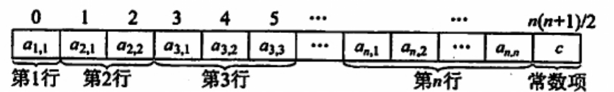

- 上三角矩阵

元素下标之间的对应关系为：

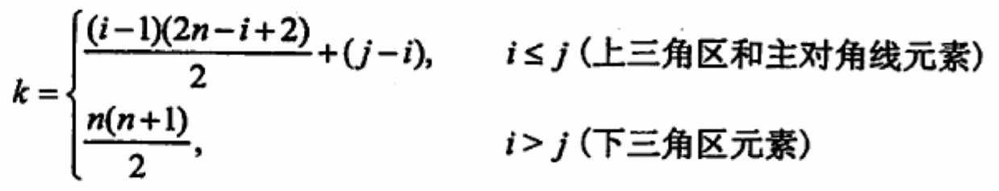

在内存中压缩形式为：

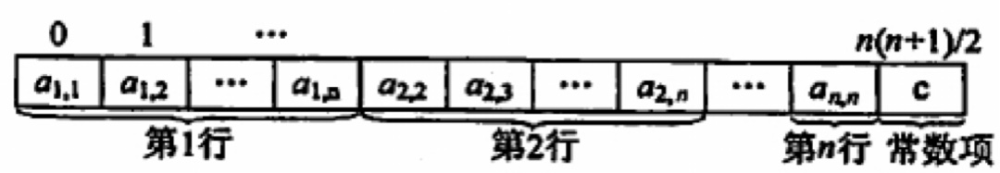


#### 三对角矩阵

定义：也叫做带状矩阵，对于n阶方阵中A中的任一元素a<sub>ij</sub>，当|i - j| > 1时，有a<sub>ij</sub> = 0（1 ≤ i，j ≤ n）。可以存放在一维数组**B[3n - 2]**中如下图：

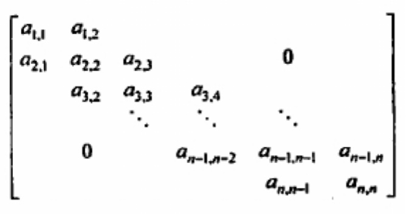

元素下标之间的对应关系为：**k = 2i + j - 3**

在内存中压缩形式为：

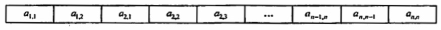


### 稀疏矩阵

定义：矩阵中非零元素的个数t，相对矩阵元素的个数s来说非常少，即s >> t的矩阵称为稀疏矩阵。

通过将非零元素及其相应的行和列构成一个三元组（行标，列标，值），然后按照某种规律存储这些三元组。稀疏矩阵的压缩存储够便失去了随机存取的特性。

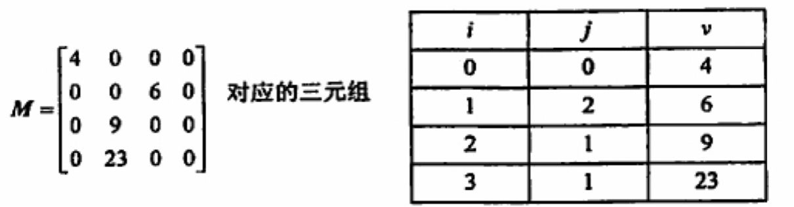

稀疏矩阵的三元组既可以采用数组存储，也可以采用十字链表法存储。
