# 树

## 树的基本概念

### 树的定义

树是有n个结点的有限集。当n = 0时称为空树。在任意一棵非空树中应该满足：

- 有且仅有一个特定的称为根的结点
- 当n > 1时，其余结点可分为m（m > 0）个互不相交的有限集T<sub>1</sub>，T<sub>2</sub>，... ，T<sub>m</sub>，其中每个集合本身就是一棵树，并且称为根的子树

树的定义是递归的，树作为一种逻辑结构，同时也是一种分层结构，具有以下两个特点：

- 树的根结点没有前驱，除根结点外的所有结点有且只有一个前驱
- 树中所有结点可以有零个或多个后继

**在n个结点的树中有n - 1条边**

<br/>

### 基本术语

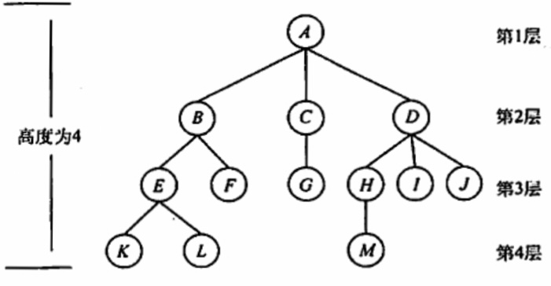

- 根A到结点K的唯一路径上的任意结点，称为结点K的**祖先**
- 结点K是结点B的**子孙**
- E是结点K和结点L的**双亲**，并且结点K和结点L是**兄弟**（有相同的双亲）
- 结点K是结点E的**孩子**
- **结点的度**：树中一个结点的孩子个数
- **树的度**：树中结点的最大度数
- **分支结点（非终端结点）**：度大于0的结点
- **叶子结点（终端结点）**：度为0的结点（没有孩子的结点）
- **结点的深度**：从根结点开始自顶向下逐层累加的
- **结点的高度**：从叶结点开始自底向上逐层累加的
- **结点的层次**和**树的高度**见上图
- **有序树和无序树**：树中结点的各子树从左到右是有次序的，不能互换，则为有序树，否则就是无序树
- **路径**：树中两个结点之间的路径是由这两个结点之间所进过的结点序列构成的
- **路径长度**：路径上所经过的边的个数
- **森林**：m（m ≥ 0）棵互不相交的树的集合

<br/>

### 树的性质

树具有如下最基本的性质：

- 树中的结点数等于所有及结点的度数之和加1（在n个结点的树中有n - 1条边）

- 度为m的树中第i层上至多有**m<sup>i - 1</sup>**个结点（i ≥ 1）

- 高度为h的m叉树至多有**(m<sup>h</sup> - 1)(m - 1)**个结点，至少有**h**个结点

- 高度为h、度为m的树至多有**h + m - 1**个结点

- 具有n个结点的m叉树的最小高度为**⌈log<sub>m</sub>(n(m - 1) + 1)⌉**，若为二叉树则为**h = log<sub>2</sub>⌈(n + 1)⌉**

  分析：
  $$
  前h - 1层最多有\frac{m^{h-1}-1}{m - 1}个结点，前h层最多有\frac{m^{h}-1}{m - 1}个结点，即\\
  \frac{m^{h-1}-1}{m - 1} < n ≤ \frac{m^{h}-1}{m - 1}，\\
  化简得h_{min} = ⌈log_{m}(n(m - 1) + 1)⌉
  $$
  

## 二叉树的概念

### 二叉树的定义及其主要特性

#### 二叉树的定义

定义：二叉树是另一种树形结构，特点是每个结点至多只有两棵子树，且这两棵子树有左右之分，其次序不能任意颠倒，二叉树是**有序树**

二叉树是n（n ≥ 0）个结点的有限集合：

- 或者为空二叉树面，即n = 0
- 或者由一个根结点和两个互不相交的被称为根的左子树和右子树组成。左子树和右子树又分别是一棵二叉树（递归形式的定义）

度为m的树与m叉树的区别：

|                       度为m的树                       |              m叉树              |
| :---------------------------------------------------: | :-----------------------------: |
|            任意结点的度 ≤ m（最多m个孩子）            | 任意结点的度 ≤ m（最多m个孩子） |
|           至少有一个结点度 = m（有m个孩子）           |     允许所有结点的度都 < m      |
| 一定是非空树，至少有m + 1个结点（1个根结点和m个孩子） |           可以是空树            |

<br/>

#### 几个特殊的二叉树

**满二叉树**：一棵高度为h，含有2<sup>h</sup> - 1个结点的二叉树，即树中每层都含有最多的结点。可以对满二叉树按层序编号：约定编号从根结点（根结点编号为1）起，自上而下，自左向右。这样，对于编号为i的结点，若有双亲，则其**双亲为⌊i / 2⌋**；若有左孩子，则**左孩子为2i**；若有右孩子，则**右孩子为2i + 1**

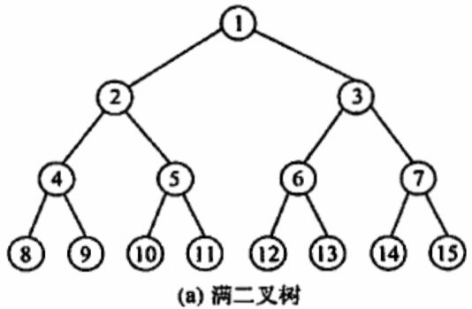

**完全二叉树**：高度为h、有n个结点的二叉树，当且仅当其每个结点都与高度为h的满二叉树中编号为1 ~ n的结点一一对应时，称为完全二叉树。可以看到，满二叉树的叶子结点都只会出现在最后一层和倒数第二层，且都集中在左下方。

其特点如下：

- 若i ≤ ⌊n / 2⌋，则结点i为分支结点，否则为叶子结点
- 叶子结点只可能在层次最大的两层上出现。对于最大层次中的叶子结点，都依次排列在改层最左边的位置上
- 若有度为1的结点，则只可能有一个，且该结点只有左孩子而无右孩子
- 按层序编号后，一旦出现某个结点（编号为i）为叶子结点或只有左孩子，则编号大于i的结点均为叶子结点
- 若n为奇数，则每个分支结点都有左孩子和右孩子；若n为偶数，则编号最大的分支结点（编号为n / 2）只有左孩子，没有右孩子，其余分支结点左、右孩子都有

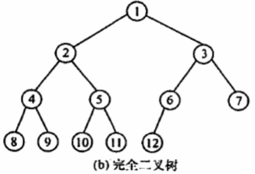

**二叉排序树**：左子树上所有结点的关键字均小于根结点的关键字；右子树上所有结点的关键字均大于根结点的关键字；左子树和右子树又各是一棵二叉排序树

**平衡二叉树**：树上任一结点的左子树和右子树的深度之差不超过1

<br/>

#### 二叉树的性质

- 非空二叉树上的叶子结点数等于度为2的结点数加1，即**n<sub>0</sub> = n<sub>2</sub> + 1**

- 非空二叉树上第k层上至多有**2<sup>k - 1</sup>**（k ≥ 1）个结点

- 高度为h的二叉树至多有**2<sup>h</sup> - 1**（h ≥ 1）个结点

- 对完全二叉树从上到下、从左到右的顺序依次编号1，2，... ，n，则有以下关系：

  ①当i > 1时，结点i的双亲的编号为**⌊i / 2⌋**

  ②当2i ≤ n时，结点i的左孩子编号为**2i**，否则无左孩子

  ③当2i + 1 ≤ n时，结点i的右孩子编号为**2i + 1**，否则无右孩子

  ④结点i所在层次（深度）为**⌊log<sub>2</sub>i⌋ + 1**或**⌊log<sub>2</sub>(i + 1)⌋**

- 具有n个（n > 0）结点的完全二叉树的高度为**⌊log<sub>2</sub>(n + 1)⌋**或**⌊log<sub>2</sub>n⌋ + 1**

<br/>

### 二叉树的存储结构

#### 顺序存储结构

二叉树的顺序存储结构是指用一组地址连续的存储单元依次自上而下、自左向右存储完全二叉树上的结点元素，即完全二叉树上编号为i的结点元素在一维数组下标为i - 1的分量中。

完全二叉树和满二叉树采用顺序存储结构比较合适，而一般的二叉树要添加上一些并不存在的空结点，这样会浪费空间。最坏情况下，一个高度为h且只有h个结点的单支树需要占2<sup>h</sup> - 1个存储单元。下图为二叉树的顺序存储结构：

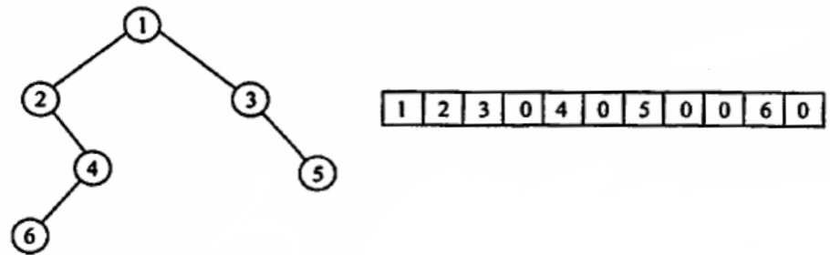

为了计算方便，数组下标为0处一般不存放元素，从下标为1处开始存储。

<br/>

#### 链式存储结构

用链表来存储二叉树中的每个结点。一个二叉链表的结点一般包含3个域：数据域data、左指针域lchild和右指针域rchild，如下图所示：

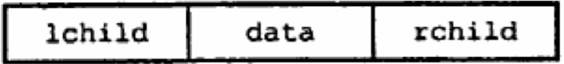

下图为二叉链表的存储结构：

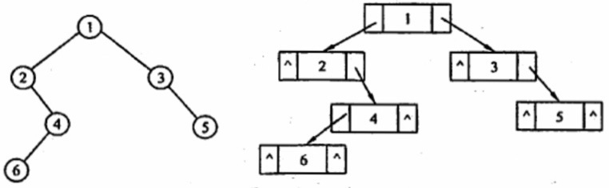

```c++
// 二叉树的链式存储结构
typedef struct BiTNode {
    ElemType data;	// 数据域
    struct BiTNode* lchild, * rchild;	// 左、右孩子指针
}BiTNode, * BiTree;
```

性质：在含有n个结点的二叉链表中，含有n + 1个空链域

推导：n个结点有n - 1条边，有2n个指针域，则空链域有2n - (n - 1) = n + 1个

<br/>

## 二叉树的遍历和线索二叉树

### 二叉树的遍历

定义：按某条搜索路径访问树中每个结点，使得每个结点均被访问一次，而且仅被访问一次

二叉树常见的遍历次序有：先序遍历（NLR）、中序遍历（LNR）和后序遍历（LRN），“序”指的是根结点在何时被访问


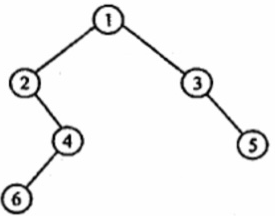

#### 先序遍历（PreOrder）

若二叉树为空，则什么也不做；否则：

- 访问根结点
- 先序遍历左子树
- 先序遍历右子树

```c++
void PreOrder(BiTree T){
    if(T != nullptr) {
        visit(T);		// 访问根结点
        PreOrder(T->lchild);	// 递归遍历左子树
        PreOrder(T->rchild);	// 递归遍历右子树
    }
}
```

上图先序遍历为：1 2 4 6 3 5

<br/>

#### 中序遍历（InOrder）

若二叉树为空，则什么也不做；否则：

- 先序遍历左子树
- 访问根结点
- 先序遍历右子树

```c++
void InOrder(BiTree T) {
    if(T != nullptr) {
        InOrder(T->lchild);		// 递归遍历左子树
        visit(T);		// 访问根结点
        InOrder(T->rchild);		// 递归遍历右子树
    }
}
```

上图中序遍历为：2 6 4 1 3 5

<br/>

#### 后序遍历（PostOrder）

- 先序遍历左子树
- 先序遍历右子树
- 访问根结点

```c++
void PostOrder(BiTree T) {
    if(T != nullptr) {
        PostOrder(T->lchild);	// 递归遍历左子树
        PostOrder(T->rchild);	// 递归遍历右子树
        visit(T);		// 访问根结点
    }
}
```

上图后序遍历为：6 4 2 5 3 1

上述三种遍历算法中，递归遍历左、右子树的顺序都是固定的，只是访问根结点的顺序不同，**时间复杂度都为O(n)**。在递归遍历中，递归工作栈的深度恰好为树的深度，最坏情况下二叉树是有n个结点且深度为n的单支树，所以**空间复杂度为O(n)**

<br/>

#### 递归算法和非递归算法的转换

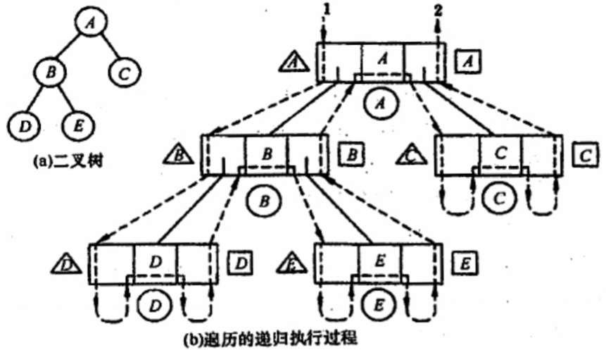

上图表示了3种遍历算法的递归执行过程

- 向下的箭头：更深一层的递归调用
- 向上的箭头：从递归调用退出返回
- 三角形、圆形和方形内的字符：分别表示在先序、中序后序遍历的过程中访问结点时输出的信息

例如圆形内的字符B，由于中序遍历中访问结点是在遍历左子树之后、遍历右子树之前进行的，B的左边向上的虚线表示这时候已经遍历完了结点B的左子树，并从递归调用中调用中退出，这时候会访问结点B（visit(B)），然后在对结点B的右子树进行中序遍历即右边向下的虚线。沿虚线游走可以分别得到	先序序列为：A B D E C，中序序列为：D B E A C，后序序列为：D E B C A

<br/>

首先先来分析中序遍历的访问过程：

①沿着根的左孩子，依次入栈，直到左孩子为空，说明已经找到可以输出的结点；此时栈内元素依次为A B D

②栈顶元素出栈并访问：若其右孩子为空，继续执行②；若其右孩子不为空，将右子树转执行①

栈顶D出栈并访问，它是中序序列的第一个结点；D右孩子为空，栈顶B出栈并访问；B右孩子不为空，将其右孩子E入栈，E左孩子为空，栈顶E出栈并访问；E右孩子为空，栈顶A出栈并访问；A右孩子不为空，将其右孩子C入栈，C左孩子为空，栈顶C出栈并访问。因此得到中序遍历序列D B E A C

```c++
void InOrder2(BiTree T) {
    InitStack(S);	// 初始化栈
    BiTree p = T;	// p是遍历指针
    while (p != nullptr || !IsEmpty(S)) {
        if (p != nullptr) {		// 一路向左
            Push(S, p);
            p = p->lchild;
        }
        else {		// 出栈访问结点，并转向出栈结点的右子树
            Pop(S, p);
            visit(p);	// 访问结点
            p = p->rchild;
        }
    }
}
```

<br/>

先序遍历和中序遍历的基本思想是类似的，只需把访问结点操作放在入栈操作的前面

```c++
void PreOrder2(BiTree T) {
    InitStack(S);
    BiTree p = T;
    while (p != nullptr || !InEmpty(S)) {
        if (p != nullptr) {     // 一路向左
            visit(p);	// 访问结点，并入栈
            Push(S, p);
            p = p->lchild;
        }
        else {		// 出栈，并转向出栈结点的右子树
            Pop(S, p);
            p = p->rchild;
        }
    }
}
```

<br/>

后序非递归遍历二叉树是先访问左子树，再访问右子树，最后访问根结点。分析上图：

①沿着根的左孩子，依次入栈，直到左孩子为空。此时栈内元素依次为A B D

②读栈顶元素：若其右孩子不空且未被访问过，将右子树转执行①；否则，栈顶元素出栈并访问。

栈顶D的右孩子为空，出栈并访问，它是后序序列的第一个结点；栈顶B的右孩子不空且未被访问过，E入栈，栈顶E的左右孩子均为空，出栈并访问；栈顶A的右孩子不空且未被访问过，C入栈，栈顶C的左右孩子均为空，出栈并访问；栈顶A的右孩子不空但已被访问，A出栈并访问。由此得到后序序列D E B C A

这里面关键是②中，必须区分返回时是从左子树返回的还是从右子树返回的，因此设定一个辅助指针r，指向最近访问过的结点。也可以在结点中增加一个标志域，记录是否已被访问。（目的都是为了保证左右子树都访问完后才访问根结点）

```C++
void PostOrder2(BiTree T) {
    InitStack(S); 
    BiTree p = T, r = nullptr;
    while (p != nullptr || !IsEmpty(S)) {
        if (p != nullptr) {     // 走到最左边
            Push(S, p);
            p = p->lchild;
        }
        else {		// 向右
            GetTop(S, p);       // 读栈顶元素（非出栈）
            if (p->rchild && p->rchild != r)    // 若右子树存在，且未被访问过
                p = p->rchild;		// 转向右
            else {      // 否则，弹出结点并访问
                Pop(S, p);
                visit(p);
                r = p;      // 记录最近访问过的结点
                p = nullptr;    // 结点访问结束后，重置p指针
            }
        }
    }
}
```

<br/>

#### 层次遍历

如下图，二叉树的层次遍历就是按照箭头所指方向，按照1，2，3，4的层次顺序，对二叉树的各个结点进行访问。

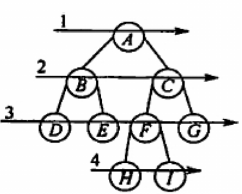

要进行层次遍历需要借助一个队列。过程为：

①先将二叉树的根结点入队

②出队，访问出队结点，若它有左子树，则将左子树根结点入队；若它有右子树，则将右子树根结点入队

③重复执行②，直到队列为空

```c++
void LevelOrder(BiTree T) {
    InitQueue(Q);
    BiTree p = nullptr;
    EnQueue(Q, T);
    while (!IsEmpty(Q)) {       // 队列不空则循环
        DeQueue(Q, p);      // 队头结点出队
        visit(p);
        if (p->lchild != nullptr)      // 左子树不为空，则右子树根结点入队
            EnQueue(Q, p->lchild);
        if (p->rchild != nullptr)      // 右子树不为空，则右子树根结点入队
            EnQueue(Q, p->rchild);
    }
}
```

<br/>

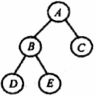

下面是完整的代码：（[栈和队列的定义点击这里(ctrl + 鼠标左键)](栈和队列.md)）

```c++
using ElemType = char;

// 栈和队列（全局）
SqStack S;
SqQueue Q;

// 二叉树的链式存储结构
typedef struct BiTNode {
    ElemType data;	// 数据域
    struct BiTNode* lchild, * rchild;	// 左、右孩子指针
}BiTNode, * BiTree;

// 访问结点
void visit(BiTNode* T) {
    cout << T->data << " ";
}

// 先序遍历（递归）
void PreOrder(BiTree T) {
    if (T != nullptr) {
        visit(T);		// 访问根结点
        PreOrder(T->lchild);	// 递归遍历左子树
        PreOrder(T->rchild);	// 递归遍历右子树
    }
}

// 先序遍历（非递归）
void PreOrder2(BiTree T) {
    InitStack(S);
    BiTree p = T;
    while (p != nullptr || !StackIsEmpty(S)) {
        if (p != nullptr) {     // 一路向左
            visit(p);	// 访问结点，并入栈
            Push(S, p);
            p = p->lchild;
        }
        else {		// 出栈，并转向出栈结点的右子树
            Pop(S, p);
            p = p->rchild;
        }
    }
}

// 中序遍历（递归）
void InOrder(BiTree T) {
    if (T != nullptr) {
        InOrder(T->lchild);		// 递归遍历左子树
        visit(T);		// 访问根结点
        InOrder(T->rchild);		// 递归遍历右子树
    }
}

// 中序遍历（非递归）
void InOrder2(BiTree T) {
    InitStack(S);	// 初始化栈
    BiTree p = T;	// p是遍历指针
    while (p != nullptr || !StackIsEmpty(S)) {
        if (p != nullptr) {		// 一路向左
            Push(S, p);
            p = p->lchild;
        }
        else {		// 出栈访问结点，并转向出栈结点的右子树
            Pop(S, p);
            visit(p);	// 访问结点
            p = p->rchild;
        }
    }
}

// 后序遍历（递归）
void PostOrder(BiTree T) {
    if (T != nullptr) {
        PostOrder(T->lchild);	// 递归遍历左子树
        PostOrder(T->rchild);	// 递归遍历右子树
        visit(T);		// 访问根结点
    }
}

// 后序遍历（非递归）
void PostOrder2(BiTree T) {
    InitStack(S);
    BiTree p = T, r = nullptr;
    while (p != nullptr || !StackIsEmpty(S)) {
        if (p != nullptr) {     // 走到最左边
            Push(S, p);
            p = p->lchild;
        }
        else {		// 向右
            GetTop(S, p);       // 读栈顶元素（非出栈）
            if (p->rchild && p->rchild != r)    // 若右子树存在，且未被访问过
                p = p->rchild;		// 转向右
            else {      // 否则，弹出结点并访问
                Pop(S, p);
                visit(p);
                r = p;      // 记录最近访问过的结点
                p = nullptr;    // 结点访问结束后，重置p指针
            }
        }
    }
}

// 层次遍历
void LevelOrder(BiTree T) {
    InitQueue(Q);
    BiTree p = nullptr;
    EnQueue(Q, T);
    while (!QueueIsEmpty(Q)) {       // 队列不空则循环
        DeQueue(Q, p);      // 队头结点出队
        visit(p);
        if (p->lchild != nullptr)      // 左子树不为空，则右子树根结点入队
            EnQueue(Q, p->lchild);
        if (p->rchild != nullptr)      // 右子树不为空，则右子树根结点入队
            EnQueue(Q, p->rchild);
    }
}
```

- 运行结果

```c++
int main() {
    // 构建二叉树
    BiTree T = new BiTNode();
    T->data = 'A';
    T->lchild = new BiTNode();
    T->rchild = new BiTNode();
    T->rchild->lchild = nullptr;
    T->rchild->rchild = nullptr;
    T->lchild->data = 'B';
    T->rchild->data = 'C';
    T->lchild->lchild = new BiTNode();
    T->lchild->rchild = new BiTNode();
    T->lchild->lchild->data = 'D';
    T->lchild->lchild->lchild = nullptr;
    T->lchild->lchild->rchild = nullptr;
    T->lchild->rchild->data = 'E';
    T->lchild->rchild->lchild = nullptr;
    T->lchild->rchild->rchild = nullptr;

    cout << "先序遍历（递归）：";
    PreOrder(T);
    cout << endl;
    cout << "先序遍历（非递归）：";
    PreOrder2(T);
    cout << endl;

    cout << "中序遍历（递归）：";
    InOrder(T);
    cout << endl;
    cout << "中序遍历（非递归）：";
    InOrder2(T);
    cout << endl;

    cout << "后序遍历（递归）：";
    PostOrder(T);
    cout << endl;
    cout << "后序遍历（非递归）：";
    PostOrder2(T);
    cout << endl;

    cout << "层次遍历：";
    LevelOrder(T);
    cout << endl;
    return 0;
}

输出：
先序遍历（递归）：A B D E C
先序遍历（非递归）：A B D E C
中序遍历（递归）：D B E A C
中序遍历（非递归）：D B E A C
后序遍历（递归）：D E B C A
后序遍历（非递归）：D E B C A
层次遍历：A B C D E
```

<br/>

#### 由遍历序列构造二叉树

如何唯一地确定一棵二叉树？

- 先序序列 + 中序序列
- 后序序列 + 中序序列
- 层序序列 + 中序序列

例如：求先序序列（ABCDEFGHI）和中序序列（BCAEDGHFI）所确定的二叉树

首先，由先序序列可知A为二叉树的根结点。中序序列中A之前的BC为左子树的中序序列，EDGHFI为右子树的中序序列。然后由先序序列可知B是左子树的根结点，D是右子树的根结点。以此类推，如下图：

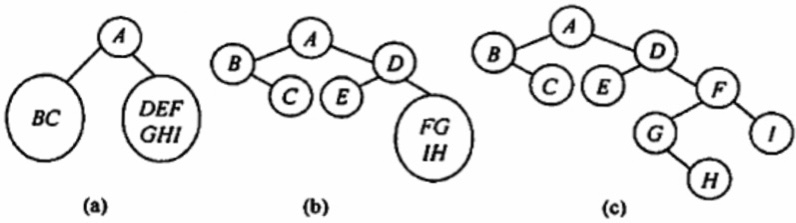

<br/>

### 线索二叉树

#### 线索二叉树的基本概念

定义：线索二叉树是以一定的规则将二叉树中的结点排列成一个线性序列，从而得到几种遍历序列，使得该序列中的每个结点（第一个和最后一个结点除外）都有一个**直接前驱**和**直接后继**。

传统的二叉树存储仅能体现一种父子关系，不能直接得到**结点在遍历中的前驱或后继**。前面提到，在含n个结点的二叉树中，有n + 1个空指针，我们可以把这些空指针利用起来，用来存放指向其前驱或后继的指针，这样就可以像遍历单链表那样遍历二叉树了。引入线索二叉树正是为了加快查找结点前驱和后继的速度。

线索二叉树结点结构：若无左子树，令lchild指向其前驱结点；若无右子树，令rchild指向其后继结点。还需增加两个标志域（ltag和rtag）识别指针是指向左（右）孩子还是指向前驱（后继），如下图：

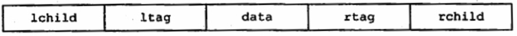

标志域的含义如下：

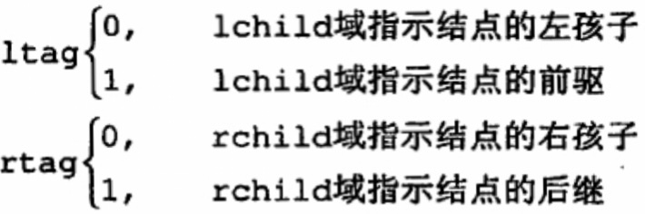

```c++
using ElemType = char;

typedef struct ThreadNode {
    ElemType data;      // 数据元素
    struct ThreadNode* lchild, * rchild;    // 左、右孩子指针
    int ltag, rtag;     // 左、右线索标志
}ThreadNode, * ThreadTree;
```

以这种结构构成的二叉链表作为二叉树的存储结构，称为**线索链表**，其中指向结点前驱和后继的指针称为**线索**。加上线索的二叉树称为**线索二叉树**。

<br/>

#### 中序线索二叉树的构造

前驱和后继的信息只有在遍历时才能得到，因此线索化的实质就是遍历一次二叉树

以中序线索二叉树的建立为例。设指针pre指向刚刚访问过的结点，指针p指向正在访问的结点，即pre指向p的前驱。在中序遍历的过程中，检查p的左指针是否为空，若为空就将它指向pre；检查pre的后继是否为空，若为空就将它指向p。如下图所示：

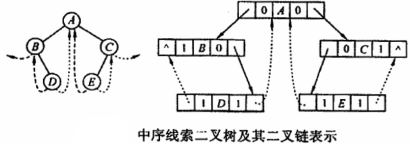

```c++
ThreadNode* pre = nullptr;

void visit(ThreadNode* p) {
    if (p->lchild == nullptr) {     // 左子树为空，建立前驱搜索
        p->lchild = pre;
        p->ltag = 1;
    }
    if (pre != nullptr && pre->rchild == nullptr) {     // 建立前驱结点的后继线索
        pre->rchild = p;
        pre->rtag = 1;
    }
    pre = p;
}

void InThread(ThreadTree T) {   // 其实就是二叉树的中序遍历
    if (T != nullptr) {
        InThread(T->lchild);
        visit(T);		// 唯一与中序遍历不同的地方
        InThread(T->rchild);
    }
}

// 中序线索二叉树T
void CreateInThread(ThreadTree T) {
    pre = nullptr;
    if (T != nullptr) {     // 非空二叉树才能线索化
        InThread(T);    // 中序线索化二叉树
        if (pre->rchild == nullptr)
            pre->rtag = 1;      // 处理遍历的最后一个结点
    }
}
```

为了方便，可以在二叉树的线索链表上也添加一个头结点，令

- 其lchild域的指针指向二叉树的根结点
- 其rchild域的指针指向中序遍历时访问的最后一个结点
- 令二叉树中序遍历中的第一个结点的lchild域指针和最后一个结点的rchild域指针均指向头结点

这好比为二叉树建立了一个双向线索链表，方便从前往后或从后往前对线索二叉树进行遍历，如下图：

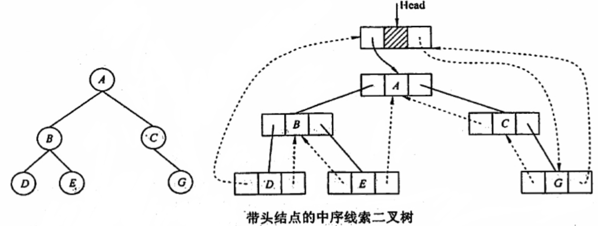

<br/>

#### 中序线索二叉树的遍历

只要找到序列中的第一个结点，然后依次找结点的后继，直至后继为空。在中序线索二叉树中找结点后继的规律是：

- 若其右标志为“1”，则右链为线索，指示其后继
- 否则遍历右子树中第一个访问的结点（右子树最左下的结点）为其后继

不含头结点的线索二叉树的遍历算法如下：

```c++
void _visit(ThreadNode* p) {
    cout << p->data << " ";
}

// 求中序线索二叉树中中序序列下的第一个结点
ThreadNode* FirstNode(ThreadNode* p) {
    while (p->ltag == 0) p = p->lchild;     // 最左下结点（不一定是叶结点）
    return p;
}

// 求中序线索二叉树中结点p在中序序列下的后继
ThreadNode* NextNode(ThreadNode* p) {
    if (p->rtag == 0) return FirstNode(p->rchild);
    return p->rchild;       // rtag == 1直接返回后继线索
}

// 不含头结点的中序线索二叉树的中序遍历（顺序）
void InOrder1(ThreadNode * T) {
    for (ThreadNode* p = FirstNode(T); p != nullptr; p = NextNode(p))
        _visit(p);
}

// 求中序线索二叉树中中序序列下的最后一个结点
ThreadNode* LastNode(ThreadNode* p) {
    while (p->rtag == 0) p = p->rchild;     // 最右下结点（不一定是叶结点）
    return p;
}

// 求中序线索二叉树中结点p在中序序列下的前驱
ThreadNode* PreNode(ThreadNode* p) {
    if (p->ltag == 0) return LastNode(p->lchild);
    return p->lchild;       // ltag == 1直接返回前驱线索
}

// 不含头结点的中序线索二叉树的中序遍历（逆序）
void InOrder2(ThreadNode * T) {
    for (ThreadNode* p = LastNode(T); p != nullptr; p = PreNode(p))
        _visit(p);
}
```

- 运行结果

```c++
int main() {
    // 构建二叉树
    ThreadTree T = new ThreadNode();
    T->data = 'A';
    T->lchild = new ThreadNode();
    T->rchild = new ThreadNode();
    T->rchild->lchild = nullptr;
    T->rchild->rchild = nullptr;
    T->lchild->data = 'B';
    T->rchild->data = 'C';
    T->lchild->lchild = new ThreadNode();
    T->lchild->rchild = new ThreadNode();
    T->lchild->lchild->data = 'D';
    T->lchild->lchild->lchild = nullptr;
    T->lchild->lchild->rchild = nullptr;
    T->lchild->rchild->data = 'E';
    T->lchild->rchild->lchild = nullptr;
    T->lchild->rchild->rchild = nullptr;

    CreateInThread(T);    // 构建中序线索二叉树
    cout << "\n中序线索二叉树的中序遍历（顺序）：";
    InOrder1(T);
    cout << "\n中序线索二叉树的中序遍历（逆序）：";
    InOrder2(T);
    return 0;
}

输出：
中序线索二叉树的中序遍历（顺序）：D B E A C
中序线索二叉树的中序遍历（逆序）：C A E B D
```

<br/>

#### 先序线索二叉树的构造

与中序类似：

```c++
// 全局变量pre，指向当前访问结点的前驱
ThreadNode* pre = nullptr;

void visit(ThreadNode* p) {
    if (p->lchild == nullptr) {     // 左子树为空，建立前驱搜索
        p->lchild = pre;
        p->ltag = 1;
    }
    if (pre != nullptr && pre->rchild == nullptr) {     // 建立前驱结点的后继线索
        pre->rchild = p;
        pre->rtag = 1;
    }
    pre = p;
}

// 先序遍历二叉树，一边遍历一边线索化
void PreThread(ThreadTree T) {
    if (T != nullptr) {
        visit(T);
        if (T->ltag == 0)       // lchild不是前驱线索
            PreThread(T->lchild);
        PreThread(T->rchild);
    }
}

// 先序线索化二叉树T
void CreatePreThread(ThreadTree T) {
    pre = nullptr;
    if (T != nullptr) {		// 非空二叉树才能线索化
        PreThread(T);		// 先序线索化二叉树
        if (pre->rchild == nullptr)
            pre->rtag = 1;      // 处理遍历的最后一个结点
    }
}
```

<br/>

#### 后序线索化二叉树的构造

与中序类似：

```c++
// 全局变量pre，指向当前访问结点的前驱
ThreadNode* pre = nullptr;

void visit(ThreadNode* p) {
    if (p->lchild == nullptr) {     // 左子树为空，建立前驱搜索
        p->lchild = pre;
        p->ltag = 1;
    }
    if (pre != nullptr && pre->rchild == nullptr) {     // 建立前驱结点的后继线索
        pre->rchild = p;
        pre->rtag = 1;
    }
    pre = p;
}

// 后序遍历二叉树，一边遍历一边线索化
void PostThread(ThreadTree T) {
    if (T != nullptr) {
        visit(T);
        PostThread(T->lchild);
        PostThread(T->rchild);
    }
}

// 后序线索化二叉树T
void CreatePreThread(ThreadTree T) {
    pre = nullptr;
    if (T != nullptr) {		// 非空二叉树才能线索化
        PostThread(T);		// 后序线索化二叉树
        if (pre->rchild == nullptr)
            pre->rtag = 1;      // 处理遍历的最后一个结点
    }
}
```

<br/>

如何手动地求出线索二叉树呢？这里以先序线索二叉树为例，现有一棵二叉树如下图（a），它的先序序列为：A B C D F，然后依次判断每个结点的左右链域，如果为空，则将其改造为线索。结点A，B均有左右孩子；结点C无左孩子，将左链域指向前驱B，无右孩子，将右链域指向后继D；结点D无左孩子，将左链域指向前驱C，无右孩子，将右链域指向后继F；结点F无左孩子，将左链域指向前驱D，无右孩子，也无后继，因此将左链域置空，得到了先序线索二叉树（b）

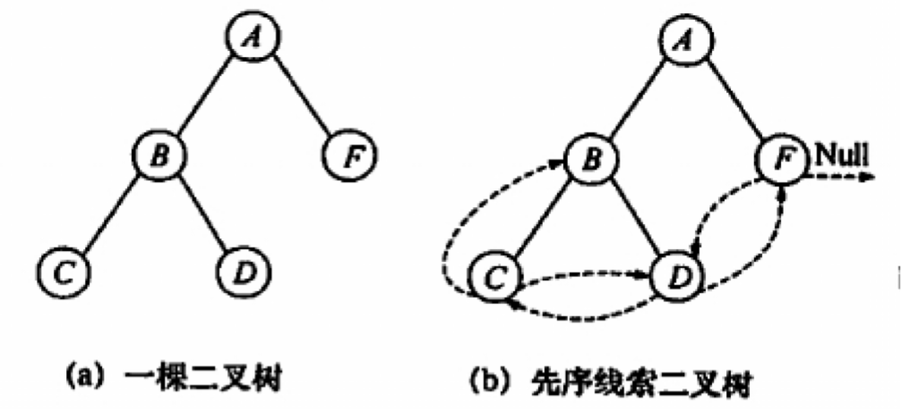

<br/>

如何在先序线索二叉树中找结点的后继？

- 如果有左孩子，则左孩子就是其后继（遍历顺序：根左右）
- 如果无左孩子但有右孩子，则右孩子就是其后继
- 如果为叶结点，则右链域直接指示了结点的后继

<br/>

在后序线索二叉树中找结点的后继较为复杂，可分为三种情况：

- 若结点x是二叉树的根，则其后继为空（遍历顺序：左右根）
- 若结点x是其双亲的右孩子，或是其双亲的左孩子且其双亲没有右子树，则其后继即为双亲
- 若结点x是其双亲的左孩子，且其双亲有右子树，则其后继为双亲的右子树上按后序遍历列出的第一个结点

在后序线索二叉树上找后继时需要知道结点双亲。

<br/>

|        | 中序线索二叉树 | 先序线索二叉树 | 后序线索二叉树 |
| :----: | :------------: | :------------: | :------------: |
| 找前驱 |       √        |       ×        |       √        |
| 找后继 |       √        |       √        |       ×        |

打×的地方除非使用三叉链表或是从根结点开始遍历寻找

<br/>

## 树和森林

### 树的存储结构

#### 双亲表示法

采用一组连续空间来存储每个结点，同时在每个结点中增加一个伪指针，指示其双亲结点在数组中的位置，如下图所示：

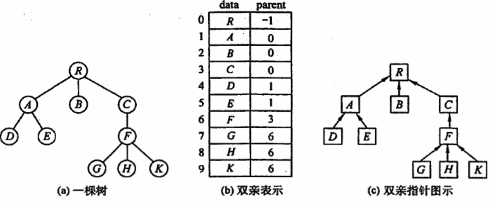

```c++
#define MAX_TREE_SIZE 100
typedef struct {
    ElemType data;  // 数据元素
    int parent;     // 双亲位置域（伪指针）
}PTNode;

typedef struct {
    PTNode nodes[MAX_TREE_SIZE];    // 双亲表示
    int n;      // 结点数
}PTree;
```

每个结点只有唯一一个双亲，可以很快得到每个结点的双亲结点，但求结点的孩子时需要遍历整个结构。

<br/>

#### 孩子表示法

将每个结点的孩子结点结点都用单链表链接起来形成一个线性结构，此时n个结点就有n个孩子链表（叶子结点的孩子链表为空表），图下图所示：

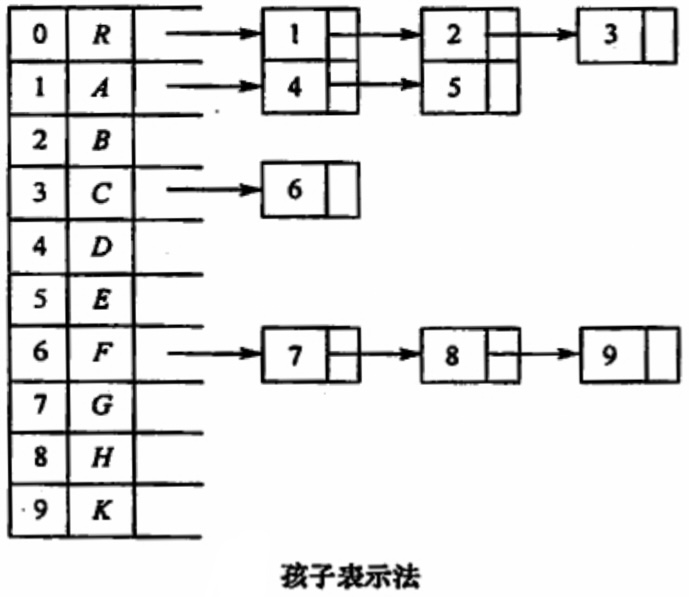

```c++
#define MAX_TREE_SIZE 100
typedef struct CTNode {
    int child;      // 孩子结点在数组中的位置
    struct CTNode* next;    // 下一个孩子
}CTNode;

typedef struct {
    ElemType data;
    struct CTNode* firstChild;  // 第一个孩子
}CTBox;

typedef struct {
    CTBox nodes[MAX_TREE_SIZE];
    int n, root;    // 结点个数和根的位置
}CTree;
```

<br/>

#### 孩子兄弟表示法

又称为二叉树表示法，即以二叉链表作为树的存储结构。孩子兄弟表示法使每个结点包含三部分内容：结点值、指向结点第一个孩子的指针、指向结点下一个兄弟结点的指针（左孩子右兄弟），如下图所示：

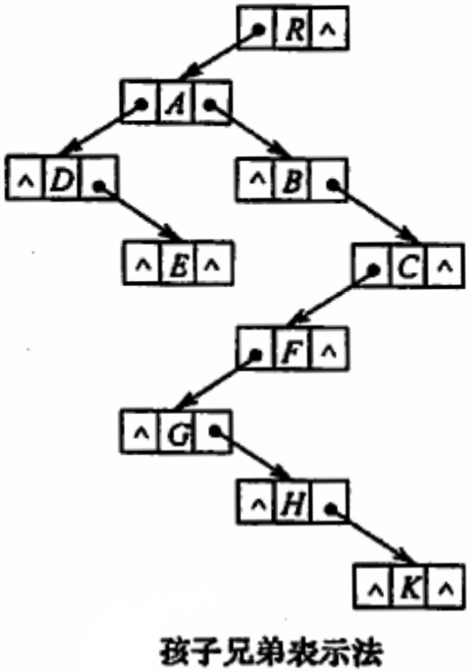

```c++
// 孩子兄弟表示法
typedef struct CSNode {
    ElemType data;      // 数据域
    struct CSNode* firstchild, * nextsibling;   // 第一个孩子和右兄弟指针
};

// 与二叉链表进行比较
typedef struct BiTNode {
    ElemType data;      // 数据域
    struct BiTNode* lchild, * rchild;   // 第一个孩子和右兄弟指针
}BiTNode, * BiTree;
```

<br/>

### 树、森林与二叉树的转换

二叉树和树都可以用二叉链表作为存储结构，给定一棵树，可以找到唯一的一棵二叉树与之对应。从物理结构上看，它们的二叉链表是相同的，只是解释不同而已。

树转换为二叉树的规则：每个结点的左指针指向它的第一个孩子，右指针指向它在树中的相邻右兄弟，这个规则又称“**左孩子右兄弟**”。由于根结点没有兄弟，所以对应的二叉树没有右子树，如下图树与二叉树的对应关系：

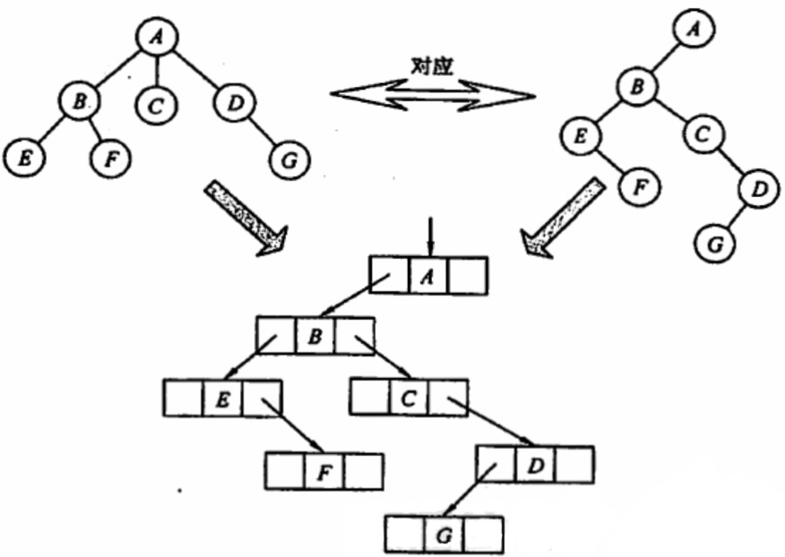

树转换成二叉树的画法：

- 在兄弟结点之间加一连线
- 对每个结点，只保留它与第一个孩子的连线，而与其他孩子的连线全部抹掉
- 以树根为轴心，顺时针旋转45°

将森林转换为二叉树的画法：

- 先将森林中的每棵树转换为二叉树
- 由于任何一棵和树对应的二叉树的右子树必空，所以把森林中第二棵树视为第一棵树的右兄弟，第三棵树为第二棵树的右兄弟...以此类推

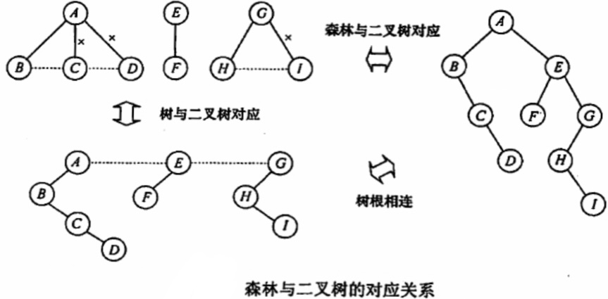

<br/>

二叉树转换为森林的规则：

- 若二叉树非空，则二叉树的根及其左子树为第一棵树的二叉树形式，故将根的右链断开
- 二叉树的右子树又可以视为一个由除第一棵树外的二叉树形式，应用相同的方法，直到最后只剩一棵没有右子树的二叉树为止
- 最后再将每棵二叉树依次转换成树，就得到了原森林

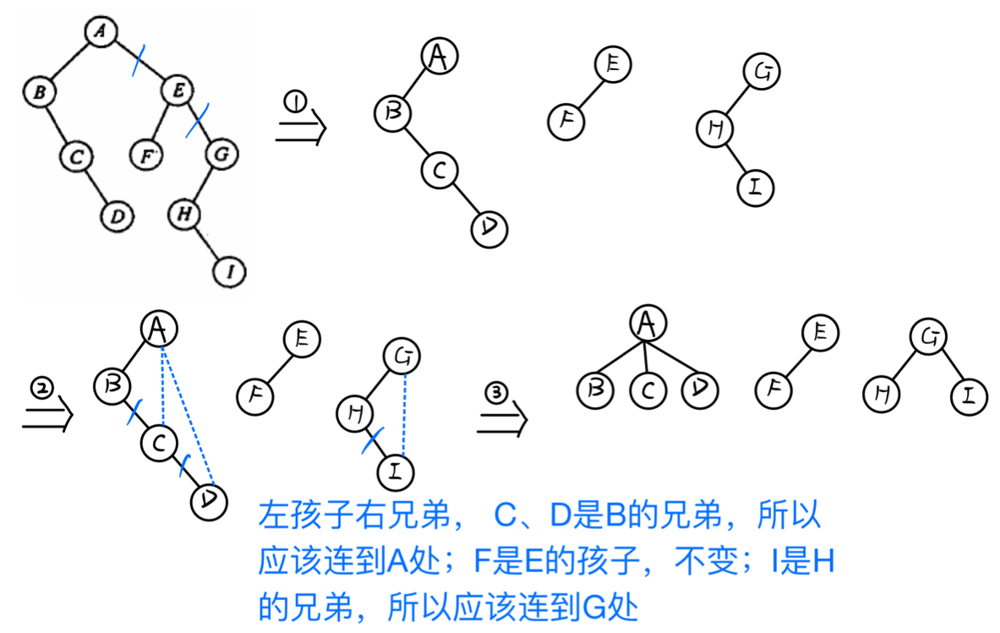

<br/>

### 树和森林的遍历

树的遍历是指用某种方式访问树中的每个结点，且仅访问一次。主要有两种方式：

- 先根遍历：若树非空，先访问根结点，再依次遍历根结点的每棵子树，遍历子树时仍遵循先根后子树的规则。其遍历序列与这棵树相应二叉树的**先序序列**相同。
- 后根遍历：若树非空，先依次遍历根结点的每棵子树，再访问根结点，遍历子树时仍遵循先子树后跟的规则。其遍历序列与这棵树相应二叉树的**中序序列**相同。

如下图的树的先根遍历序列为A B E F C D G，后根遍历序列为E F B C G D A

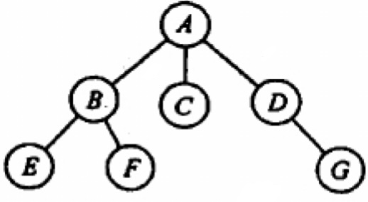

<br/>

按照森林和树相互递归的定义，可得到森林的两种遍历方法

**先序遍历**森林。若森林为非空，则按如下规则进行遍历：（其实就是对森林中的每一棵树进行**先根遍历**）

- 访问森林中第一棵树的根结点
- 先序遍历第一棵树中根结点的子树森林
- 先序遍历除去第一棵树之后剩余的树构成的森林

**中序遍历**森林。森林为非空时，按如下规则进行遍历：（其实就是对森林中的每一棵树进行**后根遍历**）

- 中序遍历森林中第一棵树的根结点的子树森林
- 访问第一棵树的根结点
- 中序遍历除去第一棵树之后剩余的树构成的森林

如下图的森林的先序遍历序列为 A B C D E F G H I，中序遍历序列为B C D A F E H I G

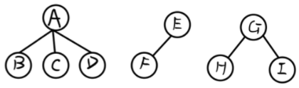

<br/>

树、森林和二叉树的遍历有如下关系：

|    树    |   森林   |  二叉树  |
| :------: | :------: | :------: |
| 先根遍历 | 先序遍历 | 先序遍历 |
| 后根遍历 | 中序遍历 | 中序遍历 |

<br/>

树的遍历伪代码：

```c++
// 树的先根遍历
void PreOrder(TreeNode* R) {
    if (R != nullptr) {
        visit(R);   // 访问结点R
        while (R还有下一个子树T)
            PreOrder(T);    //先根遍历下一棵子树
    }
}

// 树的后根遍历
void PostOrder(TreeNode* R) {
    if (R != nullptr) {
        while (R还有下一个子树T)
            PostOrder(T);       // 后根遍历下一棵子树
        visit(R);   // 访问结点R
    }
}
```

<br/>

### 树的应用——并查集

并查集是一种简单的集合表示，它支持以下3种操作：

- Union(S, Root1, Root2)：把集合S中的子集合Root2并入子集合Root1。要求Root1和Root2互不相交，否则不执行合并
- Find(S, x)：查找集合S中单元素x所在的子集合，并返回该子集合的名字
- Initial(S)：将集合S中的每个元素都初始化为只有一个单元素的子集合

通常用树（森林）的双亲表示作为并查集的存储结构，每个子集合以一棵树表示。所有表示子集合的树，构成表示全集合的森林，存放在双亲数组内。通常用数组元素的下标代表元素名，用根结点的下标代表子集合名，根结点的双亲结点为负数。

```c++
#define SIZE 100
int UFSets[SIZE];       // 集合元素数组（双亲指针数组）

// 并查集的初始化操作（S即为并查集）
void Initial(int S[]) {
    for (int i = 0; i < SIZE; ++i)
        S[i] = i;       // 初始时，每个结点各自为一个集合，这个结点是当前集合根结点
}

// Find操作（函数在并查集S中查找并返回包含元素x的树的根）
int Find(int S[], int x) {
    if (S[x] != x)   // 寻找x的根
        S[x] = Find(S, S[x]);   // 路径压缩
    return S[x];           // 根的S[]小于0（因为根没有双亲）
}

/*
// Find操作，不使用路径压缩
int Find(int S[], int x) {
    while (S[x] != x)   // 寻找x的根
       x = S[x];
    return x;
}
*/

// Union操作（函数求两个不相交子集合的并集）
void Union(int S[], int Root1, int Root2) {
    // 要求Root1与Root2是不同的，且表示子集合的名字
    int findRoot1 = Find(S, S[Root1]);
    int findRoot2 = Find(S, S[Root2]);
    if(findRoot1 != findRoot2)
        S[findRoot2] = findRoot1;       // 将根Root2连接到另一根Root1下面
}
```

- 运行结果

```c++
int main() {
    Initial(UFSets);

    // 集合S1
    Union(UFSets, 0, 6);
    Union(UFSets, 0, 7);
    Union(UFSets, 0, 8);

    // 集合S2
    Union(UFSets, 1, 4);
    Union(UFSets, 1, 9);

    // 集合S3
    Union(UFSets, 2, 3);
    Union(UFSets, 2, 5);

    cout << "元素8的根：" << Find(UFSets, 8);
    cout << "\n元素9的根：" << Find(UFSets, 9);
    cout << "\n元素5的根：" << Find(UFSets, 5) << endl;

    cout << "合并集合S1和S2\n";
    Union(UFSets, 0, 1);
    cout << "元素8的根：" << Find(UFSets, 8);
    cout << "\n元素9的根：" << Find(UFSets, 9);
    return 0;
}

输出：
元素8的根： 0
元素9的根： 1
元素5的根： 2
合并集合S1和S2
元素8的根： 0
元素9的根： 0
```

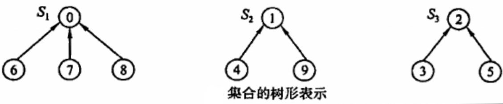

合并后为：

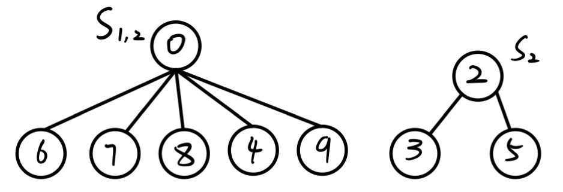

<br/>

使用路径压缩可以减少查找的次数：

```c++
int Find(int S[], int x) {
    if (S[x] != x)   // 寻找x的根
        S[x] = Find(S, S[x]);   // 路径压缩
    return S[x];           // 根的S[]小于0（因为根没有双亲）
}
```

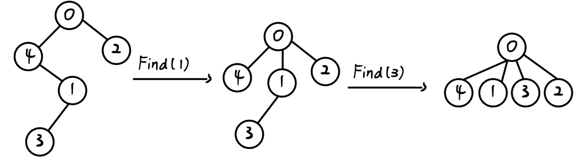

<br/>

### 树与二叉树的应用

#### 二叉排序树（BST）

##### 二叉排序树的定义

二叉排序树（二叉查找树）：或者是一棵空树，或者是具有下列特性的二叉树：

- 若左子树非空，则左子树上所有结点的值均小于根结点的值
- 若右子树非空，则右子树上所有结点的值均大于根结点的值
- 左右子树也分别是一棵二叉排序树

根据二叉排序树的定义，**左子树结点值  < 根结点值  < 右子树结点**，因此，对二叉排序树进行**中序遍历**，可以得到一个**递增**的有序序列

如下图是一棵二叉排序树，对它进行中序遍历可以得到一个递增序列1 2 3 4 6 8

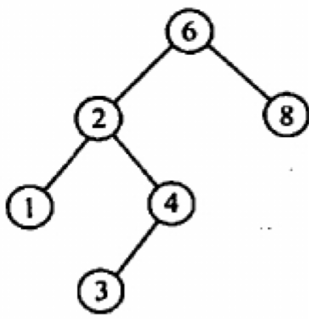

<br/>

##### 二叉排序树的查找

二叉树的查找是从根结点开始，沿某个分支逐层向下比较的过程。若二叉排序树非空，先将给定值与根结点的关键字比较，

- 若相等，则查找成功
- 若不等，如果小于根结点的关键字，则在根结点的左子树上查找，否则在跟结点的右子树上查找

```c++
// 二叉排序树的非递归查找
BSTNode* BST_Search(BiTree T, ElemType value) {
    while (T != nullptr && value != T->data) {
        if (value < T->data) T = T->lchild;     // 小于，则在左子树上查找
        else T = T->rchild;                     // 大于，则在右子树上查找
    }
    return T;
}
```

<br/>

##### 二叉排序树的插入

二叉排序树作为一种**动态树表**，特点是树的结构通常不是一次生成的，而是在查找过程中，当树中不存在关键字值等于给定的结点时再进行插入的

插入结点的过程：

- 若二叉排序树为空，则直接插入结点
- 否则，若关键字k小于根结点值，则插入到左子树；若关键字k大于根结点值，则插入到右子树

插入的结点一定是一个新添加的叶结点，且是查找失败时的查找路径上访问的最后一个结点的左孩子或右孩子

```c++
// 二叉排序树的插入
bool BST_Insert(BiTree& T, ElemType value) {
    if (T == nullptr) {     // 原树为空，新插入的记录为根结点
        T = new BSTNode();
        T->data = value;
        T->lchild = T->rchild = nullptr;
        return true;
    }
    else if (T->data == value)
        return false;       // 树中存在相同关键字的结点，插入失败
    else if (T->data < value)
        return BST_Insert(T->lchild, value);    // 插入到T的左子树
    else
        return BST_Insert(T->rchild, value);    // 插入到T的右子树
}
```

如下图在一个二叉排序树中依次插入结点28和结点58（虚线表示的边是其查找路径）：

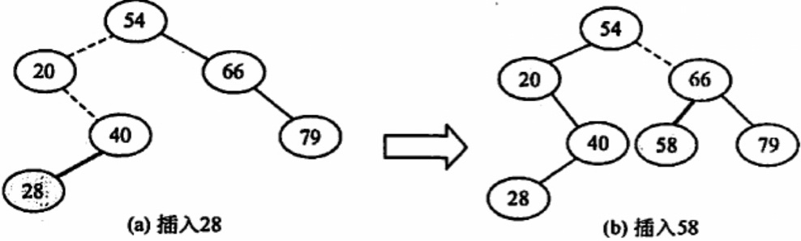

<br/>

##### 二叉排序树的构造

从一棵空树出发，依次输入元素，将它们插入到二叉排序树中合适的位置

```c++
// 构造二叉排序树
void Create_BST(BiTree& T, ElemType value[], int length) {
    T = nullptr;        // 初始时T为空树
    for (int i = 0; i < length; ++i)
        BST_Insert(T, value[i]);        // 依次将每个关键字插入到二叉排序树中
}
```

如下图构造一棵二叉排序树：

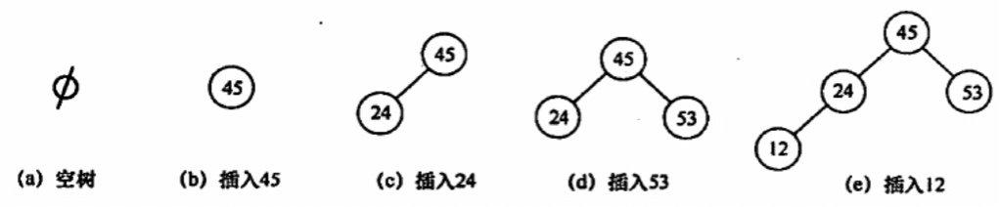

<br/>

##### 二叉排序树的删除

在二叉排序树中删除一个结点时，不能把以该结点为根的子树上的结点都删除，必须先把被删除结点从存储二叉树的链表上摘下，将因删除结点而断开的二叉链表重新链接起来，同时确保二叉排序树的性质不会丢失

删除操作的实现过程按3种情况来处理：

- 若被删除结点z是叶结点，则直接删除，不会破坏二叉排序树的性质

- 若结点z只有一棵左子树或右子树，则让z的子树称为z父节点的子树，替代z的位置

- 若结点z有左、右两棵子树，则令z的直接后继（或直接前驱）替代z，然后从二叉排序树删去这个直接后继（或直接前驱），这样就转换成了第一种或第二种情况

  z的**前驱**：z的左子树中最右下结点（z的左子树的最大结点）

  z的**后继**：z的右子树中最左下结点（z的右子树的最小结点）

如下如三种删除情况：

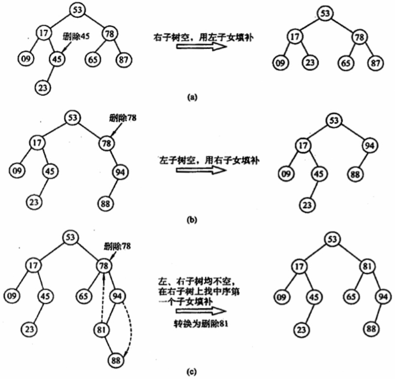

在二叉排序树中删除一个结点并插入相同的结点，结果可能与原来的二叉排序树相同，也有可能不同。

- 当删除的是叶结点的时候，则相同
- 当删除的是分支节点的时候，则不同

```c++
// pre指针为全局变量，详见完整代码
// 二叉排序树的删除
bool BST_Delete(BiTree& T, ElemType value) {
    // 首先查找结点
    BSTNode* search = BST_Search(T, value);
    if (search == nullptr) {
        return false;   // 没有这个结点
    }
    // 三种情况
    // ①待删除结点为叶结点
    if (search->lchild == nullptr && search->rchild == nullptr) {
        if (pre->lchild == search)      // 该叶结点为其双亲的左孩子
            pre->lchild = nullptr;
        else                            // 该叶结点为其双亲的右孩子
            pre->rchild = nullptr;
        delete search;
    }
    // ②待删除结点只有一棵左子树或右子树
    else if (search->lchild != nullptr && search->rchild == nullptr) {  // 只有左子树
        if (pre->lchild == search)
            pre->lchild = search->lchild;
        else
            pre->rchild = search->lchild;
        delete search;
    }
    else if(search->lchild == nullptr && search->rchild != nullptr) {   // 只有右子树
        if (pre->lchild == search)
            pre->lchild = search->rchild;
        else
            pre->rchild = search->rchild;
        delete search;
    }
    // ③待删除结点有左、右两棵子树
    else {  // 这里使用直接后继替代待删除结点;
        BSTNode* subsequent = search->rchild;
        pre = search;
        while (subsequent->lchild != nullptr) { // 寻找待删除结点的直接后继
            pre = subsequent;
            subsequent = subsequent->lchild;
        }
        // 交换结点的值
        ElemType temp = search->data;
        search->data = subsequent->data;
        subsequent->data = temp;
        BST_Delete(subsequent, subsequent->data);   // 以直接后继为根继续删除
    }
    return true;
}
```

<br/>

##### 二叉排序树的查找效率分析

二叉排序树的查找效率，主要取决于树的高度

**平衡二叉树**：二叉树的左、右子树的高度之差的绝对值不超过1。平均查找长度为O(log<sub>2</sub>n)

**单支树**：若二叉排序树是一个只有右（左）孩子的单支树，则其平均查找长度为O(n)。在构造二叉树时，当构造二叉排序树的输入序列是有序的，则会形成一个倾斜的单支树

如下图的平衡二叉树（a）和单支树（b）：

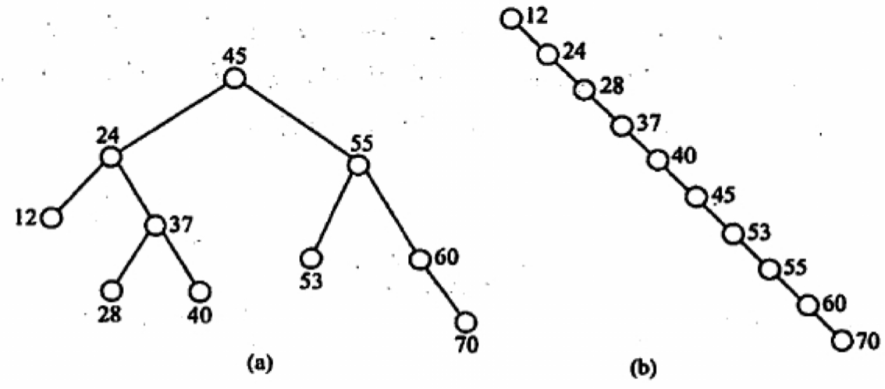

上图（a）查找成功的平均查找长度为：ASL<sub>a</sub> = (1 + 2 × 2 + 3 × 4 + 4 × 3) / 10 = 2.9

（b）查找成功的平均查找长度为：ASL<sub>b</sub> = (1 + 2 + 3 + 4 + 5 + 6 + 7 + 8 + 9 + 10) / 10 = 5.5

可以看出，二叉排序树与二分查找类似，但是二分查找的判定树唯一，而二叉排序树的查找不唯一，相同的关键字其插入顺序不同可能生成不同的二叉排序树，如上图

<br/>

##### 二叉排序树完整代码

下面是二叉排序树的完整代码（构建的二叉树为上图的（a））：

```c++
using ElemType = int;

// 二叉树的链式存储结构
typedef struct BSTNode {
    ElemType data;	// 数据域
    struct BSTNode* lchild, * rchild;	// 左、右孩子指针
}BSTTNode, * BiTree;

/*// （想要进行二叉排序树的删除，要对查找进行改造）
// 二叉排序树的非递归查找
BSTNode* BST_Search(BiTree T, ElemType value) {
    while (T != nullptr && value != T->data) {
        if (value < T->data) T = T->lchild;     // 小于，则在左子树上查找
        else T = T->rchild;                     // 大于，则在右子树上查找
    }
    return T;
}*/

// 二叉排序树的插入
bool BST_Insert(BiTree& T, ElemType value) {
    if (T == nullptr) {     // 原树为空，新插入的记录为根结点
        T = new BSTNode();
        T->data = value;
        T->lchild = T->rchild = nullptr;
        return true;
    }
    else if (T->data == value)
        return false;       // 树中存在相同关键字的结点，插入失败
    else if (T->data > value)
        return BST_Insert(T->lchild, value);    // 插入到T的左子树
    else
        return BST_Insert(T->rchild, value);    // 插入到T的右子树
}

// 构造二叉排序树
void Create_BST(BiTree& T, ElemType value[], int length) {
    T = nullptr;        // 初始时T为空树
    for (int i = 0; i < length; ++i)
        BST_Insert(T, value[i]);        // 依次将每个关键字插入到二叉排序树中
}

BSTNode* pre = nullptr;	// 用于保存查找结点的前驱结点，用于下面的删除算法使用
// 二叉排序树的非递归查找
BSTNode* BST_Search(BiTree T, ElemType value) {
    while (T != nullptr && value != T->data) {
        if (value < T->data) {     // 小于，则在左子树上查找
            pre = T;
            T = T->lchild;
        }         
        else {                     // 大于，则在右子树上查找
            pre = T;
            T = T->rchild;
        }
    }
    return T;
}

// 二叉排序树的删除
bool BST_Delete(BiTree& T, ElemType value) {
    // 首先查找结点
    BSTNode* search = BST_Search(T, value);
    if (search == nullptr) {
        return false;   // 没有这个结点
    }
    // 三种情况
    // ①待删除结点为叶结点
    if (search->lchild == nullptr && search->rchild == nullptr) {
        if (pre->lchild == search)      // 该叶结点为其双亲的左孩子
            pre->lchild = nullptr;
        else                            // 该叶结点为其双亲的右孩子
            pre->rchild = nullptr;
        delete search;
    }
    // ②待删除结点只有一棵左子树或右子树
    else if (search->lchild != nullptr && search->rchild == nullptr) {  // 只有左子树
        if (pre->lchild == search)
            pre->lchild = search->lchild;
        else
            pre->rchild = search->lchild;
        delete search;
    }
    else if(search->lchild == nullptr && search->rchild != nullptr) {   // 只有右子树
        if (pre->lchild == search)
            pre->lchild = search->rchild;
        else
            pre->rchild = search->rchild;
        delete search;
    }
    // ③待删除结点有左、右两棵子树
    else {  // 这里使用直接后继替代待删除结点;
        BSTNode* subsequent = search->rchild;
        pre = search;
        while (subsequent->lchild != nullptr) { // 寻找待删除结点的直接后继
            pre = subsequent;
            subsequent = subsequent->lchild;
        }
        // 交换结点的值
        ElemType temp = search->data;
        search->data = subsequent->data;
        subsequent->data = temp;
        BST_Delete(subsequent, subsequent->data);   // 以直接后继为根继续删除
    }
    return true;
}

// 先序遍历二叉树
void visit(BSTNode* node) {
    cout << node->data << " ";
}

void PreOrder(BiTree T) {
    if (T != nullptr) {
        visit(T);		// 访问根结点
        PreOrder(T->lchild);	// 递归遍历左子树
        PreOrder(T->rchild);	// 递归遍历右子树
    }
}

// 判断是否找到
void Trail(BSTNode* T) {
    if (T == nullptr)
        cout << "false\n";
    else
        cout << "true\n";
}
```

- 运行结果

```c++
int main() {
    BiTree BSTree;
    int value[10] = { 45,24,55,12,37,53,60,28,40,70 };
    Create_BST(BSTree, value, 10);
    cout << "先序遍历二叉排序树：";
    PreOrder(BSTree);

    cout << "\n查找结点24：";
    Trail(BST_Search(BSTree, 24));
    cout << "查找结点100：";
    Trail(BST_Search(BSTree, 100));

    cout << "插入结点100\n";
    BST_Insert(BSTree, 100);
    cout << "先序遍历二叉排序树：";
    PreOrder(BSTree);
    cout << "\n查找结点100：";
    Trail(BST_Search(BSTree, 100));

    cout << "\n删除结点37：";
    cout << (BST_Delete(BSTree, 37) ? "删除成功！\n" : "删除失败\n");
    PreOrder(BSTree);

    cout << "\n删除结点55：";
    cout << (BST_Delete(BSTree, 55) ? "删除成功！\n" : "删除失败\n");
    PreOrder(BSTree);

    cout << "\n删除结点100：";
    cout << (BST_Delete(BSTree, 100) ? "删除成功！\n" : "删除失败\n");
    PreOrder(BSTree);

    cout << "\n删除结点45：";
    cout << (BST_Delete(BSTree, 45) ? "删除成功！\n" : "删除失败\n");
    PreOrder(BSTree);
    delete pre;
    return 0;
}

输出：
先序遍历二叉排序树： 45 24 12 37 28 40 55 53 60 70
查找结点24： true
查找结点100： false
插入结点100
先序遍历二叉排序树： 45 24 12 37 28 40 55 53 60 70 100
查找结点100： true

删除结点37：删除成功！
45 24 12 40 28 55 53 60 70 100
删除结点55：删除成功！
45 24 12 40 28 60 53 70 100
删除结点100：删除成功！
45 24 12 40 28 60 53 70
删除结点45：删除成功！
53 24 12 40 28 60 70
```

过程如下图：

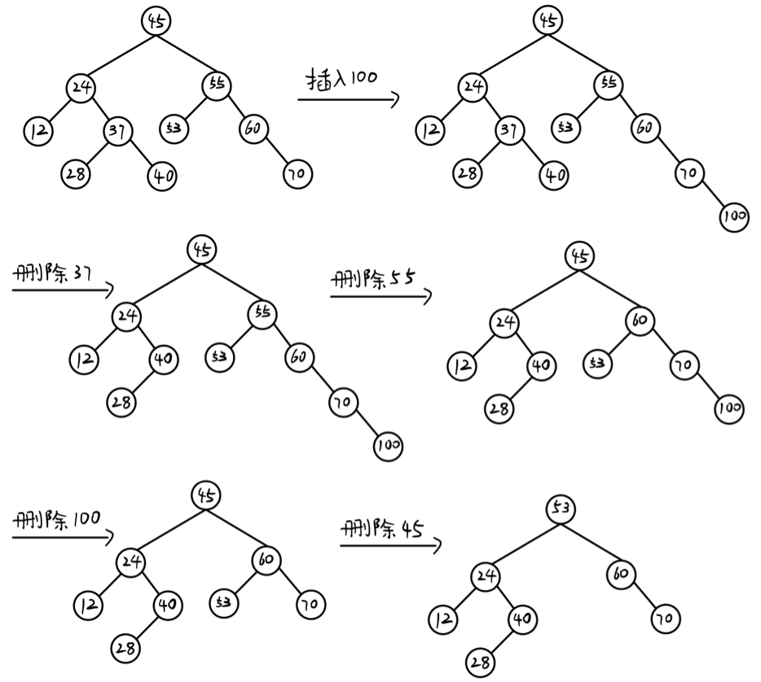

<br/>

#### 平衡二叉树（平衡树）

##### 平衡二叉树的定义

定义：为了避免树的增长过快，降低二叉排序树的性能，规定在插入和删除二叉树的结点时，要保证任意结点的左、右子树高度差的绝对值不超过1

**平衡因子**：一个结点的左子树与右子树的高度差，值只可能为-1、0或1

因此，平衡二叉树可以定义为一棵空树，或者是具有下列性质的二叉树：

- 左子树和右子树都是平衡二叉树
- 左子树和右子树的高度差的绝对值不超过1

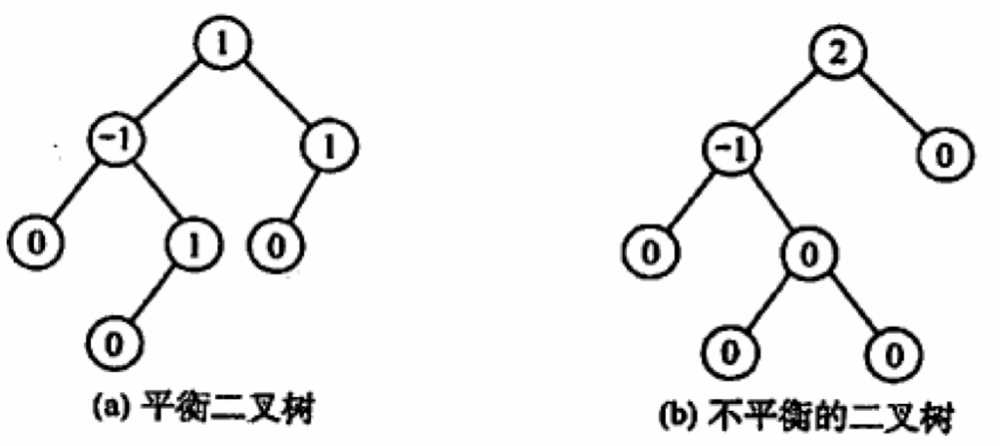

<br/>

##### 平衡二叉树的插入

基本思想：每当在二叉排序树中插入（或删除）一个结点时，首先检查其插入路径上的结点是否因为此次操作而导致了不平衡。若导致了不平衡，则先找到插入路径上离插入结点最近的平衡因子的绝对值大于1的结点A，再对以A为根的子树（**最小不平衡子树**），在保持二叉排序树的前提下，调整各个结点的位置关系，使之重新达到平衡。

平衡二叉树的插入过程的前半部分与二叉排序树相同，不同的是插入后对二叉树的调整操作，共有四种情况：

- **LL平衡旋转（右单旋转）**：由于在结点A的左孩子（L）的左子树（L）上插入了新结点，A的平衡因子由1增至2，导致以A为根的子树失去平衡，需要一次向右的旋转操作。将A的左孩子B向右上旋转代替A成为根结点，将A结点向右下旋转成为B的右子树的根结点，而B的原右子树则作为A结点的左子树

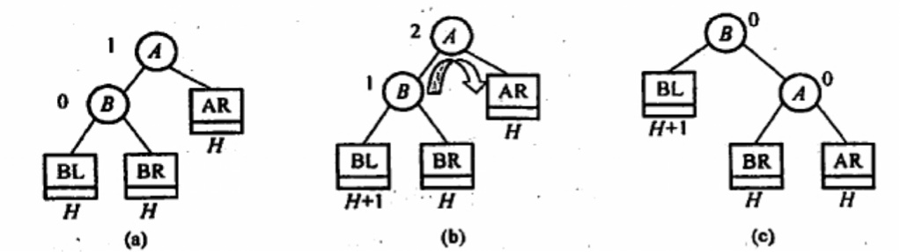

- **RR平衡旋转（左单旋转）**：由于在结点A的右孩子（R）的右子树（R）上插入了新结点，A的平衡因子由-1减至-2，导致以A为根的子树失去平衡，需要一次向左的旋转操作。将A的右孩子B向左上旋转代替A成为根结点，将A结点向左下旋转成为B的左子树的根结点，而B的原左子树则作为A结点的右子树

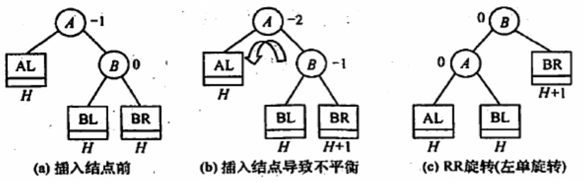

- **LR平衡旋转（先左后右双旋转）**：由于在结点A的左孩子（L）的右子树（R）上插入了新结点，A的平衡因子由1增至2，导致以A为根的子树失去平衡，需要进行两次旋转操作，先左旋转后右旋转。将A结点的左孩子B的右子树的根结点C向左上旋转提升到B结点的位置，然后把该C结点向右上旋转提升到A结点的位置

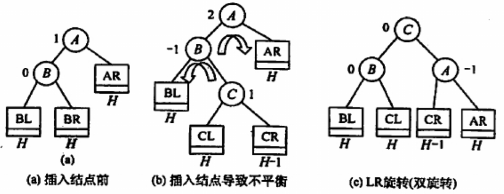

- **RL平衡旋转（先右后左双旋转）**：由于在结点A的右孩子（R）的左子树（L）上插入了新结点，A的平衡因子由-1减至-2，导致以A为根的子树失去平衡，需要进行两次旋转操作，先右旋转后左旋转。将A结点的右孩子B的左子树的根结点C向右上旋转提升到B结点的位置，然后把该C结点向左上旋转提升到A结点的位置

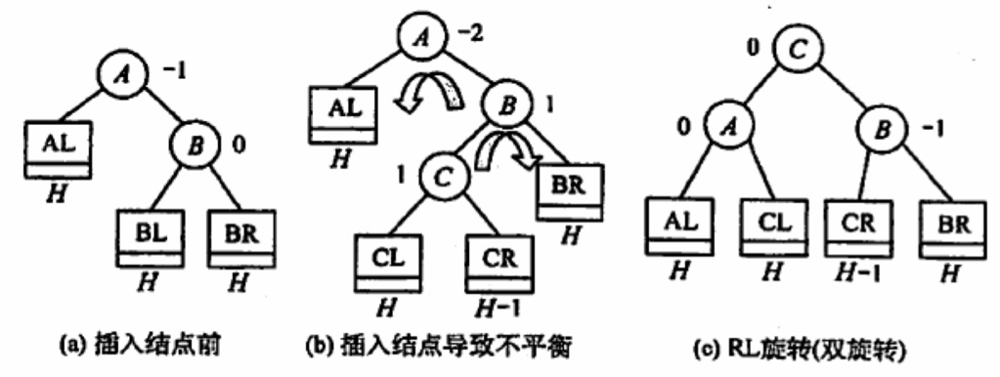

<br/>

**例子**：假设关键字序列为{15, 3, 7, 10, 9, 8}，通过该序列生成平衡二叉树的过程如下图所示：

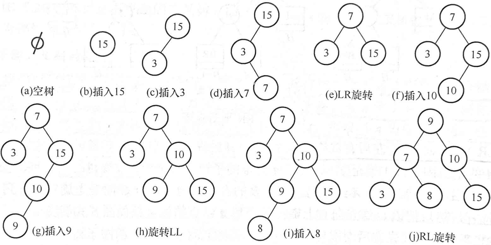

<br/>

##### 平衡二叉树的查找

在平衡二叉树上进行查找的过程与二叉排序树的相同。因此，在产找过程中，与给定值进行比较的关键字个数不超过树的深度。假设以**n<sub>h</sub>**表示深度为h的平衡树中含有的**最少结点数**。显然有n<sub>0</sub> = 0，n<sub>1</sub> = 1，n<sub>2</sub> = 2，并且有**n<sub>h</sub> = n<sub>h - 1</sub> + n<sub>h - 2</sub> + 1**。平衡二叉树的**平均查找长度为O(log<sub>2</sub>n)**，如下图：

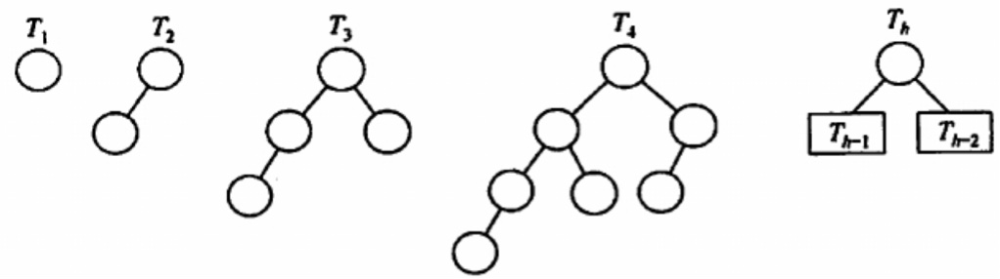

<br/>

#### 哈夫曼树和哈夫曼编码

##### 哈夫曼树的定义

**权**：树中结点被赋予的表示某种意义的数值

**该结点的带权路径长度**：从树的根到任意结点的路径长度（经过的边数）与该结点上权值的乘积

**该树的带权路径长度**：树中所有叶结点的带权路径长度之和，记为：
$$
WPL = \sum_{l = 1}^n w_i l_i，w_i：第i个叶结点所带的权值，l_i：该叶结点到根结点的路径长度
$$
**哈夫曼树（最优二叉树）**：在含有n个带权叶结点的二叉树中，带权路径长度（WPL）最小的二叉树

如下图的三棵二叉树都有四个叶子结点a，b，c，d，分别带权7，5，2，4，只有（c）为哈夫曼树（WPL最小）：

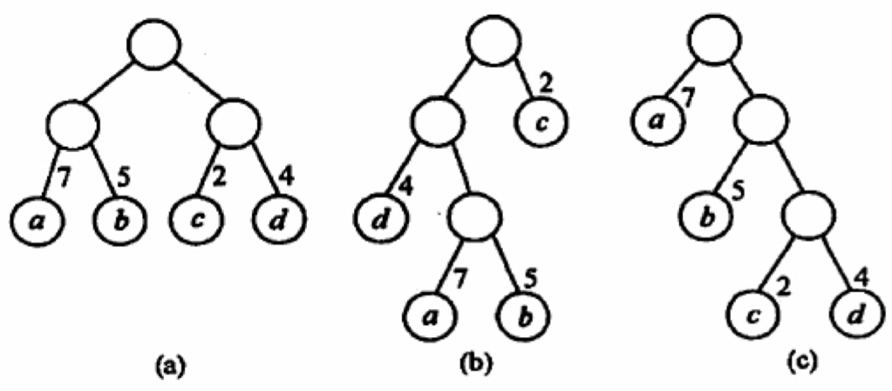

- (a)：WPL = 7 × 2 + 5 × 2 + 2 × 2 + 4 × 2 = 36
- (b)：WPL = 4 × 2 + 7 × 3 + 5 × 3 + 2 × 1 = 46
- (c)：WPL = 7 × 1 + 5 × 2 + 2 × 3 + 4 × 3 = 35

<br/>

##### 哈夫曼树的构造

给定n个权值分别为w<sub>1</sub>，w<sub>2</sub>，... ，w<sub>n</sub>的结点，构造哈夫曼树的过程如下：

- ①先将这n个结点分别作为n棵仅含一个结点的二叉树，构成森林F
- ②构造一个新结点，从F中选取两棵根结点权值最小的树作为新结点的左、右子树，并且将新结点的权值置为左、右子树上根结点的权值之和
- ③从F中删除刚才选出的两棵树，同时将新得到的树加入F中
- ④重复步骤②和③，直到F中只剩下一棵树为止

哈夫曼树具有如下特点：

- 每个初始结点最终都成为叶结点，且权值越小的结点到根结点的路径长度越大
- 构造过程中共新建了**n - 1**个结点（双分支结点），因此哈夫曼树的结点总数为**2n - 1**
- 每次构建都选择两棵树作为新结点的孩子，因此哈夫曼树中不存在度为1的结点

如下图权值{7，5，2，4}的哈夫曼树的构造过程：

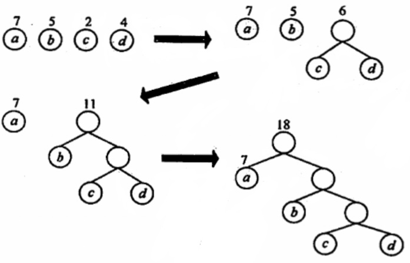

<br/>

##### 哈夫曼编码

**固定长度编码**：对每个字符同相等长度的二进制位表示

**可变长度编码**：对不同的字符用不等长的二进制位表示

可变长度编码比固定长度编码要好得多，其特点是对频率高的字符赋以短编码，而对频率较低的字符赋以长一些的编码，从而可以使字符的平均编码长度减短，起到压缩数据的效果。

**前缀编码**：没有一个编码是另一个编码的前缀

由哈夫曼树得到哈弗曼编码的过程：

- 将每个出现的字符当做一个独立的结点，其权值为它出现的频度（或次数），构造对应的哈夫曼树
- 将字符的编码解释为从根至该字符的路径上边标记的序列，其中边标记为0表示“转向左孩子”，标记为1表示“转向右孩子”（也可以是左1右0）

如下图的哈夫曼树：

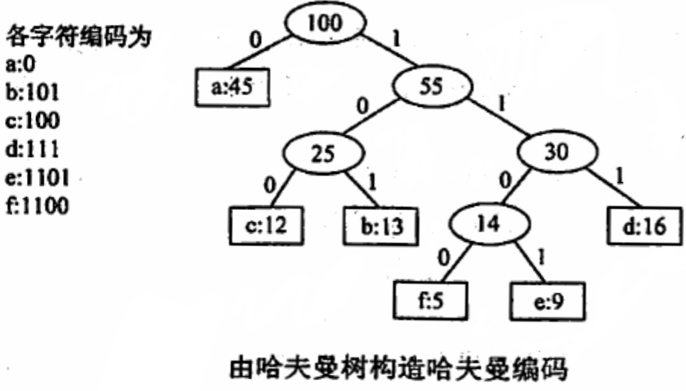

WPL = 1 × 45 + 3 × (13 +12 + 16) + 4 × (5 + 9) = 224

此处的WPL可视为最终编码得到二进制编码的长度，共224位。若采用3位固定长度编码，则得到的二进制编码长度为300位，因此哈夫曼编码共压缩了25%的数据，利用哈夫曼树可以设计出总长度最短的二进制前缀编码。

哈夫曼树不唯一，但是它们的WPL一定是相同且为最优的
