# 线性表

## 线性表的定义和基本操作

**定义**：线性表（逻辑结构）是具有相同数据类型的n（n ≥ 0）和数据元素的有限序列，其中n为表长，当n = 0是线性表是一个空表。假设一个线性表L = { a<sub>1</sub>，a<sub>2</sub>，... ，a<sub>n</sub>}，a<sub>1</sub>为表头元素，a<sub>n</sub>为表尾元素。除第一个元素外，每个元素都有且仅有一个**直接前驱**。除最后一个元素外，每个元素都有且仅有一个***直接后继**。

线性表的特点：

- 表中元素个数有限
- 表中元素具有逻辑上的顺序性，表中元素有先后次序
- 表中元素都是数据元素，每个元素都是单个元素
- 表中元素的数据类型相同，每个元素占有相同大小的存储空间
- 表中元素具有抽象性，即仅讨论元素间的逻辑关系


## 线性表的顺序表示

线性表的顺序存储（顺序表）：是用一组**地址连续**的存储单元依次存储线性表中的数据元素，从而使得**逻辑上相邻的两个元素在物理上也相邻**。

如下图，假设线性表L存储的起始位置为LOC(A)，sizeof(ElemType)是每个数据元素所占用存储空间的大小，i称为元素a<sub>i</sub>在线性表中的**位序**，线性表的顺序存储结构是一种**随机存取**的存储结构（注意第一个元素 a<sub>1</sub>放在数组下标为0的地方）

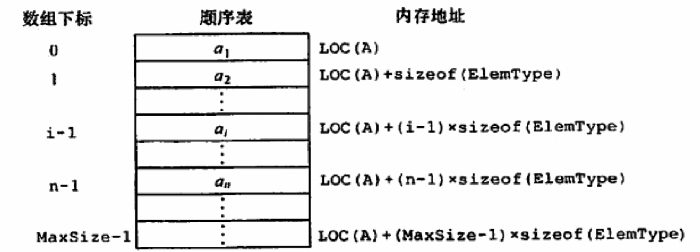

```c++
#define MaxSize 50
using ElemType = int;
/*
// 动态分配
typedef struct {
    ElemType* data;
    int length;
}SeqList;

SeqList L;
L.data = new ElemType[MaxSize]; // C++的初始动态分配
L.data = (ElenType*)malloc(sizeof(ElemType) * MaxSize); // C的初始动态分配
*/
// 静态分配
typedef struct {
    ElemType data[MaxSize];
    int length;
}SqList;

// 插入
bool ListInsert(SqList& L, int site, int value) {
    if (site < 1 || site > L.length + 1)  // 插入位置无效
        return false;
    if (L.length >= MaxSize)    // 当前存储空间已满
        return false;
    for (int j = L.length; j >= site; --j) // 后移元素
        L.data[j] = L.data[j - 1];
    L.data[site - 1] = value;
    ++L.length;
    return true;
}

// 删除
bool ListDelete(SqList& L, int site, ElemType& retValue) {
    if (site < 1 || site > L.length)
        return false;
    retValue = L.data[site - 1];    // 被删除元素的值
    for (int i = site; i < L.length; ++i)
        L.data[i - 1] = L.data[i];
    --L.length;
    return true;
}

// 按值查找（顺序查找）
int LocateElem(SqList L, ElemType value) {
    for (int i = 0; i < L.length; ++i)
        if (L.data[i] == value)
            return i + 1;   // 元素位置比数组下表多1
    return 0;   // 查找失败
}

// 打印顺序表
void ListPrint(const SqList& L) {
    for (int i = 0; i < L.length; ++i)
        cout << L.data[i] << " ";
    cout << endl;
}
```

- 运行结果

```c++
int main() {
    SqList L;
    L.length = 0;
    for (int i = 0; i < 10; ++i)
        ListInsert(L, i + 1, i);
    cout << "初始顺序表：";
    ListPrint(L);

    ElemType retValue;
    ListDelete(L, 5, retValue);
    cout << "删除第5个元素“" << retValue << "”后：";
    ListPrint(L);
    
    int site = LocateElem(L, 4);
    cout << "查找元素4：";
    if (site == 0)
        cout << "查找失败";
    else
        cout << "查找成功，在第" << site << "个位置";
    return 0;
}

输出：
初始顺序表：0 1 2 3 4 5 6 7 8 9
删除第5个元素“4”后：0 1 2 3 5 6 7 8 9
查找元素4：查找失败
```

顺序表操作性能分析：

插入操作（ListInsert）：

- 最好情况：在表尾插入（i = n + 1），时间复杂度为O(1)
- 最坏情况：在表头插入（i = 1），时间复杂度为O(n)
- 平均情况：**时间复杂度为O(n)**

删除操作（ListDelete）：

- 最好情况：删除表尾元素（i = n），时间复杂度为O(1)
- 最坏情况：删除表头元素（i = 1），时间复杂度为O(n)
- 平均情况：**时间复杂度为O(n)**

上述两个操作的时间主要耗费在移动元素上

按值查找（LocateElem）：

- 最好情况：查找元素就在表头（i = 1），时间复杂度为O(1)
- 最坏情况：查找元素就在表尾（i = n）或不存在时，时间复杂度为O(n)
- 平均情况：**时间复杂度为O(n)**


## 线性表的链式表示

链式存储线性表时，不需要使用地址连续的存储单元，即不要求逻辑上相邻的元素在物理位置上也相邻，它通过“链”建立起数据元素之间的逻辑关系，失去了随机存取的优点。

### 单链表的定义

**定义**：线性表的链式存储又称单链表，它是通过一组任意的存储单元来存储线性表中的数据元素。为了建立起数据元素之间的关系，对每个链表结点，采用如下图的结构：**date**为**数据域**，存放数据元素，**next**为**指针域**，存放其后继结点的地址。

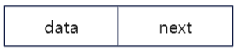

利用单链表可以解决顺序表需要大量连续存储单元的缺点，但单链表附加指针域，也存在浪费存储空间的缺点。单链表是**非随机存取**的存储结构，查找某个特定结点时，需要从表头开始遍历，依次查找。

通常用**头指针**来标识一个单链表，头指针为NULL时表示一个空表，为了操作方便也能在单链表第一个结点之前附加一个**头结点**

- 带头结点的单链表：（头结点内一般不存储信息）

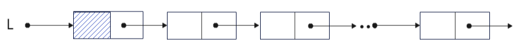

- 不带头结点的单链表：

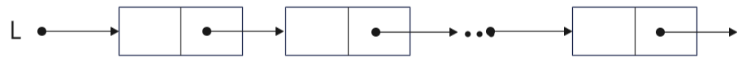

不管带不带头结点，头指针一定指向单链表的第一个结点，引入头结点是为了操作方便。

```c++
using ElemType = int;

// 单链表结点
typedef struct LNode {
    ElemType data;          // 数据域
    struct LNode* next;     // 指针域
}LNode, * LinkList;

// 头插法建立单链表（逆序）
LinkList List_HeadInsert(LinkList& L) {
    LNode* node;
    int value;
    L = new LNode();    // 头结点
    L->next = nullptr;
    cin >> value;
    while (value != 9999) { // 9999为结束标志
        node = new LNode();
        node->data = value;
        node->next = L->next;   // 插入链表中
        L->next = node;
        cin >> value;
    }
    return L;
}

// 尾插法建立单链表
LinkList List_TailInsert(LinkList& L) {
    int value;
    L = new LNode();    // 头结点
    LNode* node, * tail = L;
    cin >> value;
    while (value != 9999) { // 9999为结束标志
        node = new LNode();
        node->data = value;
        tail->next = node;  // 插入链表中
        tail = node;    // node成为新的表尾结点
        cin >> value;
    }
    tail->next = nullptr;   // 表尾指针置空
    return L;
}

// 求表长（不包含头结点）
int List_Size(LinkList L) {
    int count = 0;
    LNode* p = L->next;
    if (p == nullptr)
        return 0;
    while (p != nullptr) {
        p = p->next;
        ++count;
    }
    return count;
}

// 按序号查找结点值
LNode* GetElem(LinkList L, int site) {
    int i = 1;
    LNode* p = L->next;
    if (site == 0)     // 返回头结点
        return L;
    if (site < 1)
        return nullptr;
    while (p != nullptr && i < site) {
        p = p->next;
        ++i;
    }
    return p;   // 若i大于表长，则返回nullptr
}

// 按值查找表结点
LNode* LocateELem(LinkList L, int value) {
    LNode* p = L->next;
    while (p != nullptr && L->data != value)
        p = p->next;
    return p;
}

// 插入结点
bool List_Insert(LinkList& L, int site, int value) {
    LNode* p = GetElem(L, site - 1);    // 待插入位置的前驱结点
    if (p == nullptr)
        return false;
    LNode* node = new LNode();
    node->data = value;
    node->next = p->next; // 插入结点
    p->next = node;
    return true;
}

// 删除结点
bool List_Delete(LinkList& L, int site) {
    LNode* p = GetElem(L, site - 1);    // 待删除位置的前驱结点
    if (p == nullptr)
        return false;
    LNode* q = p->next; // q指向待删除结点
    p->next = q->next;
    delete q;
    return true;
}

// 打印链表
void PrintList(const LinkList L) {
    LNode* p = L->next;
    cout << "链表：";
    while (p != nullptr) {
        cout << p->data << " ";
        p = p->next;
    }
    cout << endl;
}
```

- 运行结果

```c++
int main() {
    LinkList L = nullptr;     // 输入数据：5 85 95 22 12 30 1 25 36 54 9999
    cout << "输入建立链表的方式：头插法/尾插法(0/1)：";
    int i = 0;
    cin >> i;
    if (i == 0) {
        cout << "输入数据：";
        List_HeadInsert(L);
    }
    else if (i == 1) {
        cout << "输入数据：";
        List_TailInsert(L);
    }
    PrintList(L);

    cout << "链表长度：" << List_Size(L) << endl;

    cout << "查找值为3的结点：";
    LNode* search = LocateELem(L, 3);
    cout << (search == nullptr ? "查找失败\n" : "查找成功\n");

    cout << "在位置1处插入值为100的结点：";
    List_Insert(L, 1, 100);
    PrintList(L);

    cout << "删除位置1处的结点";
    List_Delete(L, 1);
    PrintList(L);

    return 0;
}

输出：
// 头插法
输入建立链表的方式：头插法/尾插法(0/1)： 0
输入数据： 5 85 95 22 12 30 1 25 36 54 9999
链表： 54 36 25 1 30 12 22 95 85 5
链表长度： 10
查找值为3的结点：查找失败
在位置1处插入值为100的结点：链表： 100 54 36 25 1 30 12 22 95 85 5
删除位置1处的结点链表： 54 36 25 1 30 12 22 95 85 5
    
// 尾插法
输入建立链表的方式：头插法/尾插法(0/1)： 1
输入数据： 5 85 95 22 12 30 1 25 36 54 9999
链表： 5 85 95 22 12 30 1 25 36 54
链表长度： 10
查找值为3的结点：查找失败
在位置1处插入值为100的结点：链表： 100 5 85 95 22 12 30 1 25 36 54
删除位置1处的结点链表： 5 85 95 22 12 30 1 25 36 54
```


链表操作性能分析：

头/尾插法建立单链表：**时间复杂度为O(n)**

按序号查找结点：**时间复杂度为O(n)**

插入结点：主要时间开销在于查找第i - 1个元素，**时间复杂度为O(n)**，若在给定的结点后面插入新结点，则**时间复杂度为O(1)**

删除结点：主要时间开销在于查找第i - 1个元素，**时间复杂度为O(n)**，若删除给定结点后的结点，则**时间复杂度为O(1)**

求表长：**时间复杂度为O(n)**


### 双链表

因为单链表只有一个指向其后继的指针，因此要访问某个结点的前驱结点时只能从前往后遍历，访问某个结点的前驱结点的时间复杂度为O(n)，访问某个结点的后续结点的时间复杂度为O(1)，为了解决访问前驱结点的问题引入了双链表，双链表有两个指针，**prior**和**next**，分别指向其前驱结点和后继结点，如下图：

双链表结点：

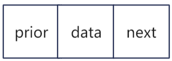

双链表：

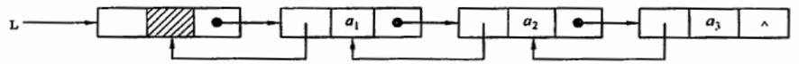

```c++
using ElemType = int;

// 双链表结点
typedef struct DNode {
    ElemType data;
    struct DNode* prior, * next;
}DNode, * DLinkList;

// 初始化双链表
bool InitDLinkList(DLinkList& L) {
    L = new DNode();
    if (L == NULL)  // 内存不足，分配失败
        return false;
    L->prior = nullptr; // 头结点没有前驱结点
    L->next = nullptr;
    return true;
}

// 在p结点之后插入s结点
bool DList_Insert(DLinkList& L, DNode* p, DNode* s) {
    if (p != nullptr || s != nullptr)
        return false;
    s->next = p->next;
    if (p->next != nullptr)		// p为最后一个结点的情况
        p->next->prior = s;
    s->prior = p;
    p->next = s;
    return true;
}

// 删除p结点的后继结点
bool DList_Delete(DNode* p) {
    if (p == nullptr)
        return false;
    DNode* q = p->next;     // 找到p的后继结点q
    if (q == nullptr)
        return false;
    p->next = q->next;
    if (q->next != nullptr)     // q结点不是最后一个结点
        p->next->prior = p;
    free(q);
    return true;
}

// 销毁链表
void DList_Destroy(DLinkList& L) {
    while (L->next != nullptr)
        DList_Delete(L);
    free(L);
    L = nullptr;    // 头指针指向nullptr
}
```


双链表的插入和删除操作的时间复杂度均为O(1)

插入：

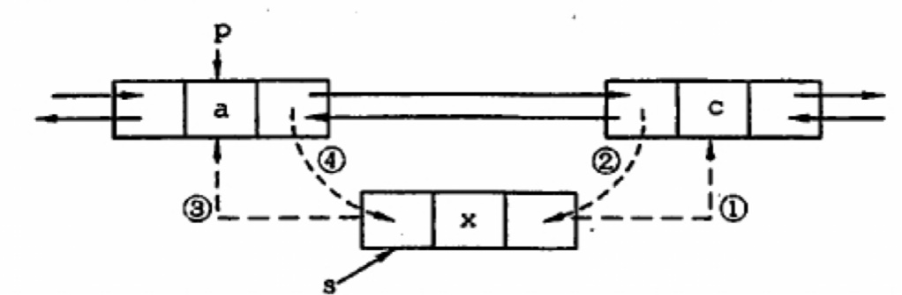

- ①s->next = p->next;
- ②p->next->prior = s;
- ③s->prior = p;
- ④p->next = s;

删除：

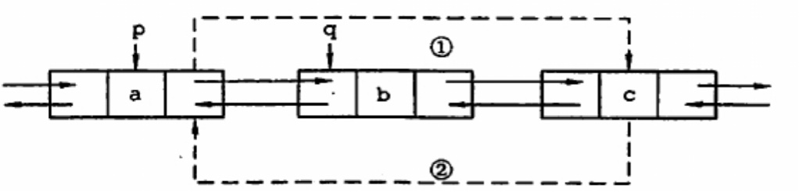

- ①p->next = q->next;
- ②q->next->prior = p;
- ③free(q);


### 循环单链表

与单链表的区别在于循环单链表的最后一个结点的指针不是NULL，而是指向头结点，从而整个链表形成一个环。因此表中没有指针域为NULL的结点，判空条件为头结点的指针是否等于头指针。

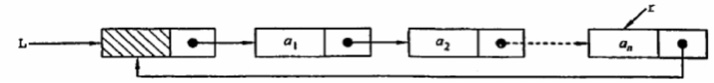

```c++
using ElemType = int;

// 循环单链表结点
typedef struct LNode {
    ElemType data;
    struct LNode* next;
}LNode, *LinkList;

// 初始化
bool InitList(LinkList& L) {
    L = new LNode();
    if (L == NULL)  // 内存不足，分配失败
        return false;
    L->next = L;    // 头结点next指针指向头结点
    return true;
}

// 判空
bool IsEmpty(LinkList L) {
    if (L->next == L)
        return true;
    return false;
}

// 判断p是否为表尾结点
bool IsTail(LinkList L, LNode* p) {
    if (p->next == L)
        return true;
    return false;
}
```

在循环单链表中，可以从表中的任意一个结点开始遍历整个链表。

- 若只设置头指针：对表尾操作需要O(n)的时间复杂度
- 若只设置尾指针r：r->next即为头指针，对表头和表尾操作都只需要O(1)的时间复杂度

因此设置尾指针会使得操作效率更高


### 循环双链表

循环双链表的定义与循环单链表基本相同，不同的是循环双链表中，头指针的prior指针还要指向表尾结点。

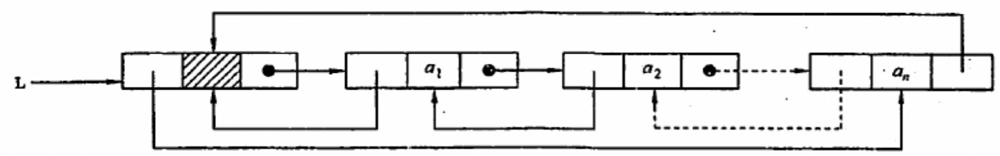

当循环双链表为空时，其头结点的prior域和next域都等于L

```c++
using ElemType = int;

// 循环双链表结点
typedef struct DNode {
    ElemType data;
    struct DNode* prior, * next;
}DNode, * DLinkList;

// 初始化
bool InitDLinkList(DLinkList& L) {
    L = new DNode();
    if (L == NULL)      // 内存不足，分配失败
        return false;
    L->prior = L;
    L->next = L;
    return true;
}

// 判空
bool IsEmpty(DLinkList L) {
    if (L->next == L)
        return true;
    return false;
}

// 判断p是否为表尾结点
bool IsTail(DLinkList L, DNode* p) {
    if (p->next == L)
        return true;
    return false;
}
```


### 静态链表

静态链表借助数组来描述线性表的链式存储结构，结点也有数据域data和指针域next，不同的是这里的指针域是结点的相对地址（数组下标），又称**游标**，静态链表其实就是一个数组，所以要预先分配一块连续的内存空间。

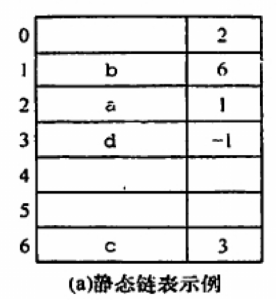

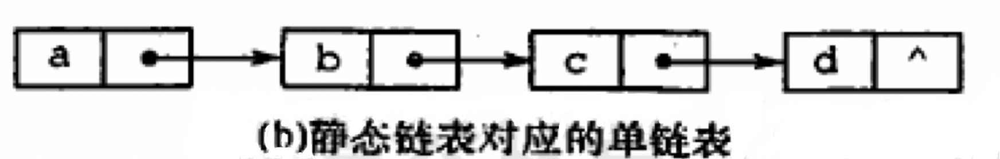

```c++
#define MaxSize 50
using ElemType = int;

typedef struct {
    ElemType data;
    int next;   // 下一个元素的数组下标
}SLinkList[MaxSize];
```

静态链表以next == -1为结束标志。静态链表的插入、删除语动态链表的相同，只需要修改指针而不需要移动元素，主要运用在不支持指针的高级语言中（如Basic）

优点：增、删操作不需要大量移动元素

缺点：不能随机存取，只能从头结点开始一次往后查找；容量固定不可变


### 顺序表和链表的比较

|                      |             顺序表             |                链表                |
| :------------------: | :----------------------------: | :--------------------------------: |
|   存取（读写）方式   |            随机存取            |             非随机存取             |
|  逻辑结构与物理结构  | 逻辑上相邻的元素在物理上也相邻 | 逻辑上相邻的元素在物理上不一定相邻 |
| 查找、插入和删除操作 |        移动元素消耗时间        |          寻找前驱消耗时间          |
|       空间分配       |      预先分配（静态分配）      |       使用时申请（动态分配）       |

