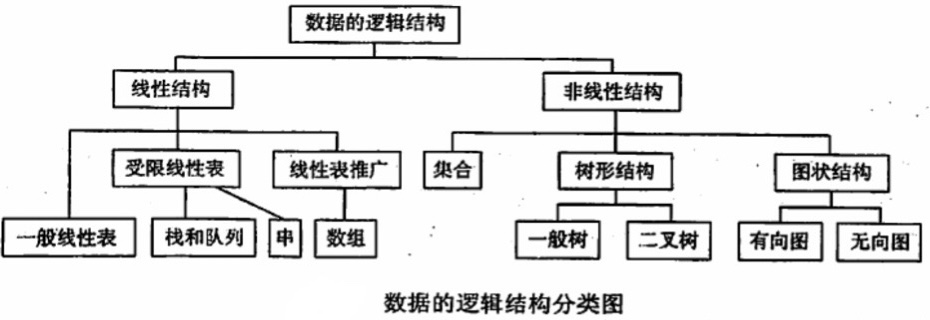
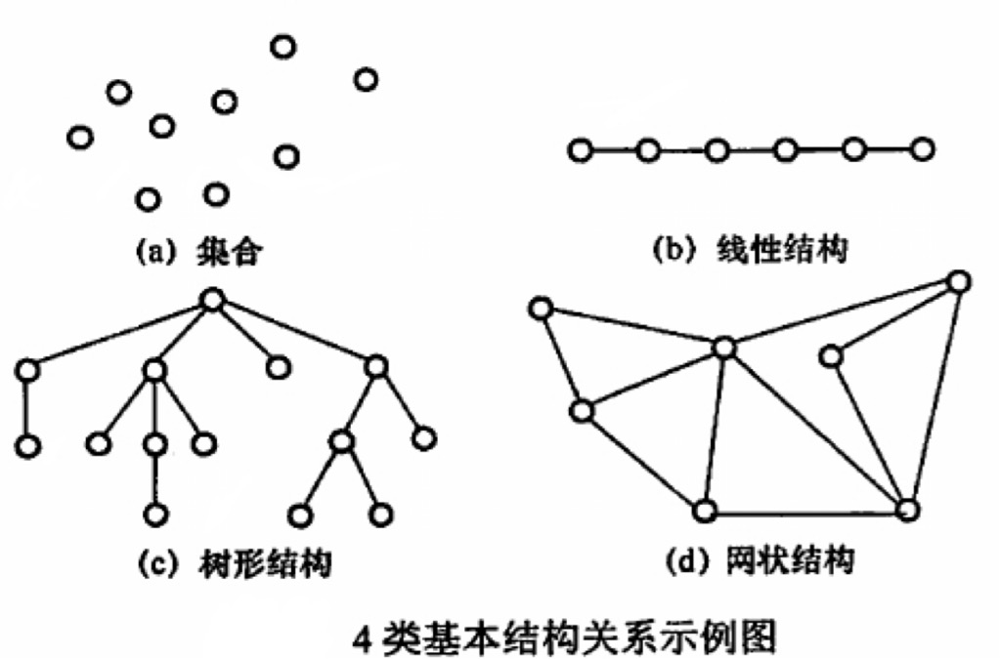

# 绪论

## 数据结构的基本概念

### 基本概念和术语

**数据**

数据是信息的载体，是描述客观事物属性的数、字符及所有能输入到计算机中并被计算机程序识别和处理的符号的集合。数据是计算机程序加工的原料

**数据元素**

数据元素是数据的基本单位，通常作为一个整体进行考虑和处理。一个数据元素可以由若干**数据项**组成，数据项是构成数据元素的不可分割的最小单位。例如，学生记录就是一个数据元素，它由学号、姓名、性别等数据项组成

**数据对象**

数据对象是具有相同性质的数据元素的集合，是数据的一个**子集**。例如，整数数据对象是集合N = {0, ±1, ±2, ...}

**数据类型**

数据类型是一个值的集合和定义在此集合上的一组操作的总称

- 原子类型：其值不可在分的数据类型
- 结构类型：其值可以在分解为若干成分（分量）的数据类型
- 抽象数据类型：抽象数据组织及与之相关的操作

**数据结构**

数据结构是相互之间存在一种或多种特定关系的数据元素的集合。数据元素不是孤立存在的，它们之间存在某种关系，这种数据元素之间的关系称为**结构**。数据结构包括三方面的内容：**逻辑结构**、**存储结构**和**数据的运算**

一个算法的设计取决于所选定的逻辑结构，而算法的实现依赖于所采用的存储结构

<br/>

### 数据结构三要素

#### 数据的逻辑结构

逻辑结构是指数据元素之间的逻辑关系，即从逻辑关系上描述数据。数据的逻辑结构分为**线性结构**和**非线性结构**，如下图：



<br/>

**集合**：结构中的数据元素之间除“同属一个集合”外，别无其他关系

**线性结构**：结构中的数据元素之间只存在**一对一**的关系

**树形结构**：结构中的数据元素之间存在**一对多**的关系

**图状结构或网状结构**：结构中的数据元素之间存在**多对多**的关系



<br/>

#### 数据的存储结构

存储结构是指数据结构在计算机中的表示（又称**映象**），也称**物理结构**。数据的存储结构主要有以下几种：

- **顺序存储**：把逻辑上相邻的元素存储在物理位置上也相邻的存储单元中，元素之间的关系由存储单元的邻接关系来体现。其优点是可以实现**随机存取**，每个元素占用最少的存储空间；缺点是只能使用相邻的一整块存储单元，因此可能产生较多的外部碎片
- **链式存储**：不要求逻辑上相邻的元素在物理位置上也相邻，借助指示元素存储地址的指针来表示元素之间的逻辑关系。其优点是不会出现碎片现象，能充分利用所有存储单元；缺点是每个元素因存储指针而占用额外的空间，且只能实现**顺序存取**
- **索引存储**：在存储元素信息的同时，还建立附加的索引表、索引表中的每项称为**索引项**，索引项的一般形式是**（关键字，地址）**。其优点是索引速度快；缺点是附加的索引表额外占用存储空间。另外，增加和删除数据时也要修改索引表，因而会花费较多的时间
- **散列存储**：根据元素的关键字直接计算出该元素的存储地址，又称**哈希存储**。其优点是检索、增加和删除结点的操作都很快；缺点是若散列函数不好，则可能出现元素存储单元的冲突，而解决冲突会增加时间和空间开销

<br/>

#### 数据元素的运算

施加在数据上的运算包括运算的**定义**和**实现**。运算的定义是针对逻辑结构的，指出运算的功能；运算的实现是针对存储结构的，指出运算的具体操作步骤

<br/>

## 算法和算法评价

### 算法的基本概念

算法是针对特定问题求解步骤的一种描述，它是指令的有限序列，其中的每条指令表示一个或多个操作。此外，一个算法还具有下列5个重要特性：

- **有穷性**：一个算法必须总在执行有穷步之后结束，且每一步都可在有穷时间内完成
- **确定性**：算法中每条指令必须有确切的含义，对于相同的输入只能得出相同的输出
- **可行性**：算法中描述的操作都可以通过已经实现的基本运算执行有限次来实现
- **输入**：一个算法有零个或多个输入，这些输入取自于某个特定的对象的集合
- **输出**：一个算法有一个或多个输出，这些输出是与输入有着某种特定关系的量

通常，设计一个“好”的算法应该考虑达到以下目标：

- **正确性**：算法应能够正确地解决求解问题
- **可读性**：算法应具有良好的可读性，以帮助人们理解
- **健壮性**：输入非法数据时，算法能适当地做出反应或进行处理，而不会产生莫名其妙的输出结果
- **效率与低存储量需求**：效率是指算法执行的时间，存储量需求是指算法执行过程中所需要的最大存储空间，这两者都与问题的规模有关

<br/>

### 算法效率的度量

算法效率的度量是通过**时间复杂度**和**空间复杂度**来描述的

<br/>

**时间复杂度**

一个语句的**频度**是指该语句在算法中被重复执行的次数。算法中所有语句的频度之和记为**T(n)**，它是算法问题规模n的函数，时间复杂度主要分析T(n)的**数量级**。算法中基本运算（**最深层循环内的语句**）的频度与T(n)同数量级，因此通常采用算法中**基本运算的频度ƒ(n)**来分析算法的时间复杂度。因此，算法的时间复杂度记为**T(n) = O(ƒ(n))**，O：T(n)的数量级

算法的复杂度不仅依赖于问题的规模n，也取决于待输入函数的性质（如输入数据元素的初始状态）。例如，在数组A[0...n - 1]中，查找给定值k的算法大致如下：

```c++
i = n - 1;					  // （1）
while (i >= 0 && (A[i] != k))   // （2）
i--;                            // （3）
return i;                       // （4）
```

该算法中语句3的频度不仅与问题规模n有关，而且与输入实例中A的各元素的取值及k的取值有关：

- 若A中没有与k相等的元素，则语句3的频度ƒ(n) = n
- 若A的最后一个元素等于k，则语句3的频度ƒ(n)是常数0

**最坏时间复杂度**：在最坏情况下，算法的时间复杂度

**平均时间复杂度**：所有可能的输入实例在等概率出现的情况下，算法的期望运行时间

**最好时间复杂度**：在最好情况下，算法的时间复杂度

一般总是考虑在最坏情况下的时间复杂度，以保证算法的运行时间不会比它更长

<br/>

在分析一个程序的时间复杂度时，有以下两条规则：

- **加法规则**：T(n) = T<sub>1</sub>(n) + T<sub>2</sub>(n)  = O(ƒ(n)) + O(g(n)) = O(max(f(n), g(n)))
- **乘法规则**：T(n) = T<sub>1</sub>(n) × T<sub>2</sub>(n) = O(ƒ(n)) × O(g(n)) = O(ƒ(n) × g(n))

<br/>

常见的渐进时间复杂度为：
$$
O(1) < O(log_2n) < O(n) < O(nlog_2n) < O(n^2) < O(n^3) < O(2^n) < O(n!) < O(n^n)
$$


**空间复杂度**

算法的空间复杂度S(n)定义为该算法所耗费的存储空间，它是问题规模n的函数。记为**S(n) = O(g(n))**

一个程序在执行时除需要存储空间来存放本身所用的指令、常数、变量和输入数据外，还需要一些对数据进行操作的工作单元和存储一些为实现计算所需信息的辅助空间。若输入数据所占空间只取决于问题本身，和算法无关，则只需分析除输入和程序之外的额外空间

算法原地工作是指算法所需的辅助空间为常量，即O(1)

