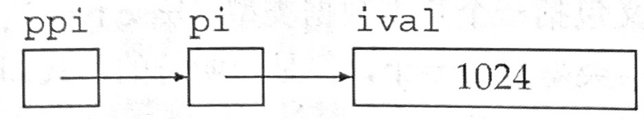
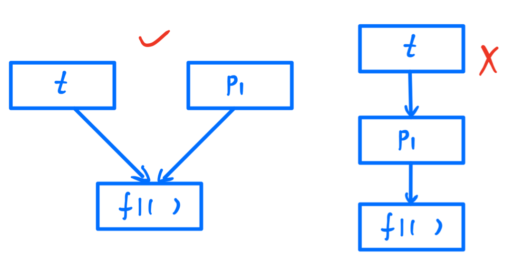

# 补充知识(指针和引用)

## 引用

**引用**为对象起了另外一个名字，引用类型引用另一种类型。通过将声明符写成**&d**的形式来定义引用类型，其中d是声明的变量名：

```c++
int ival = 1024;
int& refVal = ival;     // refVal指向ival（是ival的另一个名字）
int& refVal2;       // 报错：引用必须被初始化
```

一般在初始化变量时，初始值会被拷贝到新建的对象中。然而定义引用时，程序把引用和它的初始值**绑定**在一起，而不是将初始值拷贝给引用。注意，无法令引用重新绑定到另一个对象，因此引用必须初始化

<br/>

### 引用即别名

定义了一个引用之后，对其进行的所有操作都是在与之前绑定的对象上进行的：

```c++
int ival = 3;
int& refVal = ival;
refVal = 2;         // 等价于ival = 2
int ii = refVal;    // 等价于ii = ival;
```

为引用赋值，实际上是把值赋给了与引用绑定的对象；获取引用的值，实际上是获取了与引用绑定的对象的值

因为引用本身不是一个对象，所以不能定义引用的引用

<br/>

### 引用的定义

允许在一条语句中定义多个引用，其中每个引用标识符都必须以符号&开头：

```c++
int i = 1024, i2 = 2048;	// i和i2都是int
int& r = i, r2 = i2;		// r是一个引用，与i绑定在一起，r2是int
int i3 = 1024, & ri = i3;   // i3是int，ri是一个引用，与i3绑定在一起
int& r3 = i3, & r4 = i2;    // r3和r4都是引用
```

<br/>

引用只能绑定在对象上，而不能与字面值或某个表达式的计算结果绑定在一起：

```c++
int& refVal4 = 10;		// 错误：引用类型的初始值必须是一个对象
double dval = 3.14;
int& refVal5 = dval;	// 错误：此处引用类型的初始值必须是int型对象
```

<br/>

## 指针

**指针**是“指向”另一种类型的复合类型

指针与引用有区别：

- 指针本身就是一个对象，允许对指针赋值和拷贝，而且在指针的生命周期内它可以先后指向几个不同的对象
- 指针无须在定义时赋初值（在块作域内定义的指针如果没有被初始化，将会拥有一个不确定的值）

<br/>

定义指针类型的方法将声明符写成**\*d**的形式，其中d是变量名。如果在一条语句中定义了几个指针变量，每个变量前面都必须有符号*：

```c++
int* ip1, * ip2;    // ip1和ip2都是指向int型对象的指针
double dp, * dp2;   // dp2是指向double型对象的指针，dp是double型对象
```

<br/>

### 获取对象的地址

指针存放某个对象的地址，想要获取该地址，需要使用**取地址符（操作符&）**：

```c++
int ival = 42;
int* p = &ival;		// p存放ival对象的地址，或者说p是指向变量ival的指针
```

<br/>

因为引用不是对象，没有实际地址，所以不能定义指向引用的指针，例如下面的代码是错误的：

```c++
int ival = 2;
int& refVal = ival;
int* p = refVal;	// 应改成：int* p = &refVal;
```

<br/>

因为在声明语句中指针的类型实际上被用于指定它所指向对象的类型。所以二者必须匹配：

```c++
double dval;
double* pd = &dval;		// 正确：初始值是double型对象的地址
double* pd2 = pd;       // 正确：初始值是指向double对象的指针

int* pi = pd;           // 错误：指针pi的类型和pd的类型不匹配
pi = &dval;             // 错误：试图把double型对象的地址赋给int型指针
```

<br/>

### 指针值

指针的值（即地址）应属于下列4种状态之一：

- 指向一个对象
- 指向紧邻接对象所占空间的下一个位置
- 空指针，意味着指针没有指向任何对象
- 无效指针，也就是上述情况之外的其他值

<br/>

### 利用指针访问对象

如果指针指向了对象，则允许使用**解引用符（操作符\*）**来访问对象：

```c++
int ival = 42;
int* p = &ival;		// p中存放着变量ival的地址，或者说p是指向变量ival的指针
cout << *p;			// 由符号*得到指针p所指的对象，输出42
```

对指针解引用会得出所指的对象，因此如果给解引用的结果赋值，实际上也就是给指针所指的对象赋值：

```c++
*p = 0;         // 由符号*得到指针p所指的对象，即可经由p为变量ival赋值
cout << *p;     //输出0
```

<br/>

注意，像&和*这样的符号，即能用作表达式里的运算符，也能作为声明的一部分出现，符号的上下文决定了符号的意义

<br/>

### 空指针

**空指针**不指向任何对象，在试图使用一个指针之前代码可以首先检查它是否为空。以下列出几个生成空指针的方法：

```c++
int* p1 = nullptr;      // 等价于int* p1 = 0;
int* p2 = 0;            // 直接将p2初始化为字面常量0
// 需要首先#include cstdlib
int* p3 = NULL;         // 等价于int* p3 = 0;
```

得到空指针最直接的办法就是用字面值**nullptr**来初始化指针，nullptr是一种特殊类型的字面值，它可以被转换成任意其它的指针类型。过去的程序还会用到一个名为NULL的**预处理变量**来给指针赋值，它的值就是0

当用到一个预处理变量时，预处理器会自动地将它替换为实际值，因此用NULL初始化指针和用0初始化指针是一样的。在新标准下，应该尽量使用nullptr并且避免使用NULL

<br/>

注意，把int变量直接赋给指针是错误的操作，即使int变量的值恰好等于0也不行：

```c++
int zero = 0;
pi = zero;		// 错误
```

<br/>

### 赋值和指针

有时候要想搞清楚一条赋值语句到底是改变了指针的值还是改变了所指对象的值不太容易，最好的办法就是记住赋值永远改变的是等号左侧的对象：

```c++
int* pi, ival = 2;
pi = &ival;		// pi的值被改变，现在pi指向了ival
```

pi被赋予了一个新值，也就是改变了那个放在pi内的地址值。若出现下面的代码：

```c++
*pi = 0;		// ival的值被改变，指针pi并没有改变
```

则*pi（也就是指针pi指向的那个对象）发生改变

<br/>

### 其他指针操作

只要指针拥有一个合法值，就能将它用在条件表达式中：

```c++
int ival = 1024;
int* pi = 0;        // pi合法，是一个空指针
int* pi2 = &ival;   // pi2是一个合法的指针，存放着ival的地址
if (pi)     // pi的值是0，因此条件的值false
    // ...
if (pi2)    // pi2指向ival，因此它的值不是0，条件的值是true
    // ... 
```

任何非零指针对应的条件值都是true

<br/>

对于两个类型相同的合法指针，可以用相等操作符（==）或不相等操作符（!=）来比较它们，比较的结果是布尔类型：

- 如果两个指针存放的地址值相同，则它们相等
- 如果两个指针存放的地址值不相同，则它们不相等

这里两个指针存放的地址相同（两个指针相等）有三种可能：

- 它们都为空
- 都指向同一个对象
- 都指向了同一个对象的下一地址

<br/>

### void\*指针

**void\***是一种特殊的指针类型，可用于存放任意对象的地址，我们对该地址中到底是个什么类型的对象并不了解：

```c++
double obj = 3.14, * pd = &obj;
void* pv = &obj;    // 正确：void*能存放任意类型对象的地址
                    // obj可以是任意类型的对象
pv = pd;            // pv可以存放任意类型的指针
```

不能直接操作void\*指针所指的对象，因为我们并不知道这个对象到底是什么类型，也就无法确定能在这个对象上做哪些操作。因此，以void\*的视角来看内存空间也就仅仅是内存空间，没办法访问内存空间中所存的对象

<br/>

### 指向指针的指针

指针是内存中的对象，像其他对象一样也有自己的地址，因此允许把指针的地址再存放到另一个指针当中

通过*的个数可以区分指针的级别，即，`**`表示指向指针的指针，`***`表示指向指针的指针的指针，以此类推：

```c++
int ival = 1024;
int* pi = &ival;	// pi指向一个int型的数
int** ppi = &pi;	// ppi指向一个int型的指针
```

下图描述了它们之间的关系：



解引用int型指针会得到一个int型的数，同样，解引用指向指针的指针会得到一个指针。此时为了访问最原始的那个对象，需要对指针的指针做两次解引用：

```c++
cout << "The value of ival\n"
     << "direct value:" << ival << "\n"
     << "indirect value:" << *pi << "\n"
     << "doubly indirect value:" << **ppi
     << endl;
// 最后得到的都是ival的值
```

<br/>

先来看一道来自于牛客网的题目：

```c++
#include <stdio.h>

int f1(int x) { return x + 5; }
int f2(int x) { return 2 * x - 1; }

int main() {
    int (*p1)(int), (*p2)(int), (*t)(int), y1, y2;
    p1 = f1;
    p2 = f2;
    y1 = p2(p1(1));
    
    t = p1;		// t = f1
    p1 = p2;	// p1 = f2
    p2 = t;		// p2 = f1
    
    y2 = p2(p1(2));		// 等价于f1(f2(2))
    printf("%d, %d\n", y1, y2);
    return 0;
}

/*
输出：
11, 8
*/
```

- 首先定义了三个指向函数的指针（p1、p2和t）
- 然后令p1指向函数f1，p2指向函数f2，然后用这两个指针来调用这两个函数（y1 = p2(p1(1))）
- 重点在12 ~ 14行的代码，令指针t指向了指针p1所指的函数，因此t指向了函数f1，p1指向了指针p2所指的函数，为f2，最后令p2指向t所指的函数，为f1
- 因此最后y2 = p2(p1(2))等价于y2 = f1(f2(2))，因此y2的值为8

注意，t = p1，t并不是一个指向p1的指针（除非这样使用：int** t = &p1），这时t指向了指针p1所指向的地址



在c++中，直接使用指针输出的是指针所指向的地址而不是指针本身的地址，若要取得指针本身的地址应该使用取地址符（&p1）：

```c++
int i = 1024;
int* p = &i;
cout << "整数i的地址：" << &i << "\n"
	<< "指针p的地址：" << &p << "\n"
	<< "指针p所指向的地址：" << p;
/*
输出：
整数i的地址：0115F91C
指针p的地址：0115F910
指针p所指向的地址：0115F91C
*/
```

<br/>

### 指向指针的引用

引用本身不是一个对象，因此不能定义指向引用的指针。但指针是对象，所以存在对指针的引用：

```c++
int i = 42;
int* p;         // p是一个int型指针
int*& r = p;    // r是一个对指针p的引用

r = &i;         // r引用了一个指针，因此给r赋值&i就是令p指向i
*r = 0;         // 解引用r得到i，也就是p指向的对象，将i的值给为0
```

要理解r的类型到底是什么，最简单的办法就是**从右向左**阅读r的定义：

- 离变量名最近的符号（此例中是&r的符号&）对变量的类型有最直接的影响，因此r是一个引用
- 声明符的其余部分用以确定r引用的类型是什么，此例中的符号*说明r引用的是一个指针
- 最后，声明的基本数据类型部分指出r引用的是一个int指针